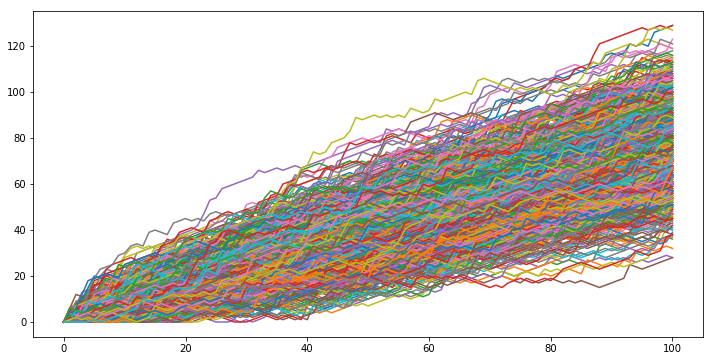
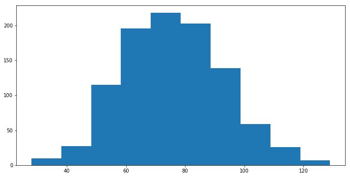

### Dictionary, Data Grouping, Loop
---------------

# Dictionary


```python
europe = {'spain':'madrid', 'france':'paris', 'germany':'berlin', 'norway':'oslo', 'australia':'vienna'}

print(europe.keys())
print(europe['norway'])
```

    dict_keys(['france', 'australia', 'norway', 'spain', 'germany'])
    oslo
    


```python
europe['italy'] = 'rome'    # add or update
europe['poland'] = 'warsaw'
del(europe['australia'])    # Remove

print(europe)               # 순서는 고정 안됨
```

    {'france': 'paris', 'spain': 'madrid', 'poland': 'warsaw', 'italy': 'rome', 'norway': 'oslo', 'germany': 'berlin'}
    


```python
print('italy' in europe)
```

    True
    


```python
# Dictionary of dictionaries
europe = {'spain': {'capital':'madrid', 'population':46.77},
          'france': {'capital':'paris', 'population':66.03},
          'germany': {'capital':'berlin', 'population':80.62},
          'norway': {'capital':'oslo', 'population':5.084}}

print(europe['france']['capital'])
```

    paris
    


```python
# Create sub-dictionary data
data = {'capital':'rome', 'population':59.83}
europe['italy'] = data

print(europe)
```

    {'france': {'population': 66.03, 'capital': 'paris'}, 'norway': {'population': 5.084, 'capital': 'oslo'}, 'italy': {'population': 59.83, 'capital': 'rome'}, 'spain': {'population': 46.77, 'capital': 'madrid'}, 'germany': {'population': 80.62, 'capital': 'berlin'}}
    

# Pandas


```python
import pandas as pd
import numpy as np
```


```python
names = ['United States', 'Australia', 'Japan', 'India', 'Russia', 'Morocco', 'Egypt']
dr =  [True, False, False, False, True, True, True]
cpc = [809, 731, 588, 18, 200, 70, 45]

my_dict = {
    'country':names,
    'drives_right':dr,
    'cars_per_cap':cpc
}
```


```python
# Build a DataFrame
cars = pd.DataFrame(my_dict)
cars.index = ['US', 'AUS', 'JAP', 'IN', 'RU', 'MOR', 'EG']
cars
```


<div>
<table border="1" class="dataframe">
  <thead>
    <tr style="text-align: right;">
      <th></th>
      <th>cars_per_cap</th>
      <th>country</th>
      <th>drives_right</th>
    </tr>
  </thead>
  <tbody>
    <tr>
      <th>US</th>
      <td>809</td>
      <td>United States</td>
      <td>True</td>
    </tr>
    <tr>
      <th>AUS</th>
      <td>731</td>
      <td>Australia</td>
      <td>False</td>
    </tr>
    <tr>
      <th>JAP</th>
      <td>588</td>
      <td>Japan</td>
      <td>False</td>
    </tr>
    <tr>
      <th>IN</th>
      <td>18</td>
      <td>India</td>
      <td>False</td>
    </tr>
    <tr>
      <th>RU</th>
      <td>200</td>
      <td>Russia</td>
      <td>True</td>
    </tr>
    <tr>
      <th>MOR</th>
      <td>70</td>
      <td>Morocco</td>
      <td>True</td>
    </tr>
    <tr>
      <th>EG</th>
      <td>45</td>
      <td>Egypt</td>
      <td>True</td>
    </tr>
  </tbody>
</table>
</div>


```python
cars = pd.read_csv('data/cars.csv', index_col = 0)
cars
```


<div>
<table border="1" class="dataframe">
  <thead>
    <tr style="text-align: right;">
      <th></th>
      <th>country</th>
      <th>cars_per_cap</th>
      <th>drives_right</th>
    </tr>
  </thead>
  <tbody>
    <tr>
      <th>US</th>
      <td>United States</td>
      <td>809</td>
      <td>True</td>
    </tr>
    <tr>
      <th>AUS</th>
      <td>Australia</td>
      <td>731</td>
      <td>False</td>
    </tr>
    <tr>
      <th>JAP</th>
      <td>Japan</td>
      <td>588</td>
      <td>False</td>
    </tr>
    <tr>
      <th>IN</th>
      <td>India</td>
      <td>18</td>
      <td>False</td>
    </tr>
    <tr>
      <th>RU</th>
      <td>Russia</td>
      <td>200</td>
      <td>True</td>
    </tr>
    <tr>
      <th>MOR</th>
      <td>Morocco</td>
      <td>70</td>
      <td>True</td>
    </tr>
    <tr>
      <th>EG</th>
      <td>Egypt</td>
      <td>45</td>
      <td>True</td>
    </tr>
  </tbody>
</table>
</div>


```python
print("\n{}".format(cars[1:4]))
print("\n{}".format(cars["country"]))      # output as Pandas Series
print("\n{}".format(cars[["country"]]))    # output as Pandas DataFrame
print("\n{}".format(cars[["country", "drives_right"]]))
```

    
           country  cars_per_cap drives_right
    AUS  Australia           731        False
    JAP      Japan           588        False
    IN       India            18        False
    
    US     United States
    AUS        Australia
    JAP            Japan
    IN             India
    RU            Russia
    MOR          Morocco
    EG             Egypt
    Name: country, dtype: object
    
               country
    US   United States
    AUS      Australia
    JAP          Japan
    IN           India
    RU          Russia
    MOR        Morocco
    EG           Egypt
    
               country drives_right
    US   United States         True
    AUS      Australia        False
    JAP          Japan        False
    IN           India        False
    RU          Russia         True
    MOR        Morocco         True
    EG           Egypt         True
    


```python
# loc & iloc
print(cars.loc[['RU', 'AUS']])
print(cars.iloc[[4, 1]])
```

           country  cars_per_cap drives_right
    RU      Russia           200         True
    AUS  Australia           731        False
           country  cars_per_cap drives_right
    RU      Russia           200         True
    AUS  Australia           731        False
    


```python
print(cars.loc['MOR', 'drives_right'])
print(cars.loc[['RU','MOR'], ['country', 'drives_right']])  # sub-DataFrame
```

    True
         country drives_right
    RU    Russia         True
    MOR  Morocco         True
    


```python
print(cars.loc[:, 'drives_right'])      # Series
print(cars.loc[:, ['drives_right']])    # DataFrame
print(cars.loc[:, ['cars_per_cap', 'drives_right']])
```

    US      True
    AUS    False
    JAP    False
    IN     False
    RU      True
    MOR     True
    EG      True
    Name: drives_right, dtype: bool
        drives_right
    US          True
    AUS        False
    JAP        False
    IN         False
    RU          True
    MOR         True
    EG          True
         cars_per_cap drives_right
    US            809         True
    AUS           731        False
    JAP           588        False
    IN             18        False
    RU            200         True
    MOR            70         True
    EG             45         True
    


```python
# Filtering pandas dataframe
cars[cars['drives_right'] == True]
```


<div>
<table border="1" class="dataframe">
  <thead>
    <tr style="text-align: right;">
      <th></th>
      <th>country</th>
      <th>cars_per_cap</th>
      <th>drives_right</th>
    </tr>
  </thead>
  <tbody>
    <tr>
      <th>US</th>
      <td>United States</td>
      <td>809</td>
      <td>True</td>
    </tr>
    <tr>
      <th>RU</th>
      <td>Russia</td>
      <td>200</td>
      <td>True</td>
    </tr>
    <tr>
      <th>MOR</th>
      <td>Morocco</td>
      <td>70</td>
      <td>True</td>
    </tr>
    <tr>
      <th>EG</th>
      <td>Egypt</td>
      <td>45</td>
      <td>True</td>
    </tr>
  </tbody>
</table>
</div>


```python
many_cars = cars["cars_per_cap"] > 500
cars[many_cars]
```


<div>
<table border="1" class="dataframe">
  <thead>
    <tr style="text-align: right;">
      <th></th>
      <th>country</th>
      <th>cars_per_cap</th>
      <th>drives_right</th>
    </tr>
  </thead>
  <tbody>
    <tr>
      <th>US</th>
      <td>United States</td>
      <td>809</td>
      <td>True</td>
    </tr>
    <tr>
      <th>AUS</th>
      <td>Australia</td>
      <td>731</td>
      <td>False</td>
    </tr>
    <tr>
      <th>JAP</th>
      <td>Japan</td>
      <td>588</td>
      <td>False</td>
    </tr>
  </tbody>
</table>
</div>


### Pandas Grouping


```python
car = pd.read_csv('data/automobile.csv')
print(car.shape)
car.head()
```

    (159, 26)
    


<div>
<table border="1" class="dataframe">
  <thead>
    <tr style="text-align: right;">
      <th></th>
      <th>symboling</th>
      <th>normalized_losses</th>
      <th>maker</th>
      <th>fuel</th>
      <th>aspiration</th>
      <th>doors</th>
      <th>body</th>
      <th>wheels</th>
      <th>engine_location</th>
      <th>wheel_base</th>
      <th>...</th>
      <th>engine_size</th>
      <th>fuel_system</th>
      <th>bore</th>
      <th>stroke</th>
      <th>compression_ratio</th>
      <th>horsepower</th>
      <th>peak_rpm</th>
      <th>city_mpg</th>
      <th>highway_mpg</th>
      <th>price</th>
    </tr>
  </thead>
  <tbody>
    <tr>
      <th>0</th>
      <td>2</td>
      <td>164</td>
      <td>audi</td>
      <td>gas</td>
      <td>std</td>
      <td>four</td>
      <td>sedan</td>
      <td>fwd</td>
      <td>front</td>
      <td>99.8</td>
      <td>...</td>
      <td>109</td>
      <td>mpfi</td>
      <td>3.19</td>
      <td>3.4</td>
      <td>10.0</td>
      <td>102</td>
      <td>5500</td>
      <td>24</td>
      <td>30</td>
      <td>13950</td>
    </tr>
    <tr>
      <th>1</th>
      <td>2</td>
      <td>164</td>
      <td>audi</td>
      <td>gas</td>
      <td>std</td>
      <td>four</td>
      <td>sedan</td>
      <td>4wd</td>
      <td>front</td>
      <td>99.4</td>
      <td>...</td>
      <td>136</td>
      <td>mpfi</td>
      <td>3.19</td>
      <td>3.4</td>
      <td>8.0</td>
      <td>115</td>
      <td>5500</td>
      <td>18</td>
      <td>22</td>
      <td>17450</td>
    </tr>
    <tr>
      <th>2</th>
      <td>1</td>
      <td>158</td>
      <td>audi</td>
      <td>gas</td>
      <td>std</td>
      <td>four</td>
      <td>sedan</td>
      <td>fwd</td>
      <td>front</td>
      <td>105.8</td>
      <td>...</td>
      <td>136</td>
      <td>mpfi</td>
      <td>3.19</td>
      <td>3.4</td>
      <td>8.5</td>
      <td>110</td>
      <td>5500</td>
      <td>19</td>
      <td>25</td>
      <td>17710</td>
    </tr>
    <tr>
      <th>3</th>
      <td>1</td>
      <td>158</td>
      <td>audi</td>
      <td>gas</td>
      <td>turbo</td>
      <td>four</td>
      <td>sedan</td>
      <td>fwd</td>
      <td>front</td>
      <td>105.8</td>
      <td>...</td>
      <td>131</td>
      <td>mpfi</td>
      <td>3.13</td>
      <td>3.4</td>
      <td>8.3</td>
      <td>140</td>
      <td>5500</td>
      <td>17</td>
      <td>20</td>
      <td>23875</td>
    </tr>
    <tr>
      <th>4</th>
      <td>2</td>
      <td>192</td>
      <td>bmw</td>
      <td>gas</td>
      <td>std</td>
      <td>two</td>
      <td>sedan</td>
      <td>rwd</td>
      <td>front</td>
      <td>101.2</td>
      <td>...</td>
      <td>108</td>
      <td>mpfi</td>
      <td>3.50</td>
      <td>2.8</td>
      <td>8.8</td>
      <td>101</td>
      <td>5800</td>
      <td>23</td>
      <td>29</td>
      <td>16430</td>
    </tr>
  </tbody>
</table>
<p>5 rows × 26 columns</p>
</div>


```python
car.loc[car.wheels == '4wd']
```


<div>
<table border="1" class="dataframe">
  <thead>
    <tr style="text-align: right;">
      <th></th>
      <th>symboling</th>
      <th>normalized_losses</th>
      <th>maker</th>
      <th>fuel</th>
      <th>aspiration</th>
      <th>doors</th>
      <th>body</th>
      <th>wheels</th>
      <th>engine_location</th>
      <th>wheel_base</th>
      <th>...</th>
      <th>engine_size</th>
      <th>fuel_system</th>
      <th>bore</th>
      <th>stroke</th>
      <th>compression_ratio</th>
      <th>horsepower</th>
      <th>peak_rpm</th>
      <th>city_mpg</th>
      <th>highway_mpg</th>
      <th>price</th>
    </tr>
  </thead>
  <tbody>
    <tr>
      <th>1</th>
      <td>2</td>
      <td>164</td>
      <td>audi</td>
      <td>gas</td>
      <td>std</td>
      <td>four</td>
      <td>sedan</td>
      <td>4wd</td>
      <td>front</td>
      <td>99.4</td>
      <td>...</td>
      <td>136</td>
      <td>mpfi</td>
      <td>3.19</td>
      <td>3.40</td>
      <td>8.0</td>
      <td>115</td>
      <td>5500</td>
      <td>18</td>
      <td>22</td>
      <td>17450</td>
    </tr>
    <tr>
      <th>99</th>
      <td>2</td>
      <td>83</td>
      <td>subaru</td>
      <td>gas</td>
      <td>std</td>
      <td>two</td>
      <td>hatchback</td>
      <td>4wd</td>
      <td>front</td>
      <td>93.3</td>
      <td>...</td>
      <td>108</td>
      <td>2bbl</td>
      <td>3.62</td>
      <td>2.64</td>
      <td>8.7</td>
      <td>73</td>
      <td>4400</td>
      <td>26</td>
      <td>31</td>
      <td>7603</td>
    </tr>
    <tr>
      <th>103</th>
      <td>0</td>
      <td>102</td>
      <td>subaru</td>
      <td>gas</td>
      <td>std</td>
      <td>four</td>
      <td>sedan</td>
      <td>4wd</td>
      <td>front</td>
      <td>97.0</td>
      <td>...</td>
      <td>108</td>
      <td>2bbl</td>
      <td>3.62</td>
      <td>2.64</td>
      <td>9.0</td>
      <td>82</td>
      <td>4800</td>
      <td>24</td>
      <td>25</td>
      <td>9233</td>
    </tr>
    <tr>
      <th>104</th>
      <td>0</td>
      <td>102</td>
      <td>subaru</td>
      <td>gas</td>
      <td>turbo</td>
      <td>four</td>
      <td>sedan</td>
      <td>4wd</td>
      <td>front</td>
      <td>97.0</td>
      <td>...</td>
      <td>108</td>
      <td>mpfi</td>
      <td>3.62</td>
      <td>2.64</td>
      <td>7.7</td>
      <td>111</td>
      <td>4800</td>
      <td>24</td>
      <td>29</td>
      <td>11259</td>
    </tr>
    <tr>
      <th>107</th>
      <td>0</td>
      <td>85</td>
      <td>subaru</td>
      <td>gas</td>
      <td>std</td>
      <td>four</td>
      <td>wagon</td>
      <td>4wd</td>
      <td>front</td>
      <td>96.9</td>
      <td>...</td>
      <td>108</td>
      <td>2bbl</td>
      <td>3.62</td>
      <td>2.64</td>
      <td>9.0</td>
      <td>82</td>
      <td>4800</td>
      <td>23</td>
      <td>29</td>
      <td>8013</td>
    </tr>
    <tr>
      <th>108</th>
      <td>0</td>
      <td>85</td>
      <td>subaru</td>
      <td>gas</td>
      <td>turbo</td>
      <td>four</td>
      <td>wagon</td>
      <td>4wd</td>
      <td>front</td>
      <td>96.9</td>
      <td>...</td>
      <td>108</td>
      <td>mpfi</td>
      <td>3.62</td>
      <td>2.64</td>
      <td>7.7</td>
      <td>111</td>
      <td>4800</td>
      <td>23</td>
      <td>23</td>
      <td>11694</td>
    </tr>
    <tr>
      <th>113</th>
      <td>0</td>
      <td>81</td>
      <td>toyota</td>
      <td>gas</td>
      <td>std</td>
      <td>four</td>
      <td>wagon</td>
      <td>4wd</td>
      <td>front</td>
      <td>95.7</td>
      <td>...</td>
      <td>92</td>
      <td>2bbl</td>
      <td>3.05</td>
      <td>3.03</td>
      <td>9.0</td>
      <td>62</td>
      <td>4800</td>
      <td>27</td>
      <td>32</td>
      <td>7898</td>
    </tr>
    <tr>
      <th>114</th>
      <td>0</td>
      <td>91</td>
      <td>toyota</td>
      <td>gas</td>
      <td>std</td>
      <td>four</td>
      <td>wagon</td>
      <td>4wd</td>
      <td>front</td>
      <td>95.7</td>
      <td>...</td>
      <td>92</td>
      <td>2bbl</td>
      <td>3.05</td>
      <td>3.03</td>
      <td>9.0</td>
      <td>62</td>
      <td>4800</td>
      <td>27</td>
      <td>32</td>
      <td>8778</td>
    </tr>
  </tbody>
</table>
<p>8 rows × 26 columns</p>
</div>


```python
# symboling : 차량 안전등급 지수
car.loc[car.wheels == '4wd', 'symboling']
```


    1      2
    99     2
    103    0
    104    0
    107    0
    108    0
    113    0
    114    0
    Name: symboling, dtype: int64


```python
a1 = car.loc[car.wheels == '4wd', 'symboling'].mean()
a2 = car.loc[car.wheels == 'fwd', 'symboling'].mean()
print(a1);print(a2)
```

    0.5
    0.8952380952380953
    


```python
grouped = car.groupby('wheels')
grouped.get_group('4wd')
```


<div>
<table border="1" class="dataframe">
  <thead>
    <tr style="text-align: right;">
      <th></th>
      <th>symboling</th>
      <th>normalized_losses</th>
      <th>maker</th>
      <th>fuel</th>
      <th>aspiration</th>
      <th>doors</th>
      <th>body</th>
      <th>wheels</th>
      <th>engine_location</th>
      <th>wheel_base</th>
      <th>...</th>
      <th>engine_size</th>
      <th>fuel_system</th>
      <th>bore</th>
      <th>stroke</th>
      <th>compression_ratio</th>
      <th>horsepower</th>
      <th>peak_rpm</th>
      <th>city_mpg</th>
      <th>highway_mpg</th>
      <th>price</th>
    </tr>
  </thead>
  <tbody>
    <tr>
      <th>1</th>
      <td>2</td>
      <td>164</td>
      <td>audi</td>
      <td>gas</td>
      <td>std</td>
      <td>four</td>
      <td>sedan</td>
      <td>4wd</td>
      <td>front</td>
      <td>99.4</td>
      <td>...</td>
      <td>136</td>
      <td>mpfi</td>
      <td>3.19</td>
      <td>3.40</td>
      <td>8.0</td>
      <td>115</td>
      <td>5500</td>
      <td>18</td>
      <td>22</td>
      <td>17450</td>
    </tr>
    <tr>
      <th>99</th>
      <td>2</td>
      <td>83</td>
      <td>subaru</td>
      <td>gas</td>
      <td>std</td>
      <td>two</td>
      <td>hatchback</td>
      <td>4wd</td>
      <td>front</td>
      <td>93.3</td>
      <td>...</td>
      <td>108</td>
      <td>2bbl</td>
      <td>3.62</td>
      <td>2.64</td>
      <td>8.7</td>
      <td>73</td>
      <td>4400</td>
      <td>26</td>
      <td>31</td>
      <td>7603</td>
    </tr>
    <tr>
      <th>103</th>
      <td>0</td>
      <td>102</td>
      <td>subaru</td>
      <td>gas</td>
      <td>std</td>
      <td>four</td>
      <td>sedan</td>
      <td>4wd</td>
      <td>front</td>
      <td>97.0</td>
      <td>...</td>
      <td>108</td>
      <td>2bbl</td>
      <td>3.62</td>
      <td>2.64</td>
      <td>9.0</td>
      <td>82</td>
      <td>4800</td>
      <td>24</td>
      <td>25</td>
      <td>9233</td>
    </tr>
    <tr>
      <th>104</th>
      <td>0</td>
      <td>102</td>
      <td>subaru</td>
      <td>gas</td>
      <td>turbo</td>
      <td>four</td>
      <td>sedan</td>
      <td>4wd</td>
      <td>front</td>
      <td>97.0</td>
      <td>...</td>
      <td>108</td>
      <td>mpfi</td>
      <td>3.62</td>
      <td>2.64</td>
      <td>7.7</td>
      <td>111</td>
      <td>4800</td>
      <td>24</td>
      <td>29</td>
      <td>11259</td>
    </tr>
    <tr>
      <th>107</th>
      <td>0</td>
      <td>85</td>
      <td>subaru</td>
      <td>gas</td>
      <td>std</td>
      <td>four</td>
      <td>wagon</td>
      <td>4wd</td>
      <td>front</td>
      <td>96.9</td>
      <td>...</td>
      <td>108</td>
      <td>2bbl</td>
      <td>3.62</td>
      <td>2.64</td>
      <td>9.0</td>
      <td>82</td>
      <td>4800</td>
      <td>23</td>
      <td>29</td>
      <td>8013</td>
    </tr>
    <tr>
      <th>108</th>
      <td>0</td>
      <td>85</td>
      <td>subaru</td>
      <td>gas</td>
      <td>turbo</td>
      <td>four</td>
      <td>wagon</td>
      <td>4wd</td>
      <td>front</td>
      <td>96.9</td>
      <td>...</td>
      <td>108</td>
      <td>mpfi</td>
      <td>3.62</td>
      <td>2.64</td>
      <td>7.7</td>
      <td>111</td>
      <td>4800</td>
      <td>23</td>
      <td>23</td>
      <td>11694</td>
    </tr>
    <tr>
      <th>113</th>
      <td>0</td>
      <td>81</td>
      <td>toyota</td>
      <td>gas</td>
      <td>std</td>
      <td>four</td>
      <td>wagon</td>
      <td>4wd</td>
      <td>front</td>
      <td>95.7</td>
      <td>...</td>
      <td>92</td>
      <td>2bbl</td>
      <td>3.05</td>
      <td>3.03</td>
      <td>9.0</td>
      <td>62</td>
      <td>4800</td>
      <td>27</td>
      <td>32</td>
      <td>7898</td>
    </tr>
    <tr>
      <th>114</th>
      <td>0</td>
      <td>91</td>
      <td>toyota</td>
      <td>gas</td>
      <td>std</td>
      <td>four</td>
      <td>wagon</td>
      <td>4wd</td>
      <td>front</td>
      <td>95.7</td>
      <td>...</td>
      <td>92</td>
      <td>2bbl</td>
      <td>3.05</td>
      <td>3.03</td>
      <td>9.0</td>
      <td>62</td>
      <td>4800</td>
      <td>27</td>
      <td>32</td>
      <td>8778</td>
    </tr>
  </tbody>
</table>
<p>8 rows × 26 columns</p>
</div>


```python
grouped['symboling'].mean()
```


    wheels
    4wd    0.500000
    fwd    0.895238
    rwd    0.413043
    Name: symboling, dtype: float64


```python
print(grouped['symboling'].agg([np.mean, np.sum]))
print(grouped['symboling'].agg({'평균': np.mean, '합계': np.sum}))
```

                mean  sum
    wheels               
    4wd     0.500000    4
    fwd     0.895238   94
    rwd     0.413043   19
                  평균  합계
    wheels              
    4wd     0.500000   4
    fwd     0.895238  94
    rwd     0.413043  19
    


```python
# Ordered Dictionary
from collections import OrderedDict
```


```python
d = OrderedDict([('평균', np.mean), ('합계', np.sum)])
d
```


    OrderedDict([('평균', <function numpy.core.fromnumeric.mean>),
                 ('합계', <function numpy.core.fromnumeric.sum>)])


```python
d['평균']
```


    <function numpy.core.fromnumeric.mean>


```python
grouped['symboling'].agg(OrderedDict([('평균', np.mean), ('합계', np.sum)]))
```


<div>
<table border="1" class="dataframe">
  <thead>
    <tr style="text-align: right;">
      <th></th>
      <th>평균</th>
      <th>합계</th>
    </tr>
    <tr>
      <th>wheels</th>
      <th></th>
      <th></th>
    </tr>
  </thead>
  <tbody>
    <tr>
      <th>4wd</th>
      <td>0.500000</td>
      <td>4</td>
    </tr>
    <tr>
      <th>fwd</th>
      <td>0.895238</td>
      <td>94</td>
    </tr>
    <tr>
      <th>rwd</th>
      <td>0.413043</td>
      <td>19</td>
    </tr>
  </tbody>
</table>
</div>


# Loop


```python
distance = [11.25, 18.0, 20.0, 10.75, 9.50]
for d in distance :
    print(d)
```

    11.25
    18.0
    20.0
    10.75
    9.5
    

### enumerate


```python
for index, a in enumerate(distance) :
    print("room " + str(index + 1) + " : " + str(a))
```

    room 1 : 11.25
    room 2 : 18.0
    room 3 : 20.0
    room 4 : 10.75
    room 5 : 9.5
    

### Loop over list


```python
distance = [["London", 11.25],
            ["Rome", 18.0],
            ["Oslo", 20.0],
            ["Paris", 10.75],
            ["Madrid", 9.50]]
```


```python
for city in distance:
    print("the " + city[0] + " : " + str(city[1]) + " km")
```

    the London : 11.25 km
    the Rome : 18.0 km
    the Oslo : 20.0 km
    the Paris : 10.75 km
    the Madrid : 9.5 km
    

### Loop over dictionary


```python
europe = {'spain':'madrid', 'france':'paris', 'germany':'bonn', 'norway':'oslo', 'italy':'rome', 
          'poland':'warsaw', 'australia':'vienna'}
```


```python
for key, value in europe.items():
    print("the capital of " + key.upper() + " is " + value)
```

    the capital of FRANCE is paris
    the capital of AUSTRALIA is vienna
    the capital of SPAIN is madrid
    the capital of POLAND is warsaw
    the capital of ITALY is rome
    the capital of NORWAY is oslo
    the capital of GERMANY is bonn
    

### Loop over Numpy array


```python
height = [74, 79, 72, 77, 73, 69, 67, 71, 76]
np_height = np.array(height)

for x in np_height :                # 1D array
    print(str(x) + " inches")
```

    74 inches
    79 inches
    72 inches
    77 inches
    73 inches
    69 inches
    67 inches
    71 inches
    76 inches
    


```python
people = [[74, 180], [74, 215], [72, 210], [72, 210], [73, 188], [69, 176]]
np_people = np.array(people)

for x in np_people :   # 2D array
    print(x)
```

    [ 74 180]
    [ 74 215]
    [ 72 210]
    [ 72 210]
    [ 73 188]
    [ 69 176]
    


```python
for x in np.nditer(np_people) :   # 2D array
    print(x)
```

    74
    180
    74
    215
    72
    210
    72
    210
    73
    188
    69
    176
    

### Loop over DataFrame


```python
cars = pd.read_csv('data/cars.csv', index_col = 0)
```


```python
for lab, row in cars.iterrows() :
    print(lab + " --- " + row['country'] + " : " + str(row['cars_per_cap']))
```

    US --- United States : 809
    AUS --- Australia : 731
    JAP --- Japan : 588
    IN --- India : 18
    RU --- Russia : 200
    MOR --- Morocco : 70
    EG --- Egypt : 45
    


```python
# adds COUNTRY column
for lab, row in cars.iterrows() :
    cars.loc[lab, 'COUNTRY'] = row['country'].upper()

cars
```


<div>
<table border="1" class="dataframe">
  <thead>
    <tr style="text-align: right;">
      <th></th>
      <th>country</th>
      <th>cars_per_cap</th>
      <th>drives_right</th>
      <th>COUNTRY</th>
    </tr>
  </thead>
  <tbody>
    <tr>
      <th>US</th>
      <td>United States</td>
      <td>809</td>
      <td>True</td>
      <td>UNITED STATES</td>
    </tr>
    <tr>
      <th>AUS</th>
      <td>Australia</td>
      <td>731</td>
      <td>False</td>
      <td>AUSTRALIA</td>
    </tr>
    <tr>
      <th>JAP</th>
      <td>Japan</td>
      <td>588</td>
      <td>False</td>
      <td>JAPAN</td>
    </tr>
    <tr>
      <th>IN</th>
      <td>India</td>
      <td>18</td>
      <td>False</td>
      <td>INDIA</td>
    </tr>
    <tr>
      <th>RU</th>
      <td>Russia</td>
      <td>200</td>
      <td>True</td>
      <td>RUSSIA</td>
    </tr>
    <tr>
      <th>MOR</th>
      <td>Morocco</td>
      <td>70</td>
      <td>True</td>
      <td>MOROCCO</td>
    </tr>
    <tr>
      <th>EG</th>
      <td>Egypt</td>
      <td>45</td>
      <td>True</td>
      <td>EGYPT</td>
    </tr>
  </tbody>
</table>
</div>


# Case Study: Hacker Statistics. Normal Distribution


```python
np.random.seed(9999)
print(np.random.rand())             # random float
print(np.random.randint(1, 7))      # random int (1~6 범위)
```

    0.8233890742543671
    2
    


```python
# Random Walk
all_walks = []
for i in range(1000) :
    random_walk = [0]

    for x in range(100) :
        # step에 마지막 숫자 설정
        step = random_walk[-1]

        # 주사위 던지기
        dice = np.random.randint(1,7)

        # 다음 step 결정.
        # 주사위 2 이하이면 -1. 3에서 5 사이이면 +1.
        if dice <= 2:
            step = max(0, step - 1)     # 음수값 되면 0 리턴
        elif dice <= 5:
            step += 1
        else:
            step += np.random.randint(1, 7)

        # append next_step to random_walk
        random_walk.append(step)
        
    # random_walk 결과를 전체 결과 array에 추가
    all_walks.append(random_walk)
```


```python
np_all_walks = np.array(all_walks)
np_all_walks
```


    array([[ 0,  6,  7, ..., 62, 61, 63],
           [ 0,  1,  2, ..., 67, 66, 65],
           [ 0,  1,  2, ..., 70, 71, 72],
           ..., 
           [ 0,  0,  1, ..., 44, 43, 44],
           [ 0,  1,  2, ..., 51, 52, 53],
           [ 0,  0,  0, ..., 79, 84, 85]])


```python
np_aw_t = np.transpose(np_all_walks)
np_aw_t
```


    array([[ 0,  0,  0, ...,  0,  0,  0],
           [ 6,  1,  1, ...,  0,  1,  0],
           [ 7,  2,  2, ...,  1,  2,  0],
           ..., 
           [62, 67, 70, ..., 44, 51, 79],
           [61, 66, 71, ..., 43, 52, 84],
           [63, 65, 72, ..., 44, 53, 85]])


```python
%matplotlib inline
import matplotlib.pyplot as plt
```


```python
# setting plot defatult size
%pylab inline
pylab.rcParams['figure.figsize'] = (12, 6)
```

    Populating the interactive namespace from numpy and matplotlib
    


```python
plt.plot(np_aw_t)
plt.show()
```





```python
ends = np_aw_t[-1]
ends[0:50]
```


    array([ 63,  65,  72,  51,  47,  47,  62,  42,  91,  71,  75,  82,  65,
            66,  80,  68,  64, 103,  80, 104,  81,  91,  75,  87,  75,  98,
            97, 118,  83,  81,  71,  41, 108,  66,  41,  84,  54,  76,  71,
            55,  65, 100,  69,  62,  81,  71,  57,  70, 112,  68])


```python
plt.hist(ends)
plt.show()
```




