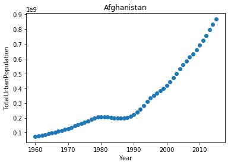

#### Iterator, Generator, List comprehensions, generators for streaming data & large files

-----------------------
### Iterating


```python
import pandas as pd
```


```python
flist = ['targaryen', 'stark', 'baratheon', 'tully', 'lannister', 'tyrell', 'martell']
alist = ['dragon','wolf','deer','fish','lion','rose','sun']
nlist = ['대너리스','에다드','로버트','브린덴','제이미','로라스','도란'];
```


```python
for item in flist:
    print(item)
```

    targaryen
    stark
    baratheon
    tully
    lannister
    tyrell
    martell
    


```python
# make iterator from list
superspeed = iter(flist)

print(next(superspeed))
print(next(superspeed))
print(next(superspeed))
```

    targaryen
    stark
    baratheon
    


```python
small_value = iter(range(3))

print(next(small_value))
print(next(small_value))
print(next(small_value))
```

    0
    1
    2
    


```python
googol = iter(range(10 ** 1000))   # big number - may not work

print(next(googol))
print(next(googol))
```

    0
    1
    

###  enumerate


```python
enumlist = list(enumerate(flist))   # list of tuple
print(enumlist)
```

    [(0, 'targaryen'), (1, 'stark'), (2, 'baratheon'), (3, 'tully'), (4, 'lannister'), (5, 'tyrell'), (6, 'martell')]
    


```python
for index1, value1 in enumlist:    # unpack tuple
    print(index1, value1)
```

    0 targaryen
    1 stark
    2 baratheon
    3 tully
    4 lannister
    5 tyrell
    6 martell
    


```python
for index2, value2 in enumerate(flist, start = 1):   # Change the start index
    print(index2, value2)
```

    1 targaryen
    2 stark
    3 baratheon
    4 tully
    5 lannister
    6 tyrell
    7 martell
    

### zip


```python
m_data = list(zip(nlist, flist, alist))
print(m_data)
```

    [('대너리스', 'targaryen', 'dragon'), ('에다드', 'stark', 'wolf'), ('로버트', 'baratheon', 'deer'), ('브린덴', 'tully', 'fish'), ('제이미', 'lannister', 'lion'), ('로라스', 'tyrell', 'rose'), ('도란', 'martell', 'sun')]
    


```python
m_zip = zip(nlist, flist, alist)   # create zip object

print(m_zip)

for value1, value2, value3 in m_zip:   # unzip
    print(value1, value2, value3)
```

    <zip object at 0x0000017E86695F48>
    대너리스 targaryen dragon
    에다드 stark wolf
    로버트 baratheon deer
    브린덴 tully fish
    제이미 lannister lion
    로라스 tyrell rose
    도란 martell sun
    


```python
# unzip (*)
m_zip = zip(nlist, flist, alist) 
print(*m_zip)
```

    ('대너리스', 'targaryen', 'dragon') ('에다드', 'stark', 'wolf') ('로버트', 'baratheon', 'deer') ('브린덴', 'tully', 'fish') ('제이미', 'lannister', 'lion') ('로라스', 'tyrell', 'rose') ('도란', 'martell', 'sun')
    


```python
m_zip = zip(nlist, flist, alist) 
result1, result2, result3 = zip(*m_zip)  # unzip to tuple
print(result2)
print(flist)
print(result2 == flist)   # Check if unpacked tuples are equivalent to original tuples
```

    ('targaryen', 'stark', 'baratheon', 'tully', 'lannister', 'tyrell', 'martell')
    ['targaryen', 'stark', 'baratheon', 'tully', 'lannister', 'tyrell', 'martell']
    False
    

### iteration by chunk


```python
counts_dict = {}

# Iterate over the file chunk by chunk
for chunk in pd.read_csv('data/tweets.csv', chunksize = 10):
    # Iterate over the column in dataframe
    for entry in chunk.lang:
        if entry in counts_dict.keys():
            counts_dict[entry] += 1
        else:
            counts_dict[entry] = 1

print(counts_dict)
```

    {'kr': 12, 'jp': 36, 'ru': 6, 'en': 222, 'et': 24}
    


```python
# count entry function with chunksize
```


```python
def count_entries(csv_file, c_size, colname):
    """Return a dictionary with counts of ccurrences as value for each key."""
    
    counts_dict = {}

    for chunk in pd.read_csv(csv_file, chunksize=c_size):
        for entry in chunk[colname]:
            if entry in counts_dict.keys():
                counts_dict[entry] += 1
            else:
                counts_dict[entry] = 1

    return counts_dict
```


```python
result_counts = count_entries('data/tweets.csv', 10, 'lang')
print(result_counts)
```

    {'kr': 12, 'jp': 36, 'ru': 6, 'en': 222, 'et': 24}
    

# List comprehensions


```python
squares = [i**2 for i in range(10)]
```


```python
# Create a 5 x 5 matrix using a list of lists
matrix = [[col for col in range(5)] for row in range(5)]

for row in matrix:
    print(row)
```

    [0, 1, 2, 3, 4]
    [0, 1, 2, 3, 4]
    [0, 1, 2, 3, 4]
    [0, 1, 2, 3, 4]
    [0, 1, 2, 3, 4]
    


```python
# conditionals in comprehensions
```


```python
new_fellowship = [member for member in flist if len(member) >= 7]
print(new_fellowship)
```

    ['targaryen', 'baratheon', 'lannister', 'martell']
    


```python
new_fellowship = [member if len(member) >= 7 else '' for member in flist]
print(new_fellowship)
```

    ['targaryen', '', 'baratheon', '', 'lannister', '', 'martell']
    


```python
# tweet_clock_time = [entry[11:19] for entry in tweet_time if entry[17:19] == '19']
```


```python
# Dict comprehensions
```


```python
new_fellowship = {member:len(member) for member in flist}
print(new_fellowship)
```

    {'tully': 5, 'tyrell': 6, 'martell': 7, 'targaryen': 9, 'stark': 5, 'baratheon': 9, 'lannister': 9}
    

## Generator : Lazy evaluation


```python
# Create a generator object
lengths = (len(person) for person in flist)

for value in lengths:
    print(value)
```

    9
    5
    9
    5
    9
    6
    7
    


```python
# [num for num in range(10**10000000)]  -- 대용량 데이터일 경우 문제 발생
```


```python
# (num for num in range(10**100000))   # generator 객체 만든 후 요청시에만 처리되기 때문에 대용량 데이터 처리시 안전.
```

### Dictionary by zip


```python
# 2개의 list 를 dictionary로 만드는 함수
```


```python
def lists2dict(list1, list2):
    """list1 provides the keys and list2 provides the values."""

    zipped_lists = zip(list1, list2)
    rs_dict = dict(zipped_lists)
    return rs_dict
```


```python
fa_dict = lists2dict(alist, flist)
fa_dict
```


    {'deer': 'baratheon',
     'dragon': 'targaryen',
     'fish': 'tully',
     'lion': 'lannister',
     'rose': 'tyrell',
     'sun': 'martell',
     'wolf': 'stark'}


### list + list   >  dictionary   >   dataframe


```python
feature_names = ['familyname','firstname','crest']
```


```python
row_list = []
m_zip = zip(flist, nlist, alist)

for value1, value2, value3 in m_zip:
    item = (value1, value2, value3)
    row_list.append(item)
    
row_list
```


    [('targaryen', '대너리스', 'dragon'),
     ('stark', '에다드', 'wolf'),
     ('baratheon', '로버트', 'deer'),
     ('tully', '브린덴', 'fish'),
     ('lannister', '제이미', 'lion'),
     ('tyrell', '로라스', 'rose'),
     ('martell', '도란', 'sun')]


```python
list_of_dicts = [lists2dict(feature_names, sublist) for sublist in row_list]
list_of_dicts
```


    [{'crest': 'dragon', 'familyname': 'targaryen', 'firstname': '대너리스'},
     {'crest': 'wolf', 'familyname': 'stark', 'firstname': '에다드'},
     {'crest': 'deer', 'familyname': 'baratheon', 'firstname': '로버트'},
     {'crest': 'fish', 'familyname': 'tully', 'firstname': '브린덴'},
     {'crest': 'lion', 'familyname': 'lannister', 'firstname': '제이미'},
     {'crest': 'rose', 'familyname': 'tyrell', 'firstname': '로라스'},
     {'crest': 'sun', 'familyname': 'martell', 'firstname': '도란'}]


```python
df_game = pd.DataFrame(list_of_dicts)
df_game
```


<div>
<table border="1" class="dataframe">
  <thead>
    <tr style="text-align: right;">
      <th></th>
      <th>crest</th>
      <th>familyname</th>
      <th>firstname</th>
    </tr>
  </thead>
  <tbody>
    <tr>
      <th>0</th>
      <td>dragon</td>
      <td>targaryen</td>
      <td>대너리스</td>
    </tr>
    <tr>
      <th>1</th>
      <td>wolf</td>
      <td>stark</td>
      <td>에다드</td>
    </tr>
    <tr>
      <th>2</th>
      <td>deer</td>
      <td>baratheon</td>
      <td>로버트</td>
    </tr>
    <tr>
      <th>3</th>
      <td>fish</td>
      <td>tully</td>
      <td>브린덴</td>
    </tr>
    <tr>
      <th>4</th>
      <td>lion</td>
      <td>lannister</td>
      <td>제이미</td>
    </tr>
    <tr>
      <th>5</th>
      <td>rose</td>
      <td>tyrell</td>
      <td>로라스</td>
    </tr>
    <tr>
      <th>6</th>
      <td>sun</td>
      <td>martell</td>
      <td>도란</td>
    </tr>
  </tbody>
</table>
</div>


## Python generators for streaming data

* Use a generator to load a file line by line.
* Works on streaming data.
* Read and process the file until all lines are exhausted.

### 일반적인 방법


```python
# Open a connection to the file
with open('data/movielens_ratings.csv') as file:

    file.readline()   # Skip the column names
    
    counts_dict = {}

    # Process only the first 1000 rows
    for j in range(1000):

        # Split the current line into a list: line
        line = file.readline().split(',')

        # Get the value for the first column:  userid
        first_col = line[0]

        # userId 별 평점 부여 횟수
        if first_col in counts_dict.keys():
            counts_dict[first_col] += 1
        else:
            counts_dict[first_col] = 1

print(counts_dict)
```

    {'3': 51, '14': 20, '9': 45, '8': 116, '10': 46, '12': 61, '1': 20, '15': 38, '4': 204, '5': 100, '2': 76, '13': 53, '7': 88, '11': 38, '6': 44}
    

### Large file인 경우 처리방법


```python
def read_large_file(file_object):
    """A generator function to read a large file lazily."""

    # Loop indefinitely until the end of the file
    while True:
        data = file_object.readline()

        # Break if this is the end of the file
        if not data:
            break

        # Yield the line of data
        yield data
```


```python
counts_dict = {}
counts = 0

with open('data/movielens_ratings.csv') as file:
    # Iterate over the generator from read_large_file()
    for line in read_large_file(file):
        counts += 1
        if counts >= 1000:
            break
            
        row = line.split(',')
        first_col = row[0]

        if first_col in counts_dict.keys():
            counts_dict[first_col] += 1
        else:
            counts_dict[first_col] = 1
            
print(counts_dict)
```

    {'3': 51, '14': 20, 'userId': 1, '9': 45, '8': 116, '10': 46, '12': 61, '1': 20, '15': 36, '4': 204, '5': 100, '2': 76, '13': 53, '7': 88, '11': 38, '6': 44}
    

### iterator to load data in chunks


```python
file_reader = pd.read_csv('data/movielens_ratings.csv', chunksize=1000)  

# Get the first dataframe chunk
df_reader = next(file_reader)
```


```python
df_reader.head()
```


<div>
<table border="1" class="dataframe">
  <thead>
    <tr style="text-align: right;">
      <th></th>
      <th>userId</th>
      <th>movieId</th>
      <th>rating</th>
      <th>timestamp</th>
    </tr>
  </thead>
  <tbody>
    <tr>
      <th>0</th>
      <td>1</td>
      <td>31</td>
      <td>2.5</td>
      <td>1260759144</td>
    </tr>
    <tr>
      <th>1</th>
      <td>1</td>
      <td>1029</td>
      <td>3.0</td>
      <td>1260759179</td>
    </tr>
    <tr>
      <th>2</th>
      <td>1</td>
      <td>1061</td>
      <td>3.0</td>
      <td>1260759182</td>
    </tr>
    <tr>
      <th>3</th>
      <td>1</td>
      <td>1129</td>
      <td>2.0</td>
      <td>1260759185</td>
    </tr>
    <tr>
      <th>4</th>
      <td>1</td>
      <td>1172</td>
      <td>4.0</td>
      <td>1260759205</td>
    </tr>
  </tbody>
</table>
</div>


### iterator to load data in chunks 2


```python
import matplotlib.pyplot as plt
%matplotlib inline
```


```python
# Initialize reader object: urb_pop_reader
urb_pop_reader = pd.read_csv('data/ind_pop_data.csv', chunksize=1000)

# Get the first dataframe chunk: df_urb_pop
df_urb_pop = next(urb_pop_reader)

# Check out specific country: df_pop_ceb
df_pop_ceb = df_urb_pop[df_urb_pop['CountryCode'] == 'AFG']
df_pop_ceb.head()
```


<div>
<table border="1" class="dataframe">
  <thead>
    <tr style="text-align: right;">
      <th></th>
      <th>CountryName</th>
      <th>CountryCode</th>
      <th>Year</th>
      <th>TotalPop</th>
      <th>UrbanPopRatio</th>
    </tr>
  </thead>
  <tbody>
    <tr>
      <th>0</th>
      <td>Afghanistan</td>
      <td>AFG</td>
      <td>1960</td>
      <td>8990000.0</td>
      <td>8.22</td>
    </tr>
    <tr>
      <th>1</th>
      <td>Afghanistan</td>
      <td>AFG</td>
      <td>1961</td>
      <td>9160000.0</td>
      <td>8.51</td>
    </tr>
    <tr>
      <th>2</th>
      <td>Afghanistan</td>
      <td>AFG</td>
      <td>1962</td>
      <td>9340000.0</td>
      <td>8.81</td>
    </tr>
    <tr>
      <th>3</th>
      <td>Afghanistan</td>
      <td>AFG</td>
      <td>1963</td>
      <td>9530000.0</td>
      <td>9.11</td>
    </tr>
    <tr>
      <th>4</th>
      <td>Afghanistan</td>
      <td>AFG</td>
      <td>1964</td>
      <td>9730000.0</td>
      <td>9.43</td>
    </tr>
  </tbody>
</table>
</div>


```python
# Zip dataframe columns of interest: pops
pops = zip(df_pop_ceb['TotalPop'], df_pop_ceb['UrbanPopRatio'])

# Turn zip object into list: pops_list
pops_list = list(pops)
```


```python
# Use list comprehension to create new dataframe column 'Total Urban Population'
df_pop_ceb['TotalUrbanPopulation'] = [int(tup[0] * tup[1]) for tup in pops_list]
df_pop_ceb.head()
```

    C:\Python\Anaconda3\lib\site-packages\ipykernel\__main__.py:2: SettingWithCopyWarning: 
    A value is trying to be set on a copy of a slice from a DataFrame.
    Try using .loc[row_indexer,col_indexer] = value instead
    
    See the caveats in the documentation: http://pandas.pydata.org/pandas-docs/stable/indexing.html#indexing-view-versus-copy
      from ipykernel import kernelapp as app
    


<div>
<table border="1" class="dataframe">
  <thead>
    <tr style="text-align: right;">
      <th></th>
      <th>CountryName</th>
      <th>CountryCode</th>
      <th>Year</th>
      <th>TotalPop</th>
      <th>UrbanPopRatio</th>
      <th>TotalUrbanPopulation</th>
    </tr>
  </thead>
  <tbody>
    <tr>
      <th>0</th>
      <td>Afghanistan</td>
      <td>AFG</td>
      <td>1960</td>
      <td>8990000.0</td>
      <td>8.22</td>
      <td>73897800</td>
    </tr>
    <tr>
      <th>1</th>
      <td>Afghanistan</td>
      <td>AFG</td>
      <td>1961</td>
      <td>9160000.0</td>
      <td>8.51</td>
      <td>77951600</td>
    </tr>
    <tr>
      <th>2</th>
      <td>Afghanistan</td>
      <td>AFG</td>
      <td>1962</td>
      <td>9340000.0</td>
      <td>8.81</td>
      <td>82285400</td>
    </tr>
    <tr>
      <th>3</th>
      <td>Afghanistan</td>
      <td>AFG</td>
      <td>1963</td>
      <td>9530000.0</td>
      <td>9.11</td>
      <td>86818300</td>
    </tr>
    <tr>
      <th>4</th>
      <td>Afghanistan</td>
      <td>AFG</td>
      <td>1964</td>
      <td>9730000.0</td>
      <td>9.43</td>
      <td>91753900</td>
    </tr>
  </tbody>
</table>
</div>


```python
# Plot urban population data
plt.scatter(df_pop_ceb['Year'], df_pop_ceb['TotalUrbanPopulation'])
plt.xlabel('Year')
plt.ylabel('TotalUrbanPopulation')
plt.title('Afghanistan')
```


    <matplotlib.text.Text at 0x17e880b7a58>




