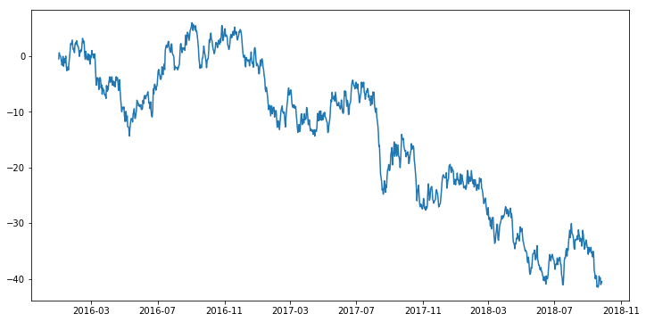
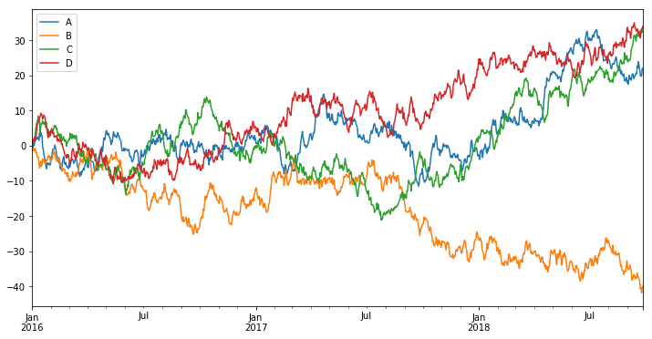
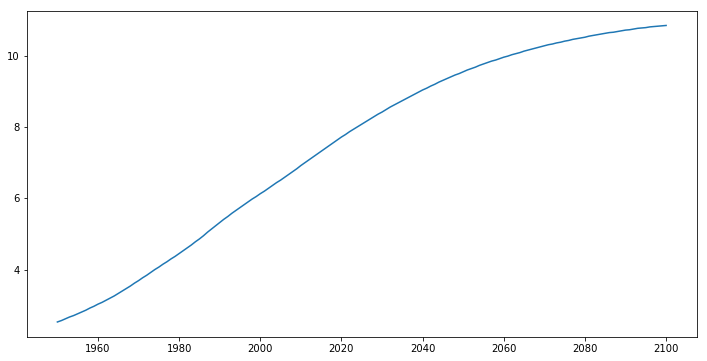
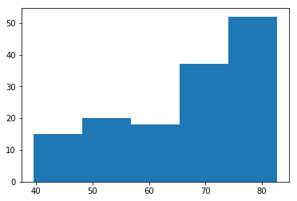
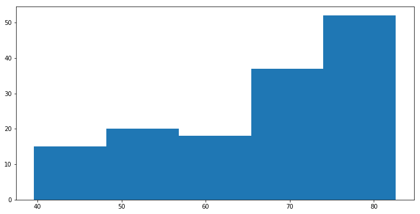
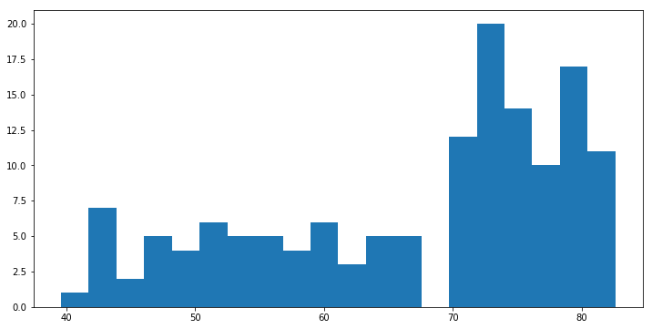
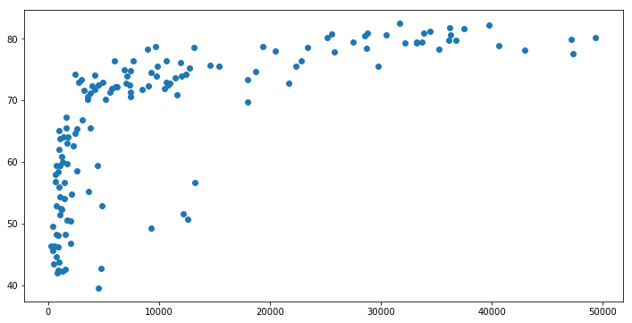
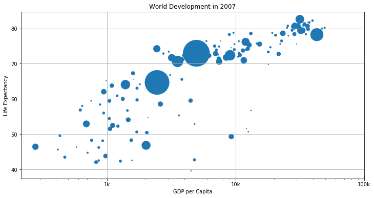

### matplotlib 사용한 plot 그리기 기초


```python
import pandas as pd
import numpy as np
import matplotlib.pyplot as plt
%matplotlib inline
```


```python
# setting plot defatult size
%pylab inline
pylab.rcParams['figure.figsize'] = (12, 6)
```

    Populating the interactive namespace from numpy and matplotlib
    


```python
ts = pd.Series(np.random.randn(1000), 
               index=pd.date_range('2016/1/1',periods=1000))
```


```python
ts = ts.cumsum()  # row 값 누적하여 합산
```


```python
ts.head()
```


    2016-01-01   -0.464964
    2016-01-02    0.634576
    2016-01-03    0.177443
    2016-01-04    0.085528
    2016-01-05   -0.253183
    Freq: D, dtype: float64


```python
ts.tail()
```


    2018-09-22   -40.263403
    2018-09-23   -39.797074
    2018-09-24   -41.015092
    2018-09-25   -40.832436
    2018-09-26   -40.470858
    Freq: D, dtype: float64


```python
plt.plot(ts)
```


    [<matplotlib.lines.Line2D at 0x268f4bf1828>]





### 컬럼이 여러 개인 경우


```python
df = pd.DataFrame(np.random.randn(1000, 4), 
                  index=ts.index, columns=['A', 'B', 'C', 'D'])
df = df.cumsum()
```


```python
df.head()
```


<div>
<table border="1" class="dataframe">
  <thead>
    <tr style="text-align: right;">
      <th></th>
      <th>A</th>
      <th>B</th>
      <th>C</th>
      <th>D</th>
    </tr>
  </thead>
  <tbody>
    <tr>
      <th>2016-01-01</th>
      <td>0.850207</td>
      <td>-0.579718</td>
      <td>1.218229</td>
      <td>0.896665</td>
    </tr>
    <tr>
      <th>2016-01-02</th>
      <td>-0.446368</td>
      <td>-1.388548</td>
      <td>0.560629</td>
      <td>1.653028</td>
    </tr>
    <tr>
      <th>2016-01-03</th>
      <td>0.746224</td>
      <td>-0.747689</td>
      <td>0.734712</td>
      <td>0.975451</td>
    </tr>
    <tr>
      <th>2016-01-04</th>
      <td>-0.029627</td>
      <td>-1.422848</td>
      <td>1.710342</td>
      <td>2.105175</td>
    </tr>
    <tr>
      <th>2016-01-05</th>
      <td>0.735473</td>
      <td>-1.094084</td>
      <td>1.792831</td>
      <td>2.489641</td>
    </tr>
  </tbody>
</table>
</div>


```python
plt.figure()
df.plot()               # plt 레이어 위에 컬럼별로 그래프 표현
plt.legend(loc='best')  # 범례 위치를 자동으로 설정
```


    <matplotlib.legend.Legend at 0x268f4bdc1d0>


    <matplotlib.figure.Figure at 0x268f4c426d8>





### csv, excel 파일로 저장


```python
df.to_csv('test1.csv')
```


```python
df.to_excel('test2.xlsx', sheet_name='cumsum')
```

### csv 파일에서 데이터 불러오기


```python
df = pd.read_csv('data/population.csv', index_col=0) # 첫번째 컬럼을 인덱스로 사용
```


```python
df.head()
```


<div>
<table border="1" class="dataframe">
  <thead>
    <tr style="text-align: right;">
      <th></th>
      <th>pop</th>
      <th>year</th>
    </tr>
  </thead>
  <tbody>
    <tr>
      <th>0</th>
      <td>2.53</td>
      <td>1950</td>
    </tr>
    <tr>
      <th>1</th>
      <td>2.57</td>
      <td>1951</td>
    </tr>
    <tr>
      <th>2</th>
      <td>2.62</td>
      <td>1952</td>
    </tr>
    <tr>
      <th>3</th>
      <td>2.67</td>
      <td>1953</td>
    </tr>
    <tr>
      <th>4</th>
      <td>2.71</td>
      <td>1954</td>
    </tr>
  </tbody>
</table>
</div>


```python
df.tail()
```


<div>
<table border="1" class="dataframe">
  <thead>
    <tr style="text-align: right;">
      <th></th>
      <th>pop</th>
      <th>year</th>
    </tr>
  </thead>
  <tbody>
    <tr>
      <th>146</th>
      <td>10.81</td>
      <td>2096</td>
    </tr>
    <tr>
      <th>147</th>
      <td>10.82</td>
      <td>2097</td>
    </tr>
    <tr>
      <th>148</th>
      <td>10.83</td>
      <td>2098</td>
    </tr>
    <tr>
      <th>149</th>
      <td>10.84</td>
      <td>2099</td>
    </tr>
    <tr>
      <th>150</th>
      <td>10.85</td>
      <td>2100</td>
    </tr>
  </tbody>
</table>
</div>


```python
plt.plot(df['year'], df['pop'])
```


    [<matplotlib.lines.Line2D at 0x268f4daffd0>]





### 히스토그램


```python
df = pd.read_csv('data/worldreport.csv', index_col=0)
```


```python
df.head()
```


<div>
<table border="1" class="dataframe">
  <thead>
    <tr style="text-align: right;">
      <th></th>
      <th>gdp_cap</th>
      <th>life_exp</th>
      <th>popul</th>
    </tr>
  </thead>
  <tbody>
    <tr>
      <th>0</th>
      <td>974.58</td>
      <td>43.82</td>
      <td>31.88</td>
    </tr>
    <tr>
      <th>1</th>
      <td>5937.02</td>
      <td>76.42</td>
      <td>3.60</td>
    </tr>
    <tr>
      <th>2</th>
      <td>6223.36</td>
      <td>72.30</td>
      <td>33.33</td>
    </tr>
    <tr>
      <th>3</th>
      <td>4797.23</td>
      <td>42.73</td>
      <td>12.42</td>
    </tr>
    <tr>
      <th>4</th>
      <td>12779.37</td>
      <td>75.31</td>
      <td>40.30</td>
    </tr>
  </tbody>
</table>
</div>


```python
plt.hist(df['life_exp'])   # 자동으로 데이터를 나눔 (binning)
```


    (array([  8.,   7.,  10.,  10.,  10.,   8.,   5.,  32.,  24.,  28.]),
     array([ 39.61 ,  43.909,  48.208,  52.507,  56.806,  61.105,  65.404,
             69.703,  74.002,  78.301,  82.6  ]),
     <a list of 10 Patch objects>)





```python
plt.hist(df['life_exp'], bins = 5)   # 연속형 변수의 범주를 5개로 나눈다.
```


    (array([ 15.,  20.,  18.,  37.,  52.]),
     array([ 39.61 ,  48.208,  56.806,  65.404,  74.002,  82.6  ]),
     <a list of 5 Patch objects>)





```python
plt.hist(df['life_exp'], bins = 20)   # 연속형 변수의 범주를 20개로 나눈다
```


    (array([  1.,   7.,   2.,   5.,   4.,   6.,   5.,   5.,   4.,   6.,   3.,
              5.,   5.,   0.,  12.,  20.,  14.,  10.,  17.,  11.]),
     array([ 39.61  ,  41.7595,  43.909 ,  46.0585,  48.208 ,  50.3575,
             52.507 ,  54.6565,  56.806 ,  58.9555,  61.105 ,  63.2545,
             65.404 ,  67.5535,  69.703 ,  71.8525,  74.002 ,  76.1515,
             78.301 ,  80.4505,  82.6   ]),
     <a list of 20 Patch objects>)





### 산점도 (Scatter plot)


```python
plt.scatter(df['gdp_cap'], df['life_exp'])
```


    <matplotlib.collections.PathCollection at 0x268f5268f98>





```python
# 인구에 따른 점 크기 표현
```


```python
plt.scatter(df['gdp_cap'], df['life_exp'], s = np.array(df['popul']) * 2)
plt.xscale('log')               # 단위가 크기 때문에 log 변환
plt.xlabel('GDP per Capita')
plt.ylabel('Life Expectancy')
plt.title('World Development in 2007')
tick_val = [1000,10000,100000]
tick_lab = ['1k','10k','100k']
plt.xticks(tick_val, tick_lab)  # Adapt the ticks on the x-axis
plt.grid(True)
```




