#### line chart, box plot, scatter plot, histogram, Rolling means (moving averages)

----------------


```python
import pandas as pd
import numpy as np
```


```python
%matplotlib inline
import matplotlib.pyplot as plt
```


```python
# setting plot defatult size
%pylab inline
pylab.rcParams['figure.figsize'] = (12, 6)
```

    Populating the interactive namespace from numpy and matplotlib


```python
df = pd.read_csv('data/ind_pop_data.csv')
df.head()
```


<div>
<table border="1" class="dataframe">
  <thead>
    <tr style="text-align: right;">
      <th></th>
      <th>CountryName</th>
      <th>CountryCode</th>
      <th>Year</th>
      <th>TotalPop</th>
      <th>UrbanPopRatio</th>
    </tr>
  </thead>
  <tbody>
    <tr>
      <th>0</th>
      <td>Afghanistan</td>
      <td>AFG</td>
      <td>1960</td>
      <td>8990000.0</td>
      <td>8.22</td>
    </tr>
    <tr>
      <th>1</th>
      <td>Afghanistan</td>
      <td>AFG</td>
      <td>1961</td>
      <td>9160000.0</td>
      <td>8.51</td>
    </tr>
    <tr>
      <th>2</th>
      <td>Afghanistan</td>
      <td>AFG</td>
      <td>1962</td>
      <td>9340000.0</td>
      <td>8.81</td>
    </tr>
    <tr>
      <th>3</th>
      <td>Afghanistan</td>
      <td>AFG</td>
      <td>1963</td>
      <td>9530000.0</td>
      <td>9.11</td>
    </tr>
    <tr>
      <th>4</th>
      <td>Afghanistan</td>
      <td>AFG</td>
      <td>1964</td>
      <td>9730000.0</td>
      <td>9.43</td>
    </tr>
  </tbody>
</table>
</div>


```python
df.values
```


    array([['Afghanistan', 'AFG', 1960, 8990000.0, 8.22],
           ['Afghanistan', 'AFG', 1961, 9160000.0, 8.51],
           ['Afghanistan', 'AFG', 1962, 9340000.0, 8.81],
           ..., 
           ['Zimbabwe', 'ZWE', 2013, 14900000.0, 32.7],
           ['Zimbabwe', 'ZWE', 2014, 15200000.0, 32.5],
           ['Zimbabwe', 'ZWE', 2015, 15600000.0, 32.4]], dtype=object)


```python
df.index
```


    RangeIndex(start=0, stop=14612, step=1)


------
### create dataframe from dictionary


```python
#1. by zip lists
```


```python
list_keys = ['country', 'population']
list_values = [['targaryen', 'stark'], [579, 973]]
```


```python
zipped = list(zip(list_keys,list_values))
data = dict(zipped)
df_zip = pd.DataFrame(data)
df_zip
```


<div>
<table border="1" class="dataframe">
  <thead>
    <tr style="text-align: right;">
      <th></th>
      <th>country</th>
      <th>population</th>
    </tr>
  </thead>
  <tbody>
    <tr>
      <th>0</th>
      <td>targaryen</td>
      <td>579</td>
    </tr>
    <tr>
      <th>1</th>
      <td>stark</td>
      <td>973</td>
    </tr>
  </tbody>
</table>
</div>


```python
df_zip.columns = ['kingdom', 'army'];   # change column labels
df_zip
```


<div>
<table border="1" class="dataframe">
  <thead>
    <tr style="text-align: right;">
      <th></th>
      <th>kingdom</th>
      <th>army</th>
    </tr>
  </thead>
  <tbody>
    <tr>
      <th>0</th>
      <td>targaryen</td>
      <td>579</td>
    </tr>
    <tr>
      <th>1</th>
      <td>stark</td>
      <td>973</td>
    </tr>
  </tbody>
</table>
</div>


```python
# 2. by broadcasting
```


```python
data = {'kingdom':list_values[0], 'babies':list_values[1]}
df_dict = pd.DataFrame(data)
df_dict
```


<div>
<table border="1" class="dataframe">
  <thead>
    <tr style="text-align: right;">
      <th></th>
      <th>babies</th>
      <th>kingdom</th>
    </tr>
  </thead>
  <tbody>
    <tr>
      <th>0</th>
      <td>579</td>
      <td>targaryen</td>
    </tr>
    <tr>
      <th>1</th>
      <td>973</td>
      <td>stark</td>
    </tr>
  </tbody>
</table>
</div>


------------------
## Importing & Exporting

#### 데이터가 깔끔하지 않은 파일에서 데이터 가져오기


```python
# df1 = pd.read_csv(file_messy, header=0, names=new_col_names)
# df2 = pd.read_csv(file_messy, delimiter=' ', header=3, comment='#')
```

#### 데이터 저장하기


```python
# df2.to_csv(file_clean, index=False)              # Save the DataFrame to a CSV file without the index
# df2.to_excel('file_clean.xlsx', index=False)   # Save the DataFrame to an excel file without the index
```

---------------
## Ploting with pandas


```python
df_pop = pd.read_csv('data/ind_pop_data.csv')
df_pop.head()
```


<div>
<table border="1" class="dataframe">
  <thead>
    <tr style="text-align: right;">
      <th></th>
      <th>CountryName</th>
      <th>CountryCode</th>
      <th>Year</th>
      <th>TotalPop</th>
      <th>UrbanPopRatio</th>
    </tr>
  </thead>
  <tbody>
    <tr>
      <th>0</th>
      <td>Afghanistan</td>
      <td>AFG</td>
      <td>1960</td>
      <td>8990000.0</td>
      <td>8.22</td>
    </tr>
    <tr>
      <th>1</th>
      <td>Afghanistan</td>
      <td>AFG</td>
      <td>1961</td>
      <td>9160000.0</td>
      <td>8.51</td>
    </tr>
    <tr>
      <th>2</th>
      <td>Afghanistan</td>
      <td>AFG</td>
      <td>1962</td>
      <td>9340000.0</td>
      <td>8.81</td>
    </tr>
    <tr>
      <th>3</th>
      <td>Afghanistan</td>
      <td>AFG</td>
      <td>1963</td>
      <td>9530000.0</td>
      <td>9.11</td>
    </tr>
    <tr>
      <th>4</th>
      <td>Afghanistan</td>
      <td>AFG</td>
      <td>1964</td>
      <td>9730000.0</td>
      <td>9.43</td>
    </tr>
  </tbody>
</table>
</div>


```python
# example 1
```


```python
df_c = df_pop[df_pop['CountryCode'] == 'CEB'].loc[:,['TotalPop','UrbanPopRatio']]
df_c.TotalPop = df_c.TotalPop / 1000000
df_c.head()
```


<div>
<table border="1" class="dataframe">
  <thead>
    <tr style="text-align: right;">
      <th></th>
      <th>TotalPop</th>
      <th>UrbanPopRatio</th>
    </tr>
  </thead>
  <tbody>
    <tr>
      <th>2240</th>
      <td>91.4</td>
      <td>44.5</td>
    </tr>
    <tr>
      <th>2241</th>
      <td>92.2</td>
      <td>45.2</td>
    </tr>
    <tr>
      <th>2242</th>
      <td>93.0</td>
      <td>45.9</td>
    </tr>
    <tr>
      <th>2243</th>
      <td>93.8</td>
      <td>46.5</td>
    </tr>
    <tr>
      <th>2244</th>
      <td>94.7</td>
      <td>47.2</td>
    </tr>
  </tbody>
</table>
</div>


```python
df_c.plot()
```


    <matplotlib.axes._subplots.AxesSubplot at 0x10d612198>


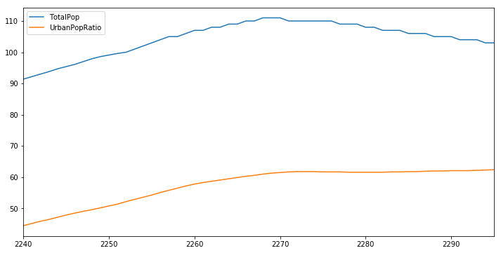


```python
# example 2
```


```python
df_k = df_pop[df_pop['CountryCode'] == 'KOR'].loc[:,['Year','TotalPop','UrbanPopRatio']]
df_k.TotalPop = df_k.TotalPop / 1000000
df_k.head()
```


<div>
<table border="1" class="dataframe">
  <thead>
    <tr style="text-align: right;">
      <th></th>
      <th>Year</th>
      <th>TotalPop</th>
      <th>UrbanPopRatio</th>
    </tr>
  </thead>
  <tbody>
    <tr>
      <th>6884</th>
      <td>1960</td>
      <td>25.0</td>
      <td>27.7</td>
    </tr>
    <tr>
      <th>6885</th>
      <td>1961</td>
      <td>25.8</td>
      <td>28.5</td>
    </tr>
    <tr>
      <th>6886</th>
      <td>1962</td>
      <td>26.5</td>
      <td>29.5</td>
    </tr>
    <tr>
      <th>6887</th>
      <td>1963</td>
      <td>27.3</td>
      <td>30.4</td>
    </tr>
    <tr>
      <th>6888</th>
      <td>1964</td>
      <td>28.0</td>
      <td>31.4</td>
    </tr>
  </tbody>
</table>
</div>


```python
plt.scatter(df_k['Year'], df_k['TotalPop'])
plt.scatter(df_k['Year'], df_k['UrbanPopRatio'])
plt.legend()
plt.title('Increase population in Korea')
plt.xlabel('Year')
```


    <matplotlib.text.Text at 0x111580320>


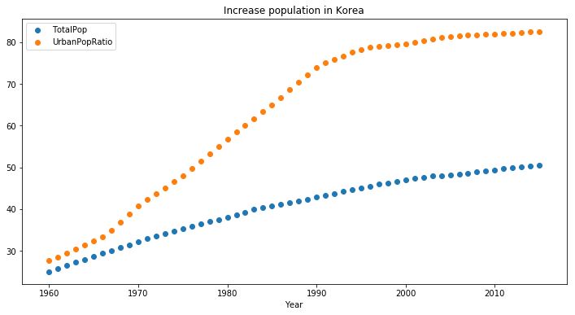


```python
# example 3
```


```python
year_s = pd.Series(list(df_k['Year']))
kor_s = pd.Series(list(df_k['UrbanPopRatio']))
ceb_s = pd.Series(list(df_c['UrbanPopRatio']))

df_new = pd.DataFrame()
df_new['Year'] = year_s
df_new['KOR'] = kor_s
df_new['CEB'] = ceb_s

df_new.head()
```


<div>
<table border="1" class="dataframe">
  <thead>
    <tr style="text-align: right;">
      <th></th>
      <th>Year</th>
      <th>KOR</th>
      <th>CEB</th>
    </tr>
  </thead>
  <tbody>
    <tr>
      <th>0</th>
      <td>1960</td>
      <td>27.7</td>
      <td>44.5</td>
    </tr>
    <tr>
      <th>1</th>
      <td>1961</td>
      <td>28.5</td>
      <td>45.2</td>
    </tr>
    <tr>
      <th>2</th>
      <td>1962</td>
      <td>29.5</td>
      <td>45.9</td>
    </tr>
    <tr>
      <th>3</th>
      <td>1963</td>
      <td>30.4</td>
      <td>46.5</td>
    </tr>
    <tr>
      <th>4</th>
      <td>1964</td>
      <td>31.4</td>
      <td>47.2</td>
    </tr>
  </tbody>
</table>
</div>


```python
df_new.plot(x='Year', y=['KOR','CEB'])
```


    <matplotlib.axes._subplots.AxesSubplot at 0x111583eb8>


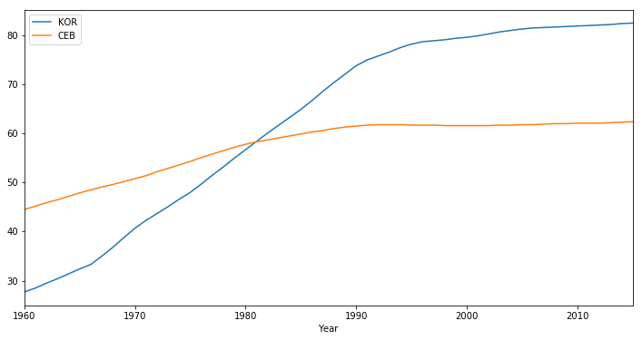


### boxplot


```python
kor_s = pd.Series(list(df_k['TotalPop']))
ceb_s = pd.Series(list(df_c['TotalPop']))

df_new = pd.DataFrame()
df_new['KOR'] = kor_s
df_new['CEB'] = ceb_s

df_new.head()
```


<div>
<table border="1" class="dataframe">
  <thead>
    <tr style="text-align: right;">
      <th></th>
      <th>KOR</th>
      <th>CEB</th>
    </tr>
  </thead>
  <tbody>
    <tr>
      <th>0</th>
      <td>25.0</td>
      <td>91.4</td>
    </tr>
    <tr>
      <th>1</th>
      <td>25.8</td>
      <td>92.2</td>
    </tr>
    <tr>
      <th>2</th>
      <td>26.5</td>
      <td>93.0</td>
    </tr>
    <tr>
      <th>3</th>
      <td>27.3</td>
      <td>93.8</td>
    </tr>
    <tr>
      <th>4</th>
      <td>28.0</td>
      <td>94.7</td>
    </tr>
  </tbody>
</table>
</div>


```python
cols = ['KOR', 'CEB']
df_new[cols].plot(kind='box')
```


    <matplotlib.axes._subplots.AxesSubplot at 0x111624198>


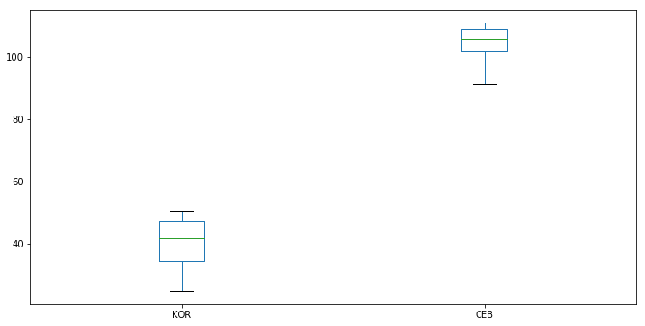


```python
cols = ['KOR', 'CEB']
df_new[cols].plot(kind='box', subplots=True)   # Generate the box plots
```


    KOR       Axes(0.125,0.125;0.352273x0.755)
    CEB    Axes(0.547727,0.125;0.352273x0.755)
    dtype: object


### histogram

* histogram, scatter plot  -- [pandas04](https://github.com/woosa7/PythonDataAnalysis/blob/master/pandas/pandas04.ipynb) 참조


```python
df = pd.read_csv('data/worldreport.csv', index_col=0)
df.head()
```


<div>
<table border="1" class="dataframe">
  <thead>
    <tr style="text-align: right;">
      <th></th>
      <th>gdp_cap</th>
      <th>life_exp</th>
      <th>popul</th>
    </tr>
  </thead>
  <tbody>
    <tr>
      <th>0</th>
      <td>974.58</td>
      <td>43.82</td>
      <td>31.88</td>
    </tr>
    <tr>
      <th>1</th>
      <td>5937.02</td>
      <td>76.42</td>
      <td>3.60</td>
    </tr>
    <tr>
      <th>2</th>
      <td>6223.36</td>
      <td>72.30</td>
      <td>33.33</td>
    </tr>
    <tr>
      <th>3</th>
      <td>4797.23</td>
      <td>42.73</td>
      <td>12.42</td>
    </tr>
    <tr>
      <th>4</th>
      <td>12779.37</td>
      <td>75.31</td>
      <td>40.30</td>
    </tr>
  </tbody>
</table>
</div>


```python
df.describe()
```


<div>
<table border="1" class="dataframe">
  <thead>
    <tr style="text-align: right;">
      <th></th>
      <th>gdp_cap</th>
      <th>life_exp</th>
      <th>popul</th>
    </tr>
  </thead>
  <tbody>
    <tr>
      <th>count</th>
      <td>142.000000</td>
      <td>142.000000</td>
      <td>142.000000</td>
    </tr>
    <tr>
      <th>mean</th>
      <td>11680.066831</td>
      <td>67.002908</td>
      <td>44.016514</td>
    </tr>
    <tr>
      <th>std</th>
      <td>12859.936734</td>
      <td>12.073475</td>
      <td>147.621369</td>
    </tr>
    <tr>
      <th>min</th>
      <td>277.550000</td>
      <td>39.610000</td>
      <td>0.190000</td>
    </tr>
    <tr>
      <th>25%</th>
      <td>1624.837500</td>
      <td>57.152500</td>
      <td>4.505000</td>
    </tr>
    <tr>
      <th>50%</th>
      <td>6124.365000</td>
      <td>71.934000</td>
      <td>10.515000</td>
    </tr>
    <tr>
      <th>75%</th>
      <td>18008.830000</td>
      <td>76.411000</td>
      <td>31.202500</td>
    </tr>
    <tr>
      <th>max</th>
      <td>49357.190000</td>
      <td>82.600000</td>
      <td>1318.680000</td>
    </tr>
  </tbody>
</table>
</div>


```python
df['life_exp'].plot(kind='hist', normed=True, bins=30)
```


    <matplotlib.axes._subplots.AxesSubplot at 0x111ab67b8>


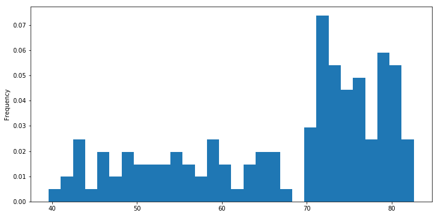


```python
# 누적 히스토그램
df['life_exp'].plot(kind='hist', normed=True, cumulative=True, bins=30, range=(35,95))
```


    <matplotlib.axes._subplots.AxesSubplot at 0x111ca2400>


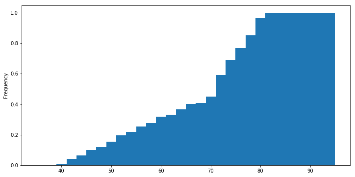


### boxplot


```python
df['life_exp'].plot(kind='box', figsize=(6,6))
```


    <matplotlib.axes._subplots.AxesSubplot at 0x111e37fd0>


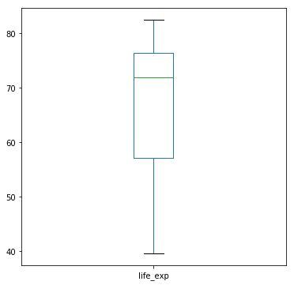


```python
# subplot 분리
```


```python
fig, axes = plt.subplots(nrows=1, ncols=3)
df_pop.loc[df_pop['Year'] == 1960].plot(ax=axes[0], y='UrbanPopRatio', kind='box', label='UrbanPopRatio 1960')
df_pop.loc[df_pop['Year'] == 1970].plot(ax=axes[1], y='UrbanPopRatio', kind='box', label='UrbanPopRatio 1970')
df_pop.loc[df_pop['Year'] == 1980].plot(ax=axes[2], y='UrbanPopRatio', kind='box', label='UrbanPopRatio 1980')
```


    <matplotlib.axes._subplots.AxesSubplot at 0x1123d0c50>


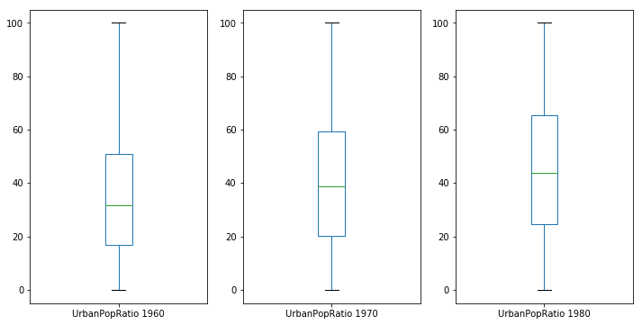


-------------
# Time Series

[pandas03](https://github.com/woosa7/PythonDataAnalysis/blob/master/pandas/pandas03.ipynb) 참조


```python
# df = pd.read_csv(filename, index_col='Date', parse_dates=True)
```


```python
df_time = pd.read_csv('data/Product_airtime.csv')
df_time.head()
```


<div>
<table border="1" class="dataframe">
  <thead>
    <tr style="text-align: right;">
      <th></th>
      <th>PRODUCT_ID</th>
      <th>AIR_DATE</th>
      <th>PRODUCT_AIRTIME_MINS</th>
      <th>PRODUCT_START_TMS</th>
      <th>PRODUCT_STOP_TMS</th>
    </tr>
  </thead>
  <tbody>
    <tr>
      <th>0</th>
      <td>2186</td>
      <td>2012-10-16 0:00</td>
      <td>0.38</td>
      <td>2012-10-16 0:43</td>
      <td>2012-10-16 0:44</td>
    </tr>
    <tr>
      <th>1</th>
      <td>2186</td>
      <td>2012-10-16 0:00</td>
      <td>5.08</td>
      <td>2012-10-16 0:48</td>
      <td>2012-10-16 0:53</td>
    </tr>
    <tr>
      <th>2</th>
      <td>2478</td>
      <td>2012-10-16 0:00</td>
      <td>0.50</td>
      <td>2012-10-16 0:25</td>
      <td>2012-10-16 0:26</td>
    </tr>
    <tr>
      <th>3</th>
      <td>2478</td>
      <td>2012-10-16 0:00</td>
      <td>12.53</td>
      <td>2012-10-16 0:31</td>
      <td>2012-10-16 0:43</td>
    </tr>
    <tr>
      <th>4</th>
      <td>6283</td>
      <td>2012-10-16 0:00</td>
      <td>0.43</td>
      <td>2012-10-16 0:47</td>
      <td>2012-10-16 0:48</td>
    </tr>
  </tbody>
</table>
</div>


```python
date_list = df_time['PRODUCT_START_TMS']
date_list[0:10]
```


    0    2012-10-16 0:43
    1    2012-10-16 0:48
    2    2012-10-16 0:25
    3    2012-10-16 0:31
    4    2012-10-16 0:47
    5    2012-10-16 0:53
    6    2012-10-16 0:00
    7    2012-10-16 0:53
    8    2012-10-16 0:59
    9    2012-10-16 0:19
    Name: PRODUCT_START_TMS, dtype: object


```python
# Convert date_list into a datetime object
time_format = '%Y-%m-%d %H:%M'
my_datetimes = pd.to_datetime(date_list, format=time_format)
my_datetimes[0:10]
```


    0   2012-10-16 00:43:00
    1   2012-10-16 00:48:00
    2   2012-10-16 00:25:00
    3   2012-10-16 00:31:00
    4   2012-10-16 00:47:00
    5   2012-10-16 00:53:00
    6   2012-10-16 00:00:00
    7   2012-10-16 00:53:00
    8   2012-10-16 00:59:00
    9   2012-10-16 00:19:00
    Name: PRODUCT_START_TMS, dtype: datetime64[ns]


```python
df_time = pd.read_csv('data/Product_airtime.csv', index_col='PRODUCT_START_TMS', parse_dates=True)
df_time.head()
```


<div>
<table border="1" class="dataframe">
  <thead>
    <tr style="text-align: right;">
      <th></th>
      <th>PRODUCT_ID</th>
      <th>AIR_DATE</th>
      <th>PRODUCT_AIRTIME_MINS</th>
      <th>PRODUCT_STOP_TMS</th>
    </tr>
    <tr>
      <th>PRODUCT_START_TMS</th>
      <th></th>
      <th></th>
      <th></th>
      <th></th>
    </tr>
  </thead>
  <tbody>
    <tr>
      <th>2012-10-16 00:43:00</th>
      <td>2186</td>
      <td>2012-10-16 0:00</td>
      <td>0.38</td>
      <td>2012-10-16 0:44</td>
    </tr>
    <tr>
      <th>2012-10-16 00:48:00</th>
      <td>2186</td>
      <td>2012-10-16 0:00</td>
      <td>5.08</td>
      <td>2012-10-16 0:53</td>
    </tr>
    <tr>
      <th>2012-10-16 00:25:00</th>
      <td>2478</td>
      <td>2012-10-16 0:00</td>
      <td>0.50</td>
      <td>2012-10-16 0:26</td>
    </tr>
    <tr>
      <th>2012-10-16 00:31:00</th>
      <td>2478</td>
      <td>2012-10-16 0:00</td>
      <td>12.53</td>
      <td>2012-10-16 0:43</td>
    </tr>
    <tr>
      <th>2012-10-16 00:47:00</th>
      <td>6283</td>
      <td>2012-10-16 0:00</td>
      <td>0.43</td>
      <td>2012-10-16 0:48</td>
    </tr>
  </tbody>
</table>
</div>


### TimeSeries 생성


```python
dateRange = pd.date_range('2017/03/01', periods=20, freq='D')
ts = pd.Series(range(len(dateRange)), index=dateRange)
ts[0:10]
```


    2017-03-01    0
    2017-03-02    1
    2017-03-03    2
    2017-03-04    3
    2017-03-05    4
    2017-03-06    5
    2017-03-07    6
    2017-03-08    7
    2017-03-09    8
    2017-03-10    9
    Freq: D, dtype: int64


```python
ts1 = ts.loc['2017-03-09']
ts1
```


    8


```python
ts2 = ts.loc['2017-03-05':'2017-03-10']
ts2
```


    2017-03-05    4
    2017-03-06    5
    2017-03-07    6
    2017-03-08    7
    2017-03-09    8
    2017-03-10    9
    Freq: D, dtype: int64


```python
sum12 = ts1 + ts2
sum12
```


    2017-03-05    12
    2017-03-06    13
    2017-03-07    14
    2017-03-08    15
    2017-03-09    16
    2017-03-10    17
    Freq: D, dtype: int64


```python
ts3 = ts2.reindex(ts.index)
ts3
```


    2017-03-01    NaN
    2017-03-02    NaN
    2017-03-03    NaN
    2017-03-04    NaN
    2017-03-05    4.0
    2017-03-06    5.0
    2017-03-07    6.0
    2017-03-08    7.0
    2017-03-09    8.0
    2017-03-10    9.0
    2017-03-11    NaN
    2017-03-12    NaN
    2017-03-13    NaN
    2017-03-14    NaN
    2017-03-15    NaN
    2017-03-16    NaN
    2017-03-17    NaN
    2017-03-18    NaN
    2017-03-19    NaN
    2017-03-20    NaN
    Freq: D, dtype: float64


```python
ts4 = ts2.reindex(ts.index, method='ffill')
ts4
```


    2017-03-01    NaN
    2017-03-02    NaN
    2017-03-03    NaN
    2017-03-04    NaN
    2017-03-05    4.0
    2017-03-06    5.0
    2017-03-07    6.0
    2017-03-08    7.0
    2017-03-09    8.0
    2017-03-10    9.0
    2017-03-11    9.0
    2017-03-12    9.0
    2017-03-13    9.0
    2017-03-14    9.0
    2017-03-15    9.0
    2017-03-16    9.0
    2017-03-17    9.0
    2017-03-18    9.0
    2017-03-19    9.0
    2017-03-20    9.0
    Freq: D, dtype: float64


```python
sum23 = ts2 + ts3
sum23
```


    2017-03-01     NaN
    2017-03-02     NaN
    2017-03-03     NaN
    2017-03-04     NaN
    2017-03-05     8.0
    2017-03-06    10.0
    2017-03-07    12.0
    2017-03-08    14.0
    2017-03-09    16.0
    2017-03-10    18.0
    2017-03-11     NaN
    2017-03-12     NaN
    2017-03-13     NaN
    2017-03-14     NaN
    2017-03-15     NaN
    2017-03-16     NaN
    2017-03-17     NaN
    2017-03-18     NaN
    2017-03-19     NaN
    2017-03-20     NaN
    Freq: D, dtype: float64


### Time Series Resample


```python
df_time = pd.read_csv('data/Product_airtime.csv', index_col='PRODUCT_START_TMS', parse_dates=True)
df_time.head()
```


<div>
<table border="1" class="dataframe">
  <thead>
    <tr style="text-align: right;">
      <th></th>
      <th>PRODUCT_ID</th>
      <th>AIR_DATE</th>
      <th>PRODUCT_AIRTIME_MINS</th>
      <th>PRODUCT_STOP_TMS</th>
    </tr>
    <tr>
      <th>PRODUCT_START_TMS</th>
      <th></th>
      <th></th>
      <th></th>
      <th></th>
    </tr>
  </thead>
  <tbody>
    <tr>
      <th>2012-10-16 00:43:00</th>
      <td>2186</td>
      <td>2012-10-16 0:00</td>
      <td>0.38</td>
      <td>2012-10-16 0:44</td>
    </tr>
    <tr>
      <th>2012-10-16 00:48:00</th>
      <td>2186</td>
      <td>2012-10-16 0:00</td>
      <td>5.08</td>
      <td>2012-10-16 0:53</td>
    </tr>
    <tr>
      <th>2012-10-16 00:25:00</th>
      <td>2478</td>
      <td>2012-10-16 0:00</td>
      <td>0.50</td>
      <td>2012-10-16 0:26</td>
    </tr>
    <tr>
      <th>2012-10-16 00:31:00</th>
      <td>2478</td>
      <td>2012-10-16 0:00</td>
      <td>12.53</td>
      <td>2012-10-16 0:43</td>
    </tr>
    <tr>
      <th>2012-10-16 00:47:00</th>
      <td>6283</td>
      <td>2012-10-16 0:00</td>
      <td>0.43</td>
      <td>2012-10-16 0:48</td>
    </tr>
  </tbody>
</table>
</div>


```python
october = df_time['PRODUCT_AIRTIME_MINS']['2012-10']

# Downsample to obtain only the daily highest temperatures in August: august_highs
october_highs = october.resample('D').max()
print(october_highs)
```

    PRODUCT_START_TMS
    2012-10-01    17.05
    2012-10-02    19.10
    2012-10-03    21.63
    2012-10-04    40.77
    2012-10-05    12.23
    2012-10-06    36.63
    2012-10-07    56.57
    2012-10-08    13.18
    2012-10-09    25.47
    2012-10-10    45.93
    2012-10-11    29.10
    2012-10-12    18.92
    2012-10-13    18.27
    2012-10-14    40.62
    2012-10-15    14.78
    2012-10-16    17.80
    2012-10-17    31.70
    2012-10-18    23.42
    2012-10-19    22.32
    2012-10-20    21.20
    2012-10-21    36.72
    2012-10-22    16.38
    2012-10-23    22.35
    2012-10-24    25.68
    2012-10-25    21.08
    2012-10-26    43.05
    2012-10-27    35.77
    2012-10-28    44.75
    2012-10-29    17.37
    2012-10-30    21.82
    2012-10-31    30.13
    Freq: D, Name: PRODUCT_AIRTIME_MINS, dtype: float64


```python
# Rolling means (or moving averages) 
```


```python
unsmoothed = df_time['PRODUCT_AIRTIME_MINS']['2012-10-01':'2012-10-10']

# Apply a rolling mean with a 24 hour window: smoothed
smoothed = unsmoothed.rolling(window=24).mean()

# Create a new DataFrame with columns smoothed and unsmoothed: august
august = pd.DataFrame({'smoothed':smoothed, 'unsmoothed':unsmoothed})

# Plot both smoothed and unsmoothed data using august.plot().
august.plot()
plt.show()
```


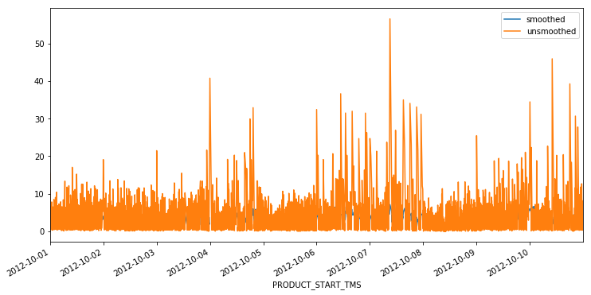


```python
# Plotting time series, datetime indexing
```


```python
october_highs.plot()
plt.legend()
plt.xlabel('Date')
```


    <matplotlib.text.Text at 0x111e7f240>


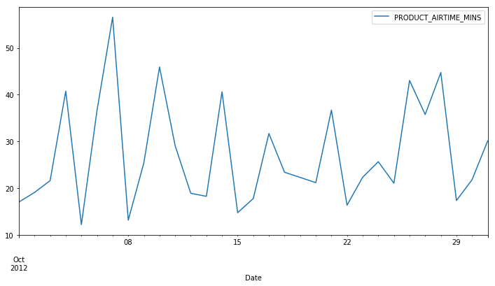


```python
october_highs['2012-10-01':'2012-10-10'].plot()
plt.legend()
plt.xlabel('Date')
```


    <matplotlib.text.Text at 0x10e0029e8>


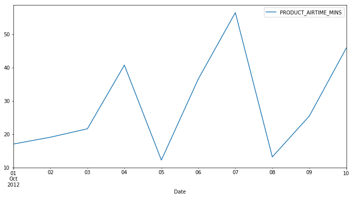

