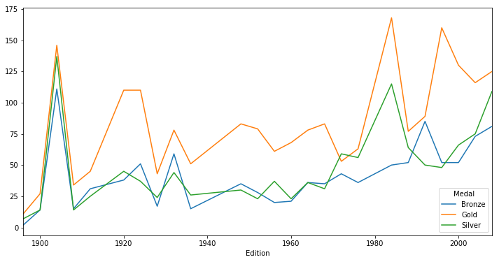
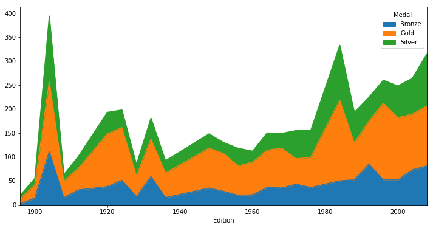
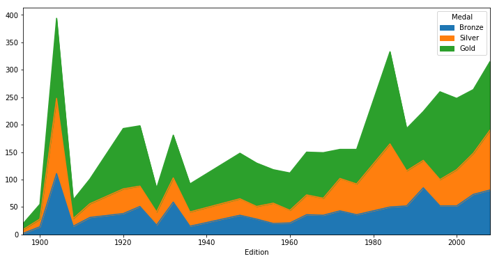

#### Data indexing, slicing, filtering & transforming. Change index, reshaping & pivot. Detect outliers.

----------------


```python
import pandas as pd
import numpy as np
%matplotlib inline
import matplotlib.pyplot as plt
```


```python
# setting plot defatult size
%pylab inline
pylab.rcParams['figure.figsize'] = (12, 6)
```

    Populating the interactive namespace from numpy and matplotlib


## 1. Extracting and transforming data


```python
df = pd.read_csv('data/election2012.csv')
df = df.loc[df.state == 'PA']
df.head()
```


<div>
<table border="1" class="dataframe">
  <thead>
    <tr style="text-align: right;">
      <th></th>
      <th>state</th>
      <th>county</th>
      <th>Obama</th>
      <th>Romney</th>
      <th>winner</th>
      <th>total</th>
      <th>margin</th>
      <th>turnout</th>
    </tr>
  </thead>
  <tbody>
    <tr>
      <th>2957</th>
      <td>PA</td>
      <td>Adams</td>
      <td>35.5</td>
      <td>63.1</td>
      <td>Romney</td>
      <td>41383</td>
      <td>27.6</td>
      <td>1.4</td>
    </tr>
    <tr>
      <th>2958</th>
      <td>PA</td>
      <td>Allegheny</td>
      <td>56.6</td>
      <td>42.2</td>
      <td>Obama</td>
      <td>607455</td>
      <td>14.4</td>
      <td>1.2</td>
    </tr>
    <tr>
      <th>2959</th>
      <td>PA</td>
      <td>Armstrong</td>
      <td>30.7</td>
      <td>67.9</td>
      <td>Romney</td>
      <td>27925</td>
      <td>37.2</td>
      <td>1.4</td>
    </tr>
    <tr>
      <th>2960</th>
      <td>PA</td>
      <td>Beaver</td>
      <td>46.0</td>
      <td>52.6</td>
      <td>Romney</td>
      <td>78951</td>
      <td>6.6</td>
      <td>1.4</td>
    </tr>
    <tr>
      <th>2961</th>
      <td>PA</td>
      <td>Bedford</td>
      <td>22.1</td>
      <td>77.0</td>
      <td>Romney</td>
      <td>21239</td>
      <td>54.9</td>
      <td>0.9</td>
    </tr>
  </tbody>
</table>
</div>


### indexing & slicing


```python
election = df.set_index('county')
election.head()
```


<div>
<table border="1" class="dataframe">
  <thead>
    <tr style="text-align: right;">
      <th></th>
      <th>state</th>
      <th>Obama</th>
      <th>Romney</th>
      <th>winner</th>
      <th>total</th>
      <th>margin</th>
      <th>turnout</th>
    </tr>
    <tr>
      <th>county</th>
      <th></th>
      <th></th>
      <th></th>
      <th></th>
      <th></th>
      <th></th>
      <th></th>
    </tr>
  </thead>
  <tbody>
    <tr>
      <th>Adams</th>
      <td>PA</td>
      <td>35.5</td>
      <td>63.1</td>
      <td>Romney</td>
      <td>41383</td>
      <td>27.6</td>
      <td>1.4</td>
    </tr>
    <tr>
      <th>Allegheny</th>
      <td>PA</td>
      <td>56.6</td>
      <td>42.2</td>
      <td>Obama</td>
      <td>607455</td>
      <td>14.4</td>
      <td>1.2</td>
    </tr>
    <tr>
      <th>Armstrong</th>
      <td>PA</td>
      <td>30.7</td>
      <td>67.9</td>
      <td>Romney</td>
      <td>27925</td>
      <td>37.2</td>
      <td>1.4</td>
    </tr>
    <tr>
      <th>Beaver</th>
      <td>PA</td>
      <td>46.0</td>
      <td>52.6</td>
      <td>Romney</td>
      <td>78951</td>
      <td>6.6</td>
      <td>1.4</td>
    </tr>
    <tr>
      <th>Bedford</th>
      <td>PA</td>
      <td>22.1</td>
      <td>77.0</td>
      <td>Romney</td>
      <td>21239</td>
      <td>54.9</td>
      <td>0.9</td>
    </tr>
  </tbody>
</table>
</div>


```python
p_counties = election.loc['Perry':'Potter']
p_counties
```


<div>
<table border="1" class="dataframe">
  <thead>
    <tr style="text-align: right;">
      <th></th>
      <th>state</th>
      <th>Obama</th>
      <th>Romney</th>
      <th>winner</th>
      <th>total</th>
      <th>margin</th>
      <th>turnout</th>
    </tr>
    <tr>
      <th>county</th>
      <th></th>
      <th></th>
      <th></th>
      <th></th>
      <th></th>
      <th></th>
      <th></th>
    </tr>
  </thead>
  <tbody>
    <tr>
      <th>Perry</th>
      <td>PA</td>
      <td>29.8</td>
      <td>68.6</td>
      <td>Romney</td>
      <td>17941</td>
      <td>38.8</td>
      <td>1.6</td>
    </tr>
    <tr>
      <th>Philadelphia</th>
      <td>PA</td>
      <td>85.2</td>
      <td>14.1</td>
      <td>Obama</td>
      <td>648864</td>
      <td>71.1</td>
      <td>0.7</td>
    </tr>
    <tr>
      <th>Pike</th>
      <td>PA</td>
      <td>43.9</td>
      <td>54.9</td>
      <td>Romney</td>
      <td>22883</td>
      <td>11.0</td>
      <td>1.2</td>
    </tr>
    <tr>
      <th>Potter</th>
      <td>PA</td>
      <td>26.3</td>
      <td>72.2</td>
      <td>Romney</td>
      <td>7091</td>
      <td>45.9</td>
      <td>1.5</td>
    </tr>
  </tbody>
</table>
</div>


```python
p_counties = election.loc['Potter':'Perry':-1]   # reverse
p_counties
```


<div>
<table border="1" class="dataframe">
  <thead>
    <tr style="text-align: right;">
      <th></th>
      <th>state</th>
      <th>Obama</th>
      <th>Romney</th>
      <th>winner</th>
      <th>total</th>
      <th>margin</th>
      <th>turnout</th>
    </tr>
    <tr>
      <th>county</th>
      <th></th>
      <th></th>
      <th></th>
      <th></th>
      <th></th>
      <th></th>
      <th></th>
    </tr>
  </thead>
  <tbody>
    <tr>
      <th>Potter</th>
      <td>PA</td>
      <td>26.3</td>
      <td>72.2</td>
      <td>Romney</td>
      <td>7091</td>
      <td>45.9</td>
      <td>1.5</td>
    </tr>
    <tr>
      <th>Pike</th>
      <td>PA</td>
      <td>43.9</td>
      <td>54.9</td>
      <td>Romney</td>
      <td>22883</td>
      <td>11.0</td>
      <td>1.2</td>
    </tr>
    <tr>
      <th>Philadelphia</th>
      <td>PA</td>
      <td>85.2</td>
      <td>14.1</td>
      <td>Obama</td>
      <td>648864</td>
      <td>71.1</td>
      <td>0.7</td>
    </tr>
    <tr>
      <th>Perry</th>
      <td>PA</td>
      <td>29.8</td>
      <td>68.6</td>
      <td>Romney</td>
      <td>17941</td>
      <td>38.8</td>
      <td>1.6</td>
    </tr>
  </tbody>
</table>
</div>


### filtering


```python
turnout_df = election[election['turnout'] < 1]
turnout_df
```


<div>
<table border="1" class="dataframe">
  <thead>
    <tr style="text-align: right;">
      <th></th>
      <th>state</th>
      <th>Obama</th>
      <th>Romney</th>
      <th>winner</th>
      <th>total</th>
      <th>margin</th>
      <th>turnout</th>
    </tr>
    <tr>
      <th>county</th>
      <th></th>
      <th></th>
      <th></th>
      <th></th>
      <th></th>
      <th></th>
      <th></th>
    </tr>
  </thead>
  <tbody>
    <tr>
      <th>Bedford</th>
      <td>PA</td>
      <td>22.1</td>
      <td>77.0</td>
      <td>Romney</td>
      <td>21239</td>
      <td>54.9</td>
      <td>0.9</td>
    </tr>
    <tr>
      <th>Philadelphia</th>
      <td>PA</td>
      <td>85.2</td>
      <td>14.1</td>
      <td>Obama</td>
      <td>648864</td>
      <td>71.1</td>
      <td>0.7</td>
    </tr>
  </tbody>
</table>
</div>


```python
low_margin = election[(election.margin < 3) & (election.turnout < 3)]   # or = |
low_margin
```


<div>
<table border="1" class="dataframe">
  <thead>
    <tr style="text-align: right;">
      <th></th>
      <th>state</th>
      <th>Obama</th>
      <th>Romney</th>
      <th>winner</th>
      <th>total</th>
      <th>margin</th>
      <th>turnout</th>
    </tr>
    <tr>
      <th>county</th>
      <th></th>
      <th></th>
      <th></th>
      <th></th>
      <th></th>
      <th></th>
      <th></th>
    </tr>
  </thead>
  <tbody>
    <tr>
      <th>Berks</th>
      <td>PA</td>
      <td>48.9</td>
      <td>49.5</td>
      <td>Romney</td>
      <td>160752</td>
      <td>0.6</td>
      <td>1.6</td>
    </tr>
    <tr>
      <th>Bucks</th>
      <td>PA</td>
      <td>50.0</td>
      <td>48.8</td>
      <td>Obama</td>
      <td>315474</td>
      <td>1.2</td>
      <td>1.2</td>
    </tr>
    <tr>
      <th>Centre</th>
      <td>PA</td>
      <td>48.9</td>
      <td>49.0</td>
      <td>Romney</td>
      <td>67374</td>
      <td>0.1</td>
      <td>2.1</td>
    </tr>
    <tr>
      <th>Chester</th>
      <td>PA</td>
      <td>49.2</td>
      <td>49.7</td>
      <td>Romney</td>
      <td>245512</td>
      <td>0.5</td>
      <td>1.1</td>
    </tr>
    <tr>
      <th>Mercer</th>
      <td>PA</td>
      <td>48.0</td>
      <td>50.6</td>
      <td>Romney</td>
      <td>47386</td>
      <td>2.6</td>
      <td>1.4</td>
    </tr>
  </tbody>
</table>
</div>


```python
# 득표율 차이가 3% 이내이면 winner 를 NULL 처리.
too_close_row = election['margin'] < 3
election.loc[too_close_row, 'winner'] = np.nan
election.info()
```

    <class 'pandas.core.frame.DataFrame'>
    Index: 67 entries, Adams to York
    Data columns (total 7 columns):
    state      67 non-null object
    Obama      67 non-null float64
    Romney     67 non-null float64
    winner     62 non-null object
    total      67 non-null int64
    margin     67 non-null float64
    turnout    67 non-null float64
    dtypes: float64(4), int64(1), object(2)
    memory usage: 4.2+ KB


```python
election['winner'].value_counts()
```


    Romney    51
    Obama     11
    Name: winner, dtype: int64


## Trasforming DataFrames : apply()


```python
# test data
sales = pd.DataFrame({'month':['Jan','Feb','Mar','Apr','May','Jun'],
                  'eggs':[47,110,226,82,132,210],
                  'salt':[12,50,89,87,np.nan,60],
                  'spam':[17,31,72,20,52,55]})
sales = sales.set_index('month')
sales
```


<div>
<table border="1" class="dataframe">
  <thead>
    <tr style="text-align: right;">
      <th></th>
      <th>eggs</th>
      <th>salt</th>
      <th>spam</th>
    </tr>
    <tr>
      <th>month</th>
      <th></th>
      <th></th>
      <th></th>
    </tr>
  </thead>
  <tbody>
    <tr>
      <th>Jan</th>
      <td>47</td>
      <td>12.0</td>
      <td>17</td>
    </tr>
    <tr>
      <th>Feb</th>
      <td>110</td>
      <td>50.0</td>
      <td>31</td>
    </tr>
    <tr>
      <th>Mar</th>
      <td>226</td>
      <td>89.0</td>
      <td>72</td>
    </tr>
    <tr>
      <th>Apr</th>
      <td>82</td>
      <td>87.0</td>
      <td>20</td>
    </tr>
    <tr>
      <th>May</th>
      <td>132</td>
      <td>NaN</td>
      <td>52</td>
    </tr>
    <tr>
      <th>Jun</th>
      <td>210</td>
      <td>60.0</td>
      <td>55</td>
    </tr>
  </tbody>
</table>
</div>


```python
# convert to dozon unit function
def dozens(n):
    return n//12
```


```python
sales.apply(dozens)
```


<div>
<table border="1" class="dataframe">
  <thead>
    <tr style="text-align: right;">
      <th></th>
      <th>eggs</th>
      <th>salt</th>
      <th>spam</th>
    </tr>
    <tr>
      <th>month</th>
      <th></th>
      <th></th>
      <th></th>
    </tr>
  </thead>
  <tbody>
    <tr>
      <th>Jan</th>
      <td>3</td>
      <td>1.0</td>
      <td>1</td>
    </tr>
    <tr>
      <th>Feb</th>
      <td>9</td>
      <td>4.0</td>
      <td>2</td>
    </tr>
    <tr>
      <th>Mar</th>
      <td>18</td>
      <td>7.0</td>
      <td>6</td>
    </tr>
    <tr>
      <th>Apr</th>
      <td>6</td>
      <td>7.0</td>
      <td>1</td>
    </tr>
    <tr>
      <th>May</th>
      <td>11</td>
      <td>NaN</td>
      <td>4</td>
    </tr>
    <tr>
      <th>Jun</th>
      <td>17</td>
      <td>5.0</td>
      <td>4</td>
    </tr>
  </tbody>
</table>
</div>


```python
sales.apply(lambda n: n//12)
```


<div>
<table border="1" class="dataframe">
  <thead>
    <tr style="text-align: right;">
      <th></th>
      <th>eggs</th>
      <th>salt</th>
      <th>spam</th>
    </tr>
    <tr>
      <th>month</th>
      <th></th>
      <th></th>
      <th></th>
    </tr>
  </thead>
  <tbody>
    <tr>
      <th>Jan</th>
      <td>3</td>
      <td>1.0</td>
      <td>1</td>
    </tr>
    <tr>
      <th>Feb</th>
      <td>9</td>
      <td>4.0</td>
      <td>2</td>
    </tr>
    <tr>
      <th>Mar</th>
      <td>18</td>
      <td>7.0</td>
      <td>6</td>
    </tr>
    <tr>
      <th>Apr</th>
      <td>6</td>
      <td>7.0</td>
      <td>1</td>
    </tr>
    <tr>
      <th>May</th>
      <td>11</td>
      <td>NaN</td>
      <td>4</td>
    </tr>
    <tr>
      <th>Jun</th>
      <td>17</td>
      <td>5.0</td>
      <td>4</td>
    </tr>
  </tbody>
</table>
</div>


```python
sales['dozen_spam'] = sales.spam.apply(dozens)
sales['salty_spam'] = sales.salt + sales.spam
sales
```


<div>
<table border="1" class="dataframe">
  <thead>
    <tr style="text-align: right;">
      <th></th>
      <th>eggs</th>
      <th>salt</th>
      <th>spam</th>
      <th>dozen_spam</th>
      <th>salty_spam</th>
    </tr>
    <tr>
      <th>month</th>
      <th></th>
      <th></th>
      <th></th>
      <th></th>
      <th></th>
    </tr>
  </thead>
  <tbody>
    <tr>
      <th>Jan</th>
      <td>47</td>
      <td>12.0</td>
      <td>17</td>
      <td>1</td>
      <td>29.0</td>
    </tr>
    <tr>
      <th>Feb</th>
      <td>110</td>
      <td>50.0</td>
      <td>31</td>
      <td>2</td>
      <td>81.0</td>
    </tr>
    <tr>
      <th>Mar</th>
      <td>226</td>
      <td>89.0</td>
      <td>72</td>
      <td>6</td>
      <td>161.0</td>
    </tr>
    <tr>
      <th>Apr</th>
      <td>82</td>
      <td>87.0</td>
      <td>20</td>
      <td>1</td>
      <td>107.0</td>
    </tr>
    <tr>
      <th>May</th>
      <td>132</td>
      <td>NaN</td>
      <td>52</td>
      <td>4</td>
      <td>NaN</td>
    </tr>
    <tr>
      <th>Jun</th>
      <td>210</td>
      <td>60.0</td>
      <td>55</td>
      <td>4</td>
      <td>115.0</td>
    </tr>
  </tbody>
</table>
</div>


### map() with a dictionary


```python
red_vs_blue = {'Obama':'blue', 'Romney':'red'}
election['color'] = election.winner.map(red_vs_blue)

election.head()
```


<div>
<table border="1" class="dataframe">
  <thead>
    <tr style="text-align: right;">
      <th></th>
      <th>state</th>
      <th>Obama</th>
      <th>Romney</th>
      <th>winner</th>
      <th>total</th>
      <th>margin</th>
      <th>turnout</th>
      <th>color</th>
    </tr>
    <tr>
      <th>county</th>
      <th></th>
      <th></th>
      <th></th>
      <th></th>
      <th></th>
      <th></th>
      <th></th>
      <th></th>
    </tr>
  </thead>
  <tbody>
    <tr>
      <th>Adams</th>
      <td>PA</td>
      <td>35.5</td>
      <td>63.1</td>
      <td>Romney</td>
      <td>41383</td>
      <td>27.6</td>
      <td>1.4</td>
      <td>red</td>
    </tr>
    <tr>
      <th>Allegheny</th>
      <td>PA</td>
      <td>56.6</td>
      <td>42.2</td>
      <td>Obama</td>
      <td>607455</td>
      <td>14.4</td>
      <td>1.2</td>
      <td>blue</td>
    </tr>
    <tr>
      <th>Armstrong</th>
      <td>PA</td>
      <td>30.7</td>
      <td>67.9</td>
      <td>Romney</td>
      <td>27925</td>
      <td>37.2</td>
      <td>1.4</td>
      <td>red</td>
    </tr>
    <tr>
      <th>Beaver</th>
      <td>PA</td>
      <td>46.0</td>
      <td>52.6</td>
      <td>Romney</td>
      <td>78951</td>
      <td>6.6</td>
      <td>1.4</td>
      <td>red</td>
    </tr>
    <tr>
      <th>Bedford</th>
      <td>PA</td>
      <td>22.1</td>
      <td>77.0</td>
      <td>Romney</td>
      <td>21239</td>
      <td>54.9</td>
      <td>0.9</td>
      <td>red</td>
    </tr>
  </tbody>
</table>
</div>


```python
from scipy.stats import zscore
```


```python
turnout_zscore = zscore(election['turnout'])    # z-score
election['turnout_zscore'] = turnout_zscore
election.tail()
```


<div>
<table border="1" class="dataframe">
  <thead>
    <tr style="text-align: right;">
      <th></th>
      <th>state</th>
      <th>Obama</th>
      <th>Romney</th>
      <th>winner</th>
      <th>total</th>
      <th>margin</th>
      <th>turnout</th>
      <th>color</th>
      <th>turnout_zscore</th>
    </tr>
    <tr>
      <th>county</th>
      <th></th>
      <th></th>
      <th></th>
      <th></th>
      <th></th>
      <th></th>
      <th></th>
      <th></th>
      <th></th>
    </tr>
  </thead>
  <tbody>
    <tr>
      <th>Washington</th>
      <td>PA</td>
      <td>42.7</td>
      <td>56.0</td>
      <td>Romney</td>
      <td>88958</td>
      <td>13.3</td>
      <td>1.3</td>
      <td>red</td>
      <td>-0.507754</td>
    </tr>
    <tr>
      <th>Wayne</th>
      <td>PA</td>
      <td>38.8</td>
      <td>59.8</td>
      <td>Romney</td>
      <td>20669</td>
      <td>21.0</td>
      <td>1.4</td>
      <td>red</td>
      <td>-0.133913</td>
    </tr>
    <tr>
      <th>Westmoreland</th>
      <td>PA</td>
      <td>37.6</td>
      <td>61.3</td>
      <td>Romney</td>
      <td>166809</td>
      <td>23.7</td>
      <td>1.1</td>
      <td>red</td>
      <td>-1.255436</td>
    </tr>
    <tr>
      <th>Wyoming</th>
      <td>PA</td>
      <td>42.9</td>
      <td>55.2</td>
      <td>Romney</td>
      <td>11001</td>
      <td>12.3</td>
      <td>1.9</td>
      <td>red</td>
      <td>1.735292</td>
    </tr>
    <tr>
      <th>York</th>
      <td>PA</td>
      <td>38.7</td>
      <td>59.9</td>
      <td>Romney</td>
      <td>183702</td>
      <td>21.2</td>
      <td>1.4</td>
      <td>red</td>
      <td>-0.133913</td>
    </tr>
  </tbody>
</table>
</div>


### Change Index


```python
sales.index = [idx.upper() for idx in sales.index]
sales.head(3)
```


<div>
<table border="1" class="dataframe">
  <thead>
    <tr style="text-align: right;">
      <th></th>
      <th>eggs</th>
      <th>salt</th>
      <th>spam</th>
      <th>dozen_spam</th>
      <th>salty_spam</th>
    </tr>
  </thead>
  <tbody>
    <tr>
      <th>JAN</th>
      <td>47</td>
      <td>12.0</td>
      <td>17</td>
      <td>1</td>
      <td>29.0</td>
    </tr>
    <tr>
      <th>FEB</th>
      <td>110</td>
      <td>50.0</td>
      <td>31</td>
      <td>2</td>
      <td>81.0</td>
    </tr>
    <tr>
      <th>MAR</th>
      <td>226</td>
      <td>89.0</td>
      <td>72</td>
      <td>6</td>
      <td>161.0</td>
    </tr>
  </tbody>
</table>
</div>


```python
sales.index.name = 'MONTHS'
sales.head(3)
```


<div>
<table border="1" class="dataframe">
  <thead>
    <tr style="text-align: right;">
      <th></th>
      <th>eggs</th>
      <th>salt</th>
      <th>spam</th>
      <th>dozen_spam</th>
      <th>salty_spam</th>
    </tr>
    <tr>
      <th>MONTHS</th>
      <th></th>
      <th></th>
      <th></th>
      <th></th>
      <th></th>
    </tr>
  </thead>
  <tbody>
    <tr>
      <th>JAN</th>
      <td>47</td>
      <td>12.0</td>
      <td>17</td>
      <td>1</td>
      <td>29.0</td>
    </tr>
    <tr>
      <th>FEB</th>
      <td>110</td>
      <td>50.0</td>
      <td>31</td>
      <td>2</td>
      <td>81.0</td>
    </tr>
    <tr>
      <th>MAR</th>
      <td>226</td>
      <td>89.0</td>
      <td>72</td>
      <td>6</td>
      <td>161.0</td>
    </tr>
  </tbody>
</table>
</div>


### Hierarchical indexing / multi index


```python
# make test data
sales = pd.DataFrame({'state':['CA','CA','TX','TX','NY','NY'], 'month':[1,2,1,2,1,2], 'eggs':[47,110,221,77,69,88], 
                      'salt':[12,50,89,87,73,49], 'spam':[17,31,72,20,37,56]})
sales
```


<div>
<table border="1" class="dataframe">
  <thead>
    <tr style="text-align: right;">
      <th></th>
      <th>eggs</th>
      <th>month</th>
      <th>salt</th>
      <th>spam</th>
      <th>state</th>
    </tr>
  </thead>
  <tbody>
    <tr>
      <th>0</th>
      <td>47</td>
      <td>1</td>
      <td>12</td>
      <td>17</td>
      <td>CA</td>
    </tr>
    <tr>
      <th>1</th>
      <td>110</td>
      <td>2</td>
      <td>50</td>
      <td>31</td>
      <td>CA</td>
    </tr>
    <tr>
      <th>2</th>
      <td>221</td>
      <td>1</td>
      <td>89</td>
      <td>72</td>
      <td>TX</td>
    </tr>
    <tr>
      <th>3</th>
      <td>77</td>
      <td>2</td>
      <td>87</td>
      <td>20</td>
      <td>TX</td>
    </tr>
    <tr>
      <th>4</th>
      <td>69</td>
      <td>1</td>
      <td>73</td>
      <td>37</td>
      <td>NY</td>
    </tr>
    <tr>
      <th>5</th>
      <td>88</td>
      <td>2</td>
      <td>49</td>
      <td>56</td>
      <td>NY</td>
    </tr>
  </tbody>
</table>
</div>


```python
sales2 = sales.set_index(['state','month'])   # multi index
sales2
```


<div>
<table border="1" class="dataframe">
  <thead>
    <tr style="text-align: right;">
      <th></th>
      <th></th>
      <th>eggs</th>
      <th>salt</th>
      <th>spam</th>
    </tr>
    <tr>
      <th>state</th>
      <th>month</th>
      <th></th>
      <th></th>
      <th></th>
    </tr>
  </thead>
  <tbody>
    <tr>
      <th rowspan="2" valign="top">CA</th>
      <th>1</th>
      <td>47</td>
      <td>12</td>
      <td>17</td>
    </tr>
    <tr>
      <th>2</th>
      <td>110</td>
      <td>50</td>
      <td>31</td>
    </tr>
    <tr>
      <th rowspan="2" valign="top">TX</th>
      <th>1</th>
      <td>221</td>
      <td>89</td>
      <td>72</td>
    </tr>
    <tr>
      <th>2</th>
      <td>77</td>
      <td>87</td>
      <td>20</td>
    </tr>
    <tr>
      <th rowspan="2" valign="top">NY</th>
      <th>1</th>
      <td>69</td>
      <td>73</td>
      <td>37</td>
    </tr>
    <tr>
      <th>2</th>
      <td>88</td>
      <td>49</td>
      <td>56</td>
    </tr>
  </tbody>
</table>
</div>


```python
sales2.index      # 인덱스 정보 조회
```


    MultiIndex(levels=[['CA', 'NY', 'TX'], [1, 2]],
               labels=[[0, 0, 2, 2, 1, 1], [0, 1, 0, 1, 0, 1]],
               names=['state', 'month'])


```python
sales2.loc[('NY', 1)]
```


    eggs    69
    salt    73
    spam    37
    Name: (NY, 1), dtype: int64


```python
sales2.loc['CA']
```


<div>
<table border="1" class="dataframe">
  <thead>
    <tr style="text-align: right;">
      <th></th>
      <th>eggs</th>
      <th>salt</th>
      <th>spam</th>
    </tr>
    <tr>
      <th>month</th>
      <th></th>
      <th></th>
      <th></th>
    </tr>
  </thead>
  <tbody>
    <tr>
      <th>1</th>
      <td>47</td>
      <td>12</td>
      <td>17</td>
    </tr>
    <tr>
      <th>2</th>
      <td>110</td>
      <td>50</td>
      <td>31</td>
    </tr>
  </tbody>
</table>
</div>


## 2. Rearranging and reshaping data

### Pivot / Stack & Unstack


```python
sales = pd.DataFrame({'weekday':['Sun','Sun','Mon','Mon'],
                  'item':['egg','spam','egg','spam'],
                  'sold':[120,250,189,187],
                  'retail':[17,31,72,20]})
sales
```


<div>
<table border="1" class="dataframe">
  <thead>
    <tr style="text-align: right;">
      <th></th>
      <th>item</th>
      <th>retail</th>
      <th>sold</th>
      <th>weekday</th>
    </tr>
  </thead>
  <tbody>
    <tr>
      <th>0</th>
      <td>egg</td>
      <td>17</td>
      <td>120</td>
      <td>Sun</td>
    </tr>
    <tr>
      <th>1</th>
      <td>spam</td>
      <td>31</td>
      <td>250</td>
      <td>Sun</td>
    </tr>
    <tr>
      <th>2</th>
      <td>egg</td>
      <td>72</td>
      <td>189</td>
      <td>Mon</td>
    </tr>
    <tr>
      <th>3</th>
      <td>spam</td>
      <td>20</td>
      <td>187</td>
      <td>Mon</td>
    </tr>
  </tbody>
</table>
</div>


```python
pivot_sold = sales.pivot(index='weekday', columns='item', values='sold')
pivot_sold
```


<div>
<table border="1" class="dataframe">
  <thead>
    <tr style="text-align: right;">
      <th>item</th>
      <th>egg</th>
      <th>spam</th>
    </tr>
    <tr>
      <th>weekday</th>
      <th></th>
      <th></th>
    </tr>
  </thead>
  <tbody>
    <tr>
      <th>Mon</th>
      <td>189</td>
      <td>187</td>
    </tr>
    <tr>
      <th>Sun</th>
      <td>120</td>
      <td>250</td>
    </tr>
  </tbody>
</table>
</div>


```python
pivot_sales = sales.pivot(index='weekday', columns='item')
pivot_sales
```


<div>
<table border="1" class="dataframe">
  <thead>
    <tr>
      <th></th>
      <th colspan="2" halign="left">retail</th>
      <th colspan="2" halign="left">sold</th>
    </tr>
    <tr>
      <th>item</th>
      <th>egg</th>
      <th>spam</th>
      <th>egg</th>
      <th>spam</th>
    </tr>
    <tr>
      <th>weekday</th>
      <th></th>
      <th></th>
      <th></th>
      <th></th>
    </tr>
  </thead>
  <tbody>
    <tr>
      <th>Mon</th>
      <td>72</td>
      <td>20</td>
      <td>189</td>
      <td>187</td>
    </tr>
    <tr>
      <th>Sun</th>
      <td>17</td>
      <td>31</td>
      <td>120</td>
      <td>250</td>
    </tr>
  </tbody>
</table>
</div>


### stack & unstack : [참조블로그](http://rfriend.tistory.com/276)


```python
sales = sales.set_index(['weekday','item'])
sales
```


<div>
<table border="1" class="dataframe">
  <thead>
    <tr style="text-align: right;">
      <th></th>
      <th></th>
      <th>retail</th>
      <th>sold</th>
    </tr>
    <tr>
      <th>weekday</th>
      <th>item</th>
      <th></th>
      <th></th>
    </tr>
  </thead>
  <tbody>
    <tr>
      <th rowspan="2" valign="top">Sun</th>
      <th>egg</th>
      <td>17</td>
      <td>120</td>
    </tr>
    <tr>
      <th>spam</th>
      <td>31</td>
      <td>250</td>
    </tr>
    <tr>
      <th rowspan="2" valign="top">Mon</th>
      <th>egg</th>
      <td>72</td>
      <td>189</td>
    </tr>
    <tr>
      <th>spam</th>
      <td>20</td>
      <td>187</td>
    </tr>
  </tbody>
</table>
</div>


```python
byweekday = sales.unstack(level='weekday')
byweekday
```


<div>
<table border="1" class="dataframe">
  <thead>
    <tr>
      <th></th>
      <th colspan="2" halign="left">retail</th>
      <th colspan="2" halign="left">sold</th>
    </tr>
    <tr>
      <th>weekday</th>
      <th>Mon</th>
      <th>Sun</th>
      <th>Mon</th>
      <th>Sun</th>
    </tr>
    <tr>
      <th>item</th>
      <th></th>
      <th></th>
      <th></th>
      <th></th>
    </tr>
  </thead>
  <tbody>
    <tr>
      <th>egg</th>
      <td>72</td>
      <td>17</td>
      <td>189</td>
      <td>120</td>
    </tr>
    <tr>
      <th>spam</th>
      <td>20</td>
      <td>31</td>
      <td>187</td>
      <td>250</td>
    </tr>
  </tbody>
</table>
</div>


```python
byweekday.stack(level='weekday')
```


<div>
<table border="1" class="dataframe">
  <thead>
    <tr style="text-align: right;">
      <th></th>
      <th></th>
      <th>retail</th>
      <th>sold</th>
    </tr>
    <tr>
      <th>item</th>
      <th>weekday</th>
      <th></th>
      <th></th>
    </tr>
  </thead>
  <tbody>
    <tr>
      <th rowspan="2" valign="top">egg</th>
      <th>Mon</th>
      <td>72</td>
      <td>189</td>
    </tr>
    <tr>
      <th>Sun</th>
      <td>17</td>
      <td>120</td>
    </tr>
    <tr>
      <th rowspan="2" valign="top">spam</th>
      <th>Mon</th>
      <td>20</td>
      <td>187</td>
    </tr>
    <tr>
      <th>Sun</th>
      <td>31</td>
      <td>250</td>
    </tr>
  </tbody>
</table>
</div>


```python
byitem = sales.unstack(level='item')
byitem
```


<div>
<table border="1" class="dataframe">
  <thead>
    <tr>
      <th></th>
      <th colspan="2" halign="left">retail</th>
      <th colspan="2" halign="left">sold</th>
    </tr>
    <tr>
      <th>item</th>
      <th>egg</th>
      <th>spam</th>
      <th>egg</th>
      <th>spam</th>
    </tr>
    <tr>
      <th>weekday</th>
      <th></th>
      <th></th>
      <th></th>
      <th></th>
    </tr>
  </thead>
  <tbody>
    <tr>
      <th>Mon</th>
      <td>72</td>
      <td>20</td>
      <td>189</td>
      <td>187</td>
    </tr>
    <tr>
      <th>Sun</th>
      <td>17</td>
      <td>31</td>
      <td>120</td>
      <td>250</td>
    </tr>
  </tbody>
</table>
</div>


```python
byitem.stack(level='item')
```


<div>
<table border="1" class="dataframe">
  <thead>
    <tr style="text-align: right;">
      <th></th>
      <th></th>
      <th>retail</th>
      <th>sold</th>
    </tr>
    <tr>
      <th>weekday</th>
      <th>item</th>
      <th></th>
      <th></th>
    </tr>
  </thead>
  <tbody>
    <tr>
      <th rowspan="2" valign="top">Mon</th>
      <th>egg</th>
      <td>72</td>
      <td>189</td>
    </tr>
    <tr>
      <th>spam</th>
      <td>20</td>
      <td>187</td>
    </tr>
    <tr>
      <th rowspan="2" valign="top">Sun</th>
      <th>egg</th>
      <td>17</td>
      <td>120</td>
    </tr>
    <tr>
      <th>spam</th>
      <td>31</td>
      <td>250</td>
    </tr>
  </tbody>
</table>
</div>


### Melting DataFrames : [참조블로그](http://rfriend.tistory.com/278)


```python
sales = pd.DataFrame({'weekday':['Sun','Sun','Mon','Mon'],
                  'item':['egg','spam','egg','spam'],
                  'sold':[120,250,189,187],
                  'retail':[17,31,72,20]})
sales
```


<div>
<table border="1" class="dataframe">
  <thead>
    <tr style="text-align: right;">
      <th></th>
      <th>item</th>
      <th>retail</th>
      <th>sold</th>
      <th>weekday</th>
    </tr>
  </thead>
  <tbody>
    <tr>
      <th>0</th>
      <td>egg</td>
      <td>17</td>
      <td>120</td>
      <td>Sun</td>
    </tr>
    <tr>
      <th>1</th>
      <td>spam</td>
      <td>31</td>
      <td>250</td>
      <td>Sun</td>
    </tr>
    <tr>
      <th>2</th>
      <td>egg</td>
      <td>72</td>
      <td>189</td>
      <td>Mon</td>
    </tr>
    <tr>
      <th>3</th>
      <td>spam</td>
      <td>20</td>
      <td>187</td>
      <td>Mon</td>
    </tr>
  </tbody>
</table>
</div>


```python
sales2 = pd.melt(sales, id_vars=['weekday'], value_name='value')
sales2
```


<div>
<table border="1" class="dataframe">
  <thead>
    <tr style="text-align: right;">
      <th></th>
      <th>weekday</th>
      <th>variable</th>
      <th>value</th>
    </tr>
  </thead>
  <tbody>
    <tr>
      <th>0</th>
      <td>Sun</td>
      <td>item</td>
      <td>egg</td>
    </tr>
    <tr>
      <th>1</th>
      <td>Sun</td>
      <td>item</td>
      <td>spam</td>
    </tr>
    <tr>
      <th>2</th>
      <td>Mon</td>
      <td>item</td>
      <td>egg</td>
    </tr>
    <tr>
      <th>3</th>
      <td>Mon</td>
      <td>item</td>
      <td>spam</td>
    </tr>
    <tr>
      <th>4</th>
      <td>Sun</td>
      <td>retail</td>
      <td>17</td>
    </tr>
    <tr>
      <th>5</th>
      <td>Sun</td>
      <td>retail</td>
      <td>31</td>
    </tr>
    <tr>
      <th>6</th>
      <td>Mon</td>
      <td>retail</td>
      <td>72</td>
    </tr>
    <tr>
      <th>7</th>
      <td>Mon</td>
      <td>retail</td>
      <td>20</td>
    </tr>
    <tr>
      <th>8</th>
      <td>Sun</td>
      <td>sold</td>
      <td>120</td>
    </tr>
    <tr>
      <th>9</th>
      <td>Sun</td>
      <td>sold</td>
      <td>250</td>
    </tr>
    <tr>
      <th>10</th>
      <td>Mon</td>
      <td>sold</td>
      <td>189</td>
    </tr>
    <tr>
      <th>11</th>
      <td>Mon</td>
      <td>sold</td>
      <td>187</td>
    </tr>
  </tbody>
</table>
</div>


```python
sales3 = pd.melt(sales, id_vars=['weekday','item'])
sales3
```


<div>
<table border="1" class="dataframe">
  <thead>
    <tr style="text-align: right;">
      <th></th>
      <th>weekday</th>
      <th>item</th>
      <th>variable</th>
      <th>value</th>
    </tr>
  </thead>
  <tbody>
    <tr>
      <th>0</th>
      <td>Sun</td>
      <td>egg</td>
      <td>retail</td>
      <td>17</td>
    </tr>
    <tr>
      <th>1</th>
      <td>Sun</td>
      <td>spam</td>
      <td>retail</td>
      <td>31</td>
    </tr>
    <tr>
      <th>2</th>
      <td>Mon</td>
      <td>egg</td>
      <td>retail</td>
      <td>72</td>
    </tr>
    <tr>
      <th>3</th>
      <td>Mon</td>
      <td>spam</td>
      <td>retail</td>
      <td>20</td>
    </tr>
    <tr>
      <th>4</th>
      <td>Sun</td>
      <td>egg</td>
      <td>sold</td>
      <td>120</td>
    </tr>
    <tr>
      <th>5</th>
      <td>Sun</td>
      <td>spam</td>
      <td>sold</td>
      <td>250</td>
    </tr>
    <tr>
      <th>6</th>
      <td>Mon</td>
      <td>egg</td>
      <td>sold</td>
      <td>189</td>
    </tr>
    <tr>
      <th>7</th>
      <td>Mon</td>
      <td>spam</td>
      <td>sold</td>
      <td>187</td>
    </tr>
  </tbody>
</table>
</div>


```python
kv_pairs = pd.melt(sales, col_level=0)
kv_pairs.tail()
```


<div>
<table border="1" class="dataframe">
  <thead>
    <tr style="text-align: right;">
      <th></th>
      <th>variable</th>
      <th>value</th>
    </tr>
  </thead>
  <tbody>
    <tr>
      <th>11</th>
      <td>sold</td>
      <td>187</td>
    </tr>
    <tr>
      <th>12</th>
      <td>weekday</td>
      <td>Sun</td>
    </tr>
    <tr>
      <th>13</th>
      <td>weekday</td>
      <td>Sun</td>
    </tr>
    <tr>
      <th>14</th>
      <td>weekday</td>
      <td>Mon</td>
    </tr>
    <tr>
      <th>15</th>
      <td>weekday</td>
      <td>Mon</td>
    </tr>
  </tbody>
</table>
</div>


### pivot_table & aggregation


```python
sales
```


<div>
<table border="1" class="dataframe">
  <thead>
    <tr style="text-align: right;">
      <th></th>
      <th>item</th>
      <th>retail</th>
      <th>sold</th>
      <th>weekday</th>
    </tr>
  </thead>
  <tbody>
    <tr>
      <th>0</th>
      <td>egg</td>
      <td>17</td>
      <td>120</td>
      <td>Sun</td>
    </tr>
    <tr>
      <th>1</th>
      <td>spam</td>
      <td>31</td>
      <td>250</td>
      <td>Sun</td>
    </tr>
    <tr>
      <th>2</th>
      <td>egg</td>
      <td>72</td>
      <td>189</td>
      <td>Mon</td>
    </tr>
    <tr>
      <th>3</th>
      <td>spam</td>
      <td>20</td>
      <td>187</td>
      <td>Mon</td>
    </tr>
  </tbody>
</table>
</div>


```python
by_item_day = sales.pivot_table(index='weekday', columns='item')
by_item_day
```


<div>
<table border="1" class="dataframe">
  <thead>
    <tr>
      <th></th>
      <th colspan="2" halign="left">retail</th>
      <th colspan="2" halign="left">sold</th>
    </tr>
    <tr>
      <th>item</th>
      <th>egg</th>
      <th>spam</th>
      <th>egg</th>
      <th>spam</th>
    </tr>
    <tr>
      <th>weekday</th>
      <th></th>
      <th></th>
      <th></th>
      <th></th>
    </tr>
  </thead>
  <tbody>
    <tr>
      <th>Mon</th>
      <td>72</td>
      <td>20</td>
      <td>189</td>
      <td>187</td>
    </tr>
    <tr>
      <th>Sun</th>
      <td>17</td>
      <td>31</td>
      <td>120</td>
      <td>250</td>
    </tr>
  </tbody>
</table>
</div>


```python
sales.pivot_table(index='weekday', aggfunc=sum)
```


<div>
<table border="1" class="dataframe">
  <thead>
    <tr style="text-align: right;">
      <th></th>
      <th>retail</th>
      <th>sold</th>
    </tr>
    <tr>
      <th>weekday</th>
      <th></th>
      <th></th>
    </tr>
  </thead>
  <tbody>
    <tr>
      <th>Mon</th>
      <td>92</td>
      <td>376</td>
    </tr>
    <tr>
      <th>Sun</th>
      <td>48</td>
      <td>370</td>
    </tr>
  </tbody>
</table>
</div>


```python
sales.pivot_table(index='weekday', aggfunc=sum, margins=True)   # All 포함.
```


<div>
<table border="1" class="dataframe">
  <thead>
    <tr style="text-align: right;">
      <th></th>
      <th>retail</th>
      <th>sold</th>
    </tr>
    <tr>
      <th>weekday</th>
      <th></th>
      <th></th>
    </tr>
  </thead>
  <tbody>
    <tr>
      <th>Mon</th>
      <td>92.0</td>
      <td>376.0</td>
    </tr>
    <tr>
      <th>Sun</th>
      <td>48.0</td>
      <td>370.0</td>
    </tr>
    <tr>
      <th>All</th>
      <td>140.0</td>
      <td>746.0</td>
    </tr>
  </tbody>
</table>
</div>


## 3. Grouping data


```python
titanic = pd.read_csv('data/titanic.csv')
titanic.head()
```


<div>
<table border="1" class="dataframe">
  <thead>
    <tr style="text-align: right;">
      <th></th>
      <th>id</th>
      <th>survived</th>
      <th>pclass</th>
      <th>name</th>
      <th>sex</th>
      <th>age</th>
      <th>sibsp</th>
      <th>parch</th>
      <th>ticket</th>
      <th>fare</th>
      <th>cabin</th>
      <th>embarked</th>
    </tr>
  </thead>
  <tbody>
    <tr>
      <th>0</th>
      <td>1</td>
      <td>0</td>
      <td>3</td>
      <td>Braund, Mr. Owen Harris</td>
      <td>male</td>
      <td>22.0</td>
      <td>1</td>
      <td>0</td>
      <td>A/5 21171</td>
      <td>7.2500</td>
      <td>NaN</td>
      <td>S</td>
    </tr>
    <tr>
      <th>1</th>
      <td>2</td>
      <td>1</td>
      <td>1</td>
      <td>Cumings, Mrs. John Bradley (Florence Briggs Th...</td>
      <td>female</td>
      <td>38.0</td>
      <td>1</td>
      <td>0</td>
      <td>PC 17599</td>
      <td>71.2833</td>
      <td>C85</td>
      <td>C</td>
    </tr>
    <tr>
      <th>2</th>
      <td>3</td>
      <td>1</td>
      <td>3</td>
      <td>Heikkinen, Miss. Laina</td>
      <td>female</td>
      <td>26.0</td>
      <td>0</td>
      <td>0</td>
      <td>STON/O2. 3101282</td>
      <td>7.9250</td>
      <td>NaN</td>
      <td>S</td>
    </tr>
    <tr>
      <th>3</th>
      <td>4</td>
      <td>1</td>
      <td>1</td>
      <td>Futrelle, Mrs. Jacques Heath (Lily May Peel)</td>
      <td>female</td>
      <td>35.0</td>
      <td>1</td>
      <td>0</td>
      <td>113803</td>
      <td>53.1000</td>
      <td>C123</td>
      <td>S</td>
    </tr>
    <tr>
      <th>4</th>
      <td>5</td>
      <td>0</td>
      <td>3</td>
      <td>Allen, Mr. William Henry</td>
      <td>male</td>
      <td>35.0</td>
      <td>0</td>
      <td>0</td>
      <td>373450</td>
      <td>8.0500</td>
      <td>NaN</td>
      <td>S</td>
    </tr>
  </tbody>
</table>
</div>


```python
by_class = titanic.groupby('pclass')
by_class
```


    <pandas.core.groupby.DataFrameGroupBy object at 0x10eefaf28>


```python
by_class['survived'].count()
```


    pclass
    1    216
    2    184
    3    491
    Name: survived, dtype: int64


```python
by_class_sub = by_class[['age','fare']]
aggregated = by_class_sub.agg(['max','median','mean'])
aggregated
```


<div>
<table border="1" class="dataframe">
  <thead>
    <tr>
      <th></th>
      <th colspan="3" halign="left">age</th>
      <th colspan="3" halign="left">fare</th>
    </tr>
    <tr>
      <th></th>
      <th>max</th>
      <th>median</th>
      <th>mean</th>
      <th>max</th>
      <th>median</th>
      <th>mean</th>
    </tr>
    <tr>
      <th>pclass</th>
      <th></th>
      <th></th>
      <th></th>
      <th></th>
      <th></th>
      <th></th>
    </tr>
  </thead>
  <tbody>
    <tr>
      <th>1</th>
      <td>80.0</td>
      <td>37.0</td>
      <td>38.233441</td>
      <td>512.3292</td>
      <td>60.2875</td>
      <td>84.154687</td>
    </tr>
    <tr>
      <th>2</th>
      <td>70.0</td>
      <td>29.0</td>
      <td>29.877630</td>
      <td>73.5000</td>
      <td>14.2500</td>
      <td>20.662183</td>
    </tr>
    <tr>
      <th>3</th>
      <td>74.0</td>
      <td>24.0</td>
      <td>25.140620</td>
      <td>69.5500</td>
      <td>8.0500</td>
      <td>13.675550</td>
    </tr>
  </tbody>
</table>
</div>


```python
aggregated.loc[:, ('age','max')]
```


    pclass
    1    80.0
    2    70.0
    3    74.0
    Name: (age, max), dtype: float64


```python
titanic.groupby(['embarked','pclass'])['survived'].count()
```


    embarked  pclass
    C         1          85
              2          17
              3          66
    Q         1           2
              2           3
              3          72
    S         1         127
              2         164
              3         353
    Name: survived, dtype: int64


### Aggregating on index levels/fields


```python
titanic_idx = pd.read_csv('data/titanic.csv', index_col=['pclass','sex']).sort_index()
titanic_idx
```


<div>
<table border="1" class="dataframe">
  <thead>
    <tr style="text-align: right;">
      <th></th>
      <th></th>
      <th>id</th>
      <th>survived</th>
      <th>name</th>
      <th>age</th>
      <th>sibsp</th>
      <th>parch</th>
      <th>ticket</th>
      <th>fare</th>
      <th>cabin</th>
      <th>embarked</th>
    </tr>
    <tr>
      <th>pclass</th>
      <th>sex</th>
      <th></th>
      <th></th>
      <th></th>
      <th></th>
      <th></th>
      <th></th>
      <th></th>
      <th></th>
      <th></th>
      <th></th>
    </tr>
  </thead>
  <tbody>
    <tr>
      <th rowspan="30" valign="top">1</th>
      <th>female</th>
      <td>2</td>
      <td>1</td>
      <td>Cumings, Mrs. John Bradley (Florence Briggs Th...</td>
      <td>38.0</td>
      <td>1</td>
      <td>0</td>
      <td>PC 17599</td>
      <td>71.2833</td>
      <td>C85</td>
      <td>C</td>
    </tr>
    <tr>
      <th>female</th>
      <td>4</td>
      <td>1</td>
      <td>Futrelle, Mrs. Jacques Heath (Lily May Peel)</td>
      <td>35.0</td>
      <td>1</td>
      <td>0</td>
      <td>113803</td>
      <td>53.1000</td>
      <td>C123</td>
      <td>S</td>
    </tr>
    <tr>
      <th>female</th>
      <td>12</td>
      <td>1</td>
      <td>Bonnell, Miss. Elizabeth</td>
      <td>58.0</td>
      <td>0</td>
      <td>0</td>
      <td>113783</td>
      <td>26.5500</td>
      <td>C103</td>
      <td>S</td>
    </tr>
    <tr>
      <th>female</th>
      <td>32</td>
      <td>1</td>
      <td>Spencer, Mrs. William Augustus (Marie Eugenie)</td>
      <td>NaN</td>
      <td>1</td>
      <td>0</td>
      <td>PC 17569</td>
      <td>146.5208</td>
      <td>B78</td>
      <td>C</td>
    </tr>
    <tr>
      <th>female</th>
      <td>53</td>
      <td>1</td>
      <td>Harper, Mrs. Henry Sleeper (Myna Haxtun)</td>
      <td>49.0</td>
      <td>1</td>
      <td>0</td>
      <td>PC 17572</td>
      <td>76.7292</td>
      <td>D33</td>
      <td>C</td>
    </tr>
    <tr>
      <th>female</th>
      <td>62</td>
      <td>1</td>
      <td>Icard, Miss. Amelie</td>
      <td>38.0</td>
      <td>0</td>
      <td>0</td>
      <td>113572</td>
      <td>80.0000</td>
      <td>B28</td>
      <td>NaN</td>
    </tr>
    <tr>
      <th>female</th>
      <td>89</td>
      <td>1</td>
      <td>Fortune, Miss. Mabel Helen</td>
      <td>23.0</td>
      <td>3</td>
      <td>2</td>
      <td>19950</td>
      <td>263.0000</td>
      <td>C23 C25 C27</td>
      <td>S</td>
    </tr>
    <tr>
      <th>female</th>
      <td>137</td>
      <td>1</td>
      <td>Newsom, Miss. Helen Monypeny</td>
      <td>19.0</td>
      <td>0</td>
      <td>2</td>
      <td>11752</td>
      <td>26.2833</td>
      <td>D47</td>
      <td>S</td>
    </tr>
    <tr>
      <th>female</th>
      <td>152</td>
      <td>1</td>
      <td>Pears, Mrs. Thomas (Edith Wearne)</td>
      <td>22.0</td>
      <td>1</td>
      <td>0</td>
      <td>113776</td>
      <td>66.6000</td>
      <td>C2</td>
      <td>S</td>
    </tr>
    <tr>
      <th>female</th>
      <td>167</td>
      <td>1</td>
      <td>Chibnall, Mrs. (Edith Martha Bowerman)</td>
      <td>NaN</td>
      <td>0</td>
      <td>1</td>
      <td>113505</td>
      <td>55.0000</td>
      <td>E33</td>
      <td>S</td>
    </tr>
    <tr>
      <th>female</th>
      <td>178</td>
      <td>0</td>
      <td>Isham, Miss. Ann Elizabeth</td>
      <td>50.0</td>
      <td>0</td>
      <td>0</td>
      <td>PC 17595</td>
      <td>28.7125</td>
      <td>C49</td>
      <td>C</td>
    </tr>
    <tr>
      <th>female</th>
      <td>195</td>
      <td>1</td>
      <td>Brown, Mrs. James Joseph (Margaret Tobin)</td>
      <td>44.0</td>
      <td>0</td>
      <td>0</td>
      <td>PC 17610</td>
      <td>27.7208</td>
      <td>B4</td>
      <td>C</td>
    </tr>
    <tr>
      <th>female</th>
      <td>196</td>
      <td>1</td>
      <td>Lurette, Miss. Elise</td>
      <td>58.0</td>
      <td>0</td>
      <td>0</td>
      <td>PC 17569</td>
      <td>146.5208</td>
      <td>B80</td>
      <td>C</td>
    </tr>
    <tr>
      <th>female</th>
      <td>216</td>
      <td>1</td>
      <td>Newell, Miss. Madeleine</td>
      <td>31.0</td>
      <td>1</td>
      <td>0</td>
      <td>35273</td>
      <td>113.2750</td>
      <td>D36</td>
      <td>C</td>
    </tr>
    <tr>
      <th>female</th>
      <td>219</td>
      <td>1</td>
      <td>Bazzani, Miss. Albina</td>
      <td>32.0</td>
      <td>0</td>
      <td>0</td>
      <td>11813</td>
      <td>76.2917</td>
      <td>D15</td>
      <td>C</td>
    </tr>
    <tr>
      <th>female</th>
      <td>231</td>
      <td>1</td>
      <td>Harris, Mrs. Henry Birkhardt (Irene Wallach)</td>
      <td>35.0</td>
      <td>1</td>
      <td>0</td>
      <td>36973</td>
      <td>83.4750</td>
      <td>C83</td>
      <td>S</td>
    </tr>
    <tr>
      <th>female</th>
      <td>257</td>
      <td>1</td>
      <td>Thorne, Mrs. Gertrude Maybelle</td>
      <td>NaN</td>
      <td>0</td>
      <td>0</td>
      <td>PC 17585</td>
      <td>79.2000</td>
      <td>NaN</td>
      <td>C</td>
    </tr>
    <tr>
      <th>female</th>
      <td>258</td>
      <td>1</td>
      <td>Cherry, Miss. Gladys</td>
      <td>30.0</td>
      <td>0</td>
      <td>0</td>
      <td>110152</td>
      <td>86.5000</td>
      <td>B77</td>
      <td>S</td>
    </tr>
    <tr>
      <th>female</th>
      <td>259</td>
      <td>1</td>
      <td>Ward, Miss. Anna</td>
      <td>35.0</td>
      <td>0</td>
      <td>0</td>
      <td>PC 17755</td>
      <td>512.3292</td>
      <td>NaN</td>
      <td>C</td>
    </tr>
    <tr>
      <th>female</th>
      <td>269</td>
      <td>1</td>
      <td>Graham, Mrs. William Thompson (Edith Junkins)</td>
      <td>58.0</td>
      <td>0</td>
      <td>1</td>
      <td>PC 17582</td>
      <td>153.4625</td>
      <td>C125</td>
      <td>S</td>
    </tr>
    <tr>
      <th>female</th>
      <td>270</td>
      <td>1</td>
      <td>Bissette, Miss. Amelia</td>
      <td>35.0</td>
      <td>0</td>
      <td>0</td>
      <td>PC 17760</td>
      <td>135.6333</td>
      <td>C99</td>
      <td>S</td>
    </tr>
    <tr>
      <th>female</th>
      <td>276</td>
      <td>1</td>
      <td>Andrews, Miss. Kornelia Theodosia</td>
      <td>63.0</td>
      <td>1</td>
      <td>0</td>
      <td>13502</td>
      <td>77.9583</td>
      <td>D7</td>
      <td>S</td>
    </tr>
    <tr>
      <th>female</th>
      <td>291</td>
      <td>1</td>
      <td>Barber, Miss. Ellen "Nellie"</td>
      <td>26.0</td>
      <td>0</td>
      <td>0</td>
      <td>19877</td>
      <td>78.8500</td>
      <td>NaN</td>
      <td>S</td>
    </tr>
    <tr>
      <th>female</th>
      <td>292</td>
      <td>1</td>
      <td>Bishop, Mrs. Dickinson H (Helen Walton)</td>
      <td>19.0</td>
      <td>1</td>
      <td>0</td>
      <td>11967</td>
      <td>91.0792</td>
      <td>B49</td>
      <td>C</td>
    </tr>
    <tr>
      <th>female</th>
      <td>298</td>
      <td>0</td>
      <td>Allison, Miss. Helen Loraine</td>
      <td>2.0</td>
      <td>1</td>
      <td>2</td>
      <td>113781</td>
      <td>151.5500</td>
      <td>C22 C26</td>
      <td>S</td>
    </tr>
    <tr>
      <th>female</th>
      <td>300</td>
      <td>1</td>
      <td>Baxter, Mrs. James (Helene DeLaudeniere Chaput)</td>
      <td>50.0</td>
      <td>0</td>
      <td>1</td>
      <td>PC 17558</td>
      <td>247.5208</td>
      <td>B58 B60</td>
      <td>C</td>
    </tr>
    <tr>
      <th>female</th>
      <td>307</td>
      <td>1</td>
      <td>Fleming, Miss. Margaret</td>
      <td>NaN</td>
      <td>0</td>
      <td>0</td>
      <td>17421</td>
      <td>110.8833</td>
      <td>NaN</td>
      <td>C</td>
    </tr>
    <tr>
      <th>female</th>
      <td>308</td>
      <td>1</td>
      <td>Penasco y Castellana, Mrs. Victor de Satode (M...</td>
      <td>17.0</td>
      <td>1</td>
      <td>0</td>
      <td>PC 17758</td>
      <td>108.9000</td>
      <td>C65</td>
      <td>C</td>
    </tr>
    <tr>
      <th>female</th>
      <td>310</td>
      <td>1</td>
      <td>Francatelli, Miss. Laura Mabel</td>
      <td>30.0</td>
      <td>0</td>
      <td>0</td>
      <td>PC 17485</td>
      <td>56.9292</td>
      <td>E36</td>
      <td>C</td>
    </tr>
    <tr>
      <th>female</th>
      <td>311</td>
      <td>1</td>
      <td>Hays, Miss. Margaret Bechstein</td>
      <td>24.0</td>
      <td>0</td>
      <td>0</td>
      <td>11767</td>
      <td>83.1583</td>
      <td>C54</td>
      <td>C</td>
    </tr>
    <tr>
      <th>...</th>
      <th>...</th>
      <td>...</td>
      <td>...</td>
      <td>...</td>
      <td>...</td>
      <td>...</td>
      <td>...</td>
      <td>...</td>
      <td>...</td>
      <td>...</td>
      <td>...</td>
    </tr>
    <tr>
      <th rowspan="30" valign="top">3</th>
      <th>male</th>
      <td>825</td>
      <td>0</td>
      <td>Panula, Master. Urho Abraham</td>
      <td>2.0</td>
      <td>4</td>
      <td>1</td>
      <td>3101295</td>
      <td>39.6875</td>
      <td>NaN</td>
      <td>S</td>
    </tr>
    <tr>
      <th>male</th>
      <td>826</td>
      <td>0</td>
      <td>Flynn, Mr. John</td>
      <td>NaN</td>
      <td>0</td>
      <td>0</td>
      <td>368323</td>
      <td>6.9500</td>
      <td>NaN</td>
      <td>Q</td>
    </tr>
    <tr>
      <th>male</th>
      <td>827</td>
      <td>0</td>
      <td>Lam, Mr. Len</td>
      <td>NaN</td>
      <td>0</td>
      <td>0</td>
      <td>1601</td>
      <td>56.4958</td>
      <td>NaN</td>
      <td>S</td>
    </tr>
    <tr>
      <th>male</th>
      <td>829</td>
      <td>1</td>
      <td>McCormack, Mr. Thomas Joseph</td>
      <td>NaN</td>
      <td>0</td>
      <td>0</td>
      <td>367228</td>
      <td>7.7500</td>
      <td>NaN</td>
      <td>Q</td>
    </tr>
    <tr>
      <th>male</th>
      <td>833</td>
      <td>0</td>
      <td>Saad, Mr. Amin</td>
      <td>NaN</td>
      <td>0</td>
      <td>0</td>
      <td>2671</td>
      <td>7.2292</td>
      <td>NaN</td>
      <td>C</td>
    </tr>
    <tr>
      <th>male</th>
      <td>834</td>
      <td>0</td>
      <td>Augustsson, Mr. Albert</td>
      <td>23.0</td>
      <td>0</td>
      <td>0</td>
      <td>347468</td>
      <td>7.8542</td>
      <td>NaN</td>
      <td>S</td>
    </tr>
    <tr>
      <th>male</th>
      <td>835</td>
      <td>0</td>
      <td>Allum, Mr. Owen George</td>
      <td>18.0</td>
      <td>0</td>
      <td>0</td>
      <td>2223</td>
      <td>8.3000</td>
      <td>NaN</td>
      <td>S</td>
    </tr>
    <tr>
      <th>male</th>
      <td>837</td>
      <td>0</td>
      <td>Pasic, Mr. Jakob</td>
      <td>21.0</td>
      <td>0</td>
      <td>0</td>
      <td>315097</td>
      <td>8.6625</td>
      <td>NaN</td>
      <td>S</td>
    </tr>
    <tr>
      <th>male</th>
      <td>838</td>
      <td>0</td>
      <td>Sirota, Mr. Maurice</td>
      <td>NaN</td>
      <td>0</td>
      <td>0</td>
      <td>392092</td>
      <td>8.0500</td>
      <td>NaN</td>
      <td>S</td>
    </tr>
    <tr>
      <th>male</th>
      <td>839</td>
      <td>1</td>
      <td>Chip, Mr. Chang</td>
      <td>32.0</td>
      <td>0</td>
      <td>0</td>
      <td>1601</td>
      <td>56.4958</td>
      <td>NaN</td>
      <td>S</td>
    </tr>
    <tr>
      <th>male</th>
      <td>841</td>
      <td>0</td>
      <td>Alhomaki, Mr. Ilmari Rudolf</td>
      <td>20.0</td>
      <td>0</td>
      <td>0</td>
      <td>SOTON/O2 3101287</td>
      <td>7.9250</td>
      <td>NaN</td>
      <td>S</td>
    </tr>
    <tr>
      <th>male</th>
      <td>844</td>
      <td>0</td>
      <td>Lemberopolous, Mr. Peter L</td>
      <td>34.5</td>
      <td>0</td>
      <td>0</td>
      <td>2683</td>
      <td>6.4375</td>
      <td>NaN</td>
      <td>C</td>
    </tr>
    <tr>
      <th>male</th>
      <td>845</td>
      <td>0</td>
      <td>Culumovic, Mr. Jeso</td>
      <td>17.0</td>
      <td>0</td>
      <td>0</td>
      <td>315090</td>
      <td>8.6625</td>
      <td>NaN</td>
      <td>S</td>
    </tr>
    <tr>
      <th>male</th>
      <td>846</td>
      <td>0</td>
      <td>Abbing, Mr. Anthony</td>
      <td>42.0</td>
      <td>0</td>
      <td>0</td>
      <td>C.A. 5547</td>
      <td>7.5500</td>
      <td>NaN</td>
      <td>S</td>
    </tr>
    <tr>
      <th>male</th>
      <td>847</td>
      <td>0</td>
      <td>Sage, Mr. Douglas Bullen</td>
      <td>NaN</td>
      <td>8</td>
      <td>2</td>
      <td>CA. 2343</td>
      <td>69.5500</td>
      <td>NaN</td>
      <td>S</td>
    </tr>
    <tr>
      <th>male</th>
      <td>848</td>
      <td>0</td>
      <td>Markoff, Mr. Marin</td>
      <td>35.0</td>
      <td>0</td>
      <td>0</td>
      <td>349213</td>
      <td>7.8958</td>
      <td>NaN</td>
      <td>C</td>
    </tr>
    <tr>
      <th>male</th>
      <td>851</td>
      <td>0</td>
      <td>Andersson, Master. Sigvard Harald Elias</td>
      <td>4.0</td>
      <td>4</td>
      <td>2</td>
      <td>347082</td>
      <td>31.2750</td>
      <td>NaN</td>
      <td>S</td>
    </tr>
    <tr>
      <th>male</th>
      <td>852</td>
      <td>0</td>
      <td>Svensson, Mr. Johan</td>
      <td>74.0</td>
      <td>0</td>
      <td>0</td>
      <td>347060</td>
      <td>7.7750</td>
      <td>NaN</td>
      <td>S</td>
    </tr>
    <tr>
      <th>male</th>
      <td>860</td>
      <td>0</td>
      <td>Razi, Mr. Raihed</td>
      <td>NaN</td>
      <td>0</td>
      <td>0</td>
      <td>2629</td>
      <td>7.2292</td>
      <td>NaN</td>
      <td>C</td>
    </tr>
    <tr>
      <th>male</th>
      <td>861</td>
      <td>0</td>
      <td>Hansen, Mr. Claus Peter</td>
      <td>41.0</td>
      <td>2</td>
      <td>0</td>
      <td>350026</td>
      <td>14.1083</td>
      <td>NaN</td>
      <td>S</td>
    </tr>
    <tr>
      <th>male</th>
      <td>869</td>
      <td>0</td>
      <td>van Melkebeke, Mr. Philemon</td>
      <td>NaN</td>
      <td>0</td>
      <td>0</td>
      <td>345777</td>
      <td>9.5000</td>
      <td>NaN</td>
      <td>S</td>
    </tr>
    <tr>
      <th>male</th>
      <td>870</td>
      <td>1</td>
      <td>Johnson, Master. Harold Theodor</td>
      <td>4.0</td>
      <td>1</td>
      <td>1</td>
      <td>347742</td>
      <td>11.1333</td>
      <td>NaN</td>
      <td>S</td>
    </tr>
    <tr>
      <th>male</th>
      <td>871</td>
      <td>0</td>
      <td>Balkic, Mr. Cerin</td>
      <td>26.0</td>
      <td>0</td>
      <td>0</td>
      <td>349248</td>
      <td>7.8958</td>
      <td>NaN</td>
      <td>S</td>
    </tr>
    <tr>
      <th>male</th>
      <td>874</td>
      <td>0</td>
      <td>Vander Cruyssen, Mr. Victor</td>
      <td>47.0</td>
      <td>0</td>
      <td>0</td>
      <td>345765</td>
      <td>9.0000</td>
      <td>NaN</td>
      <td>S</td>
    </tr>
    <tr>
      <th>male</th>
      <td>877</td>
      <td>0</td>
      <td>Gustafsson, Mr. Alfred Ossian</td>
      <td>20.0</td>
      <td>0</td>
      <td>0</td>
      <td>7534</td>
      <td>9.8458</td>
      <td>NaN</td>
      <td>S</td>
    </tr>
    <tr>
      <th>male</th>
      <td>878</td>
      <td>0</td>
      <td>Petroff, Mr. Nedelio</td>
      <td>19.0</td>
      <td>0</td>
      <td>0</td>
      <td>349212</td>
      <td>7.8958</td>
      <td>NaN</td>
      <td>S</td>
    </tr>
    <tr>
      <th>male</th>
      <td>879</td>
      <td>0</td>
      <td>Laleff, Mr. Kristo</td>
      <td>NaN</td>
      <td>0</td>
      <td>0</td>
      <td>349217</td>
      <td>7.8958</td>
      <td>NaN</td>
      <td>S</td>
    </tr>
    <tr>
      <th>male</th>
      <td>882</td>
      <td>0</td>
      <td>Markun, Mr. Johann</td>
      <td>33.0</td>
      <td>0</td>
      <td>0</td>
      <td>349257</td>
      <td>7.8958</td>
      <td>NaN</td>
      <td>S</td>
    </tr>
    <tr>
      <th>male</th>
      <td>885</td>
      <td>0</td>
      <td>Sutehall, Mr. Henry Jr</td>
      <td>25.0</td>
      <td>0</td>
      <td>0</td>
      <td>SOTON/OQ 392076</td>
      <td>7.0500</td>
      <td>NaN</td>
      <td>S</td>
    </tr>
    <tr>
      <th>male</th>
      <td>891</td>
      <td>0</td>
      <td>Dooley, Mr. Patrick</td>
      <td>32.0</td>
      <td>0</td>
      <td>0</td>
      <td>370376</td>
      <td>7.7500</td>
      <td>NaN</td>
      <td>Q</td>
    </tr>
  </tbody>
</table>
<p>891 rows × 10 columns</p>
</div>


```python
by_grp1 = titanic_idx.groupby(level=['pclass','sex'])
by_grp1
```


    <pandas.core.groupby.DataFrameGroupBy object at 0x10f0b4828>


```python
# Define the function to compute spread
def spread(series):
    return series.max() - series.min()
```


```python
# Aggregate by using the dictionary
aggregator = {'survived':'sum', 'age':'mean', 'fare':spread}
aggr = by_grp1.agg(aggregator)
aggr
```


<div>
<table border="1" class="dataframe">
  <thead>
    <tr style="text-align: right;">
      <th></th>
      <th></th>
      <th>fare</th>
      <th>survived</th>
      <th>age</th>
    </tr>
    <tr>
      <th>pclass</th>
      <th>sex</th>
      <th></th>
      <th></th>
      <th></th>
    </tr>
  </thead>
  <tbody>
    <tr>
      <th rowspan="2" valign="top">1</th>
      <th>female</th>
      <td>486.4000</td>
      <td>91</td>
      <td>34.611765</td>
    </tr>
    <tr>
      <th>male</th>
      <td>512.3292</td>
      <td>45</td>
      <td>41.281386</td>
    </tr>
    <tr>
      <th rowspan="2" valign="top">2</th>
      <th>female</th>
      <td>54.5000</td>
      <td>70</td>
      <td>28.722973</td>
    </tr>
    <tr>
      <th>male</th>
      <td>73.5000</td>
      <td>17</td>
      <td>30.740707</td>
    </tr>
    <tr>
      <th rowspan="2" valign="top">3</th>
      <th>female</th>
      <td>62.8000</td>
      <td>72</td>
      <td>21.750000</td>
    </tr>
    <tr>
      <th>male</th>
      <td>69.5500</td>
      <td>47</td>
      <td>26.507589</td>
    </tr>
  </tbody>
</table>
</div>


### Grouping on a function of the index


```python
# make test data
dates = pd.date_range('20161001', periods=30)
df = pd.DataFrame(np.random.rand(30,3).round(2), index=dates, columns=list('ABC'))
df.index.name = 'Date'
df.head()
```


<div>
<table border="1" class="dataframe">
  <thead>
    <tr style="text-align: right;">
      <th></th>
      <th>A</th>
      <th>B</th>
      <th>C</th>
    </tr>
    <tr>
      <th>Date</th>
      <th></th>
      <th></th>
      <th></th>
    </tr>
  </thead>
  <tbody>
    <tr>
      <th>2016-10-01</th>
      <td>0.03</td>
      <td>0.31</td>
      <td>0.05</td>
    </tr>
    <tr>
      <th>2016-10-02</th>
      <td>1.00</td>
      <td>0.04</td>
      <td>0.10</td>
    </tr>
    <tr>
      <th>2016-10-03</th>
      <td>0.06</td>
      <td>0.66</td>
      <td>0.36</td>
    </tr>
    <tr>
      <th>2016-10-04</th>
      <td>0.60</td>
      <td>0.37</td>
      <td>0.27</td>
    </tr>
    <tr>
      <th>2016-10-05</th>
      <td>0.78</td>
      <td>0.21</td>
      <td>0.59</td>
    </tr>
  </tbody>
</table>
</div>


```python
by_day = df.groupby(df.index.strftime('%a'))
by_day['C'].sum()
```


    Fri    1.64
    Mon    2.23
    Sat    1.32
    Sun    2.46
    Thu    1.42
    Tue    2.41
    Wed    2.51
    Name: C, dtype: float64


### Detecting outliers with Z-Scores


```python
from scipy.stats import zscore
```


```python
import warnings
warnings.simplefilter(action = "ignore", category = RuntimeWarning)
```


```python
cars = pd.read_csv('data/automobile.csv')
cars.head()
```


<div>
<table border="1" class="dataframe">
  <thead>
    <tr style="text-align: right;">
      <th></th>
      <th>symboling</th>
      <th>normalized_losses</th>
      <th>maker</th>
      <th>fuel</th>
      <th>aspiration</th>
      <th>doors</th>
      <th>body</th>
      <th>wheels</th>
      <th>engine_location</th>
      <th>wheel_base</th>
      <th>...</th>
      <th>engine_size</th>
      <th>fuel_system</th>
      <th>bore</th>
      <th>stroke</th>
      <th>compression_ratio</th>
      <th>horsepower</th>
      <th>peak_rpm</th>
      <th>city_mpg</th>
      <th>highway_mpg</th>
      <th>price</th>
    </tr>
  </thead>
  <tbody>
    <tr>
      <th>0</th>
      <td>2</td>
      <td>164</td>
      <td>audi</td>
      <td>gas</td>
      <td>std</td>
      <td>four</td>
      <td>sedan</td>
      <td>fwd</td>
      <td>front</td>
      <td>99.8</td>
      <td>...</td>
      <td>109</td>
      <td>mpfi</td>
      <td>3.19</td>
      <td>3.4</td>
      <td>10.0</td>
      <td>102</td>
      <td>5500</td>
      <td>24</td>
      <td>30</td>
      <td>13950</td>
    </tr>
    <tr>
      <th>1</th>
      <td>2</td>
      <td>164</td>
      <td>audi</td>
      <td>gas</td>
      <td>std</td>
      <td>four</td>
      <td>sedan</td>
      <td>4wd</td>
      <td>front</td>
      <td>99.4</td>
      <td>...</td>
      <td>136</td>
      <td>mpfi</td>
      <td>3.19</td>
      <td>3.4</td>
      <td>8.0</td>
      <td>115</td>
      <td>5500</td>
      <td>18</td>
      <td>22</td>
      <td>17450</td>
    </tr>
    <tr>
      <th>2</th>
      <td>1</td>
      <td>158</td>
      <td>audi</td>
      <td>gas</td>
      <td>std</td>
      <td>four</td>
      <td>sedan</td>
      <td>fwd</td>
      <td>front</td>
      <td>105.8</td>
      <td>...</td>
      <td>136</td>
      <td>mpfi</td>
      <td>3.19</td>
      <td>3.4</td>
      <td>8.5</td>
      <td>110</td>
      <td>5500</td>
      <td>19</td>
      <td>25</td>
      <td>17710</td>
    </tr>
    <tr>
      <th>3</th>
      <td>1</td>
      <td>158</td>
      <td>audi</td>
      <td>gas</td>
      <td>turbo</td>
      <td>four</td>
      <td>sedan</td>
      <td>fwd</td>
      <td>front</td>
      <td>105.8</td>
      <td>...</td>
      <td>131</td>
      <td>mpfi</td>
      <td>3.13</td>
      <td>3.4</td>
      <td>8.3</td>
      <td>140</td>
      <td>5500</td>
      <td>17</td>
      <td>20</td>
      <td>23875</td>
    </tr>
    <tr>
      <th>4</th>
      <td>2</td>
      <td>192</td>
      <td>bmw</td>
      <td>gas</td>
      <td>std</td>
      <td>two</td>
      <td>sedan</td>
      <td>rwd</td>
      <td>front</td>
      <td>101.2</td>
      <td>...</td>
      <td>108</td>
      <td>mpfi</td>
      <td>3.50</td>
      <td>2.8</td>
      <td>8.8</td>
      <td>101</td>
      <td>5800</td>
      <td>23</td>
      <td>29</td>
      <td>16430</td>
    </tr>
  </tbody>
</table>
<p>5 rows × 26 columns</p>
</div>


```python
np.seterr(divide='ignore')
standardized = cars.groupby('cylinders')['city_mpg','price'].transform(zscore)
# identify outliers
outliers = (standardized['city_mpg'] < -3) | (standardized['city_mpg'] > 3)
```


```python
cars.loc[outliers]
```


<div>
<table border="1" class="dataframe">
  <thead>
    <tr style="text-align: right;">
      <th></th>
      <th>symboling</th>
      <th>normalized_losses</th>
      <th>maker</th>
      <th>fuel</th>
      <th>aspiration</th>
      <th>doors</th>
      <th>body</th>
      <th>wheels</th>
      <th>engine_location</th>
      <th>wheel_base</th>
      <th>...</th>
      <th>engine_size</th>
      <th>fuel_system</th>
      <th>bore</th>
      <th>stroke</th>
      <th>compression_ratio</th>
      <th>horsepower</th>
      <th>peak_rpm</th>
      <th>city_mpg</th>
      <th>highway_mpg</th>
      <th>price</th>
    </tr>
  </thead>
  <tbody>
    <tr>
      <th>19</th>
      <td>2</td>
      <td>137</td>
      <td>honda</td>
      <td>gas</td>
      <td>std</td>
      <td>two</td>
      <td>hatchback</td>
      <td>fwd</td>
      <td>front</td>
      <td>86.6</td>
      <td>...</td>
      <td>92</td>
      <td>1bbl</td>
      <td>2.91</td>
      <td>3.41</td>
      <td>9.6</td>
      <td>58</td>
      <td>4800</td>
      <td>49</td>
      <td>54</td>
      <td>6479</td>
    </tr>
    <tr>
      <th>60</th>
      <td>1</td>
      <td>128</td>
      <td>nissan</td>
      <td>diesel</td>
      <td>std</td>
      <td>two</td>
      <td>sedan</td>
      <td>fwd</td>
      <td>front</td>
      <td>94.5</td>
      <td>...</td>
      <td>103</td>
      <td>idi</td>
      <td>2.99</td>
      <td>3.47</td>
      <td>21.9</td>
      <td>55</td>
      <td>4800</td>
      <td>45</td>
      <td>50</td>
      <td>7099</td>
    </tr>
  </tbody>
</table>
<p>2 rows × 26 columns</p>
</div>


### Filling missing data (imputation) by group


```python
titanic.tail()
```


<div>
<table border="1" class="dataframe">
  <thead>
    <tr style="text-align: right;">
      <th></th>
      <th>id</th>
      <th>survived</th>
      <th>pclass</th>
      <th>name</th>
      <th>sex</th>
      <th>age</th>
      <th>sibsp</th>
      <th>parch</th>
      <th>ticket</th>
      <th>fare</th>
      <th>cabin</th>
      <th>embarked</th>
    </tr>
  </thead>
  <tbody>
    <tr>
      <th>886</th>
      <td>887</td>
      <td>0</td>
      <td>2</td>
      <td>Montvila, Rev. Juozas</td>
      <td>male</td>
      <td>27.0</td>
      <td>0</td>
      <td>0</td>
      <td>211536</td>
      <td>13.00</td>
      <td>NaN</td>
      <td>S</td>
    </tr>
    <tr>
      <th>887</th>
      <td>888</td>
      <td>1</td>
      <td>1</td>
      <td>Graham, Miss. Margaret Edith</td>
      <td>female</td>
      <td>19.0</td>
      <td>0</td>
      <td>0</td>
      <td>112053</td>
      <td>30.00</td>
      <td>B42</td>
      <td>S</td>
    </tr>
    <tr>
      <th>888</th>
      <td>889</td>
      <td>0</td>
      <td>3</td>
      <td>Johnston, Miss. Catherine Helen "Carrie"</td>
      <td>female</td>
      <td>NaN</td>
      <td>1</td>
      <td>2</td>
      <td>W./C. 6607</td>
      <td>23.45</td>
      <td>NaN</td>
      <td>S</td>
    </tr>
    <tr>
      <th>889</th>
      <td>890</td>
      <td>1</td>
      <td>1</td>
      <td>Behr, Mr. Karl Howell</td>
      <td>male</td>
      <td>26.0</td>
      <td>0</td>
      <td>0</td>
      <td>111369</td>
      <td>30.00</td>
      <td>C148</td>
      <td>C</td>
    </tr>
    <tr>
      <th>890</th>
      <td>891</td>
      <td>0</td>
      <td>3</td>
      <td>Dooley, Mr. Patrick</td>
      <td>male</td>
      <td>32.0</td>
      <td>0</td>
      <td>0</td>
      <td>370376</td>
      <td>7.75</td>
      <td>NaN</td>
      <td>Q</td>
    </tr>
  </tbody>
</table>
</div>


```python
# Write a function that imputes median
def impute_median(series):
    return series.fillna(series.median())
```


```python
# grouping by sex & pclass
by_sex_class = titanic.groupby(['sex','pclass'])
```


```python
# sex & pclass 그룹별로 median 값을 missing data에 할당
titanic['age'] = by_sex_class['age'].transform(impute_median)
titanic.tail()
```


<div>
<table border="1" class="dataframe">
  <thead>
    <tr style="text-align: right;">
      <th></th>
      <th>id</th>
      <th>survived</th>
      <th>pclass</th>
      <th>name</th>
      <th>sex</th>
      <th>age</th>
      <th>sibsp</th>
      <th>parch</th>
      <th>ticket</th>
      <th>fare</th>
      <th>cabin</th>
      <th>embarked</th>
    </tr>
  </thead>
  <tbody>
    <tr>
      <th>886</th>
      <td>887</td>
      <td>0</td>
      <td>2</td>
      <td>Montvila, Rev. Juozas</td>
      <td>male</td>
      <td>27.0</td>
      <td>0</td>
      <td>0</td>
      <td>211536</td>
      <td>13.00</td>
      <td>NaN</td>
      <td>S</td>
    </tr>
    <tr>
      <th>887</th>
      <td>888</td>
      <td>1</td>
      <td>1</td>
      <td>Graham, Miss. Margaret Edith</td>
      <td>female</td>
      <td>19.0</td>
      <td>0</td>
      <td>0</td>
      <td>112053</td>
      <td>30.00</td>
      <td>B42</td>
      <td>S</td>
    </tr>
    <tr>
      <th>888</th>
      <td>889</td>
      <td>0</td>
      <td>3</td>
      <td>Johnston, Miss. Catherine Helen "Carrie"</td>
      <td>female</td>
      <td>21.5</td>
      <td>1</td>
      <td>2</td>
      <td>W./C. 6607</td>
      <td>23.45</td>
      <td>NaN</td>
      <td>S</td>
    </tr>
    <tr>
      <th>889</th>
      <td>890</td>
      <td>1</td>
      <td>1</td>
      <td>Behr, Mr. Karl Howell</td>
      <td>male</td>
      <td>26.0</td>
      <td>0</td>
      <td>0</td>
      <td>111369</td>
      <td>30.00</td>
      <td>C148</td>
      <td>C</td>
    </tr>
    <tr>
      <th>890</th>
      <td>891</td>
      <td>0</td>
      <td>3</td>
      <td>Dooley, Mr. Patrick</td>
      <td>male</td>
      <td>32.0</td>
      <td>0</td>
      <td>0</td>
      <td>370376</td>
      <td>7.75</td>
      <td>NaN</td>
      <td>Q</td>
    </tr>
  </tbody>
</table>
</div>


### transformations with .apply


```python
def disparity(gr):
    # spread
    s = gr['fare'].max() - gr['fare'].min()
    # z-score
    z = (gr['fare'] - gr['fare'].mean())/gr['fare'].std()
    return pd.DataFrame({'zscore':z , 'spread':s})
```


```python
by_class = titanic.groupby('pclass')
by_class['fare'].mean()
```


    pclass
    1    84.154687
    2    20.662183
    3    13.675550
    Name: fare, dtype: float64


```python
pgroup_disp = by_class.apply(disparity)  # 모든 row에 대해 각각 적용됨.
pgroup_disp.head()
```


<div>
<table border="1" class="dataframe">
  <thead>
    <tr style="text-align: right;">
      <th></th>
      <th>spread</th>
      <th>zscore</th>
    </tr>
  </thead>
  <tbody>
    <tr>
      <th>0</th>
      <td>69.5500</td>
      <td>-0.545549</td>
    </tr>
    <tr>
      <th>1</th>
      <td>512.3292</td>
      <td>-0.164217</td>
    </tr>
    <tr>
      <th>2</th>
      <td>69.5500</td>
      <td>-0.488239</td>
    </tr>
    <tr>
      <th>3</th>
      <td>512.3292</td>
      <td>-0.396205</td>
    </tr>
    <tr>
      <th>4</th>
      <td>69.5500</td>
      <td>-0.477626</td>
    </tr>
  </tbody>
</table>
</div>


```python
# C deck 의 생존율
```


```python
def c_deck_survival(gr):
    c_passengers = gr['cabin'].str.startswith('C').fillna(False)
    return gr.loc[c_passengers, 'survived'].mean()
```


```python
titanic.groupby('sex').apply(c_deck_survival)
```


    sex
    female    0.888889
    male      0.343750
    dtype: float64


```python
# 10살 기준 생존율
```


```python
under10 = (titanic['age'] < 10).map({True:'under 10', False:'over 10'})   # Create the Boolean Series
```


```python
survived_mean_1 = titanic.groupby(under10)['survived'].mean()
survived_mean_1
```


    age
    over 10     0.366707
    under 10    0.612903
    Name: survived, dtype: float64


```python
survived_mean_2 = titanic.groupby([under10, 'pclass'])['survived'].mean()
survived_mean_2
```


    age       pclass
    over 10   1         0.629108
              2         0.419162
              3         0.222717
    under 10  1         0.666667
              2         1.000000
              3         0.452381
    Name: survived, dtype: float64


## 4. Excercise

[Olympic medals dataset](https://www.theguardian.com/sport/datablog/2012/jun/25/olympic-medal-winner-list-data)


```python
medals = pd.read_csv('data/olympic_medals.csv')
medals.head()
```


<div>
<table border="1" class="dataframe">
  <thead>
    <tr style="text-align: right;">
      <th></th>
      <th>City</th>
      <th>Edition</th>
      <th>Sport</th>
      <th>Discipline</th>
      <th>Athlete</th>
      <th>NOC</th>
      <th>Gender</th>
      <th>Event</th>
      <th>Event_gender</th>
      <th>Medal</th>
    </tr>
  </thead>
  <tbody>
    <tr>
      <th>0</th>
      <td>Athens</td>
      <td>1896</td>
      <td>Aquatics</td>
      <td>Swimming</td>
      <td>HAJOS, Alfred</td>
      <td>HUN</td>
      <td>Men</td>
      <td>100m freestyle</td>
      <td>M</td>
      <td>Gold</td>
    </tr>
    <tr>
      <th>1</th>
      <td>Athens</td>
      <td>1896</td>
      <td>Aquatics</td>
      <td>Swimming</td>
      <td>HERSCHMANN, Otto</td>
      <td>AUT</td>
      <td>Men</td>
      <td>100m freestyle</td>
      <td>M</td>
      <td>Silver</td>
    </tr>
    <tr>
      <th>2</th>
      <td>Athens</td>
      <td>1896</td>
      <td>Aquatics</td>
      <td>Swimming</td>
      <td>DRIVAS, Dimitrios</td>
      <td>GRE</td>
      <td>Men</td>
      <td>100m freestyle for sailors</td>
      <td>M</td>
      <td>Bronze</td>
    </tr>
    <tr>
      <th>3</th>
      <td>Athens</td>
      <td>1896</td>
      <td>Aquatics</td>
      <td>Swimming</td>
      <td>MALOKINIS, Ioannis</td>
      <td>GRE</td>
      <td>Men</td>
      <td>100m freestyle for sailors</td>
      <td>M</td>
      <td>Gold</td>
    </tr>
    <tr>
      <th>4</th>
      <td>Athens</td>
      <td>1896</td>
      <td>Aquatics</td>
      <td>Swimming</td>
      <td>CHASAPIS, Spiridon</td>
      <td>GRE</td>
      <td>Men</td>
      <td>100m freestyle for sailors</td>
      <td>M</td>
      <td>Silver</td>
    </tr>
  </tbody>
</table>
</div>


```python
# 국가별 메달 합계
medals['NOC'].value_counts()[0:10]
```


    USA    4335
    URS    2049
    GBR    1594
    FRA    1314
    ITA    1228
    GER    1211
    AUS    1075
    HUN    1053
    SWE    1021
    GDR     825
    Name: NOC, dtype: int64


```python
# count medals by type
```


```python
counted = medals.pivot_table(index='NOC', values='Athlete', columns='Medal', aggfunc='count')
counted['totals'] = counted.sum(axis='columns')   # Create the new column
counted = counted.sort_values('totals', ascending=False)
counted.head()
```


<div>
<table border="1" class="dataframe">
  <thead>
    <tr style="text-align: right;">
      <th>Medal</th>
      <th>Bronze</th>
      <th>Gold</th>
      <th>Silver</th>
      <th>totals</th>
    </tr>
    <tr>
      <th>NOC</th>
      <th></th>
      <th></th>
      <th></th>
      <th></th>
    </tr>
  </thead>
  <tbody>
    <tr>
      <th>USA</th>
      <td>1052.0</td>
      <td>2088.0</td>
      <td>1195.0</td>
      <td>4335.0</td>
    </tr>
    <tr>
      <th>URS</th>
      <td>584.0</td>
      <td>838.0</td>
      <td>627.0</td>
      <td>2049.0</td>
    </tr>
    <tr>
      <th>GBR</th>
      <td>505.0</td>
      <td>498.0</td>
      <td>591.0</td>
      <td>1594.0</td>
    </tr>
    <tr>
      <th>FRA</th>
      <td>475.0</td>
      <td>378.0</td>
      <td>461.0</td>
      <td>1314.0</td>
    </tr>
    <tr>
      <th>ITA</th>
      <td>374.0</td>
      <td>460.0</td>
      <td>394.0</td>
      <td>1228.0</td>
    </tr>
  </tbody>
</table>
</div>


```python
# drop_duplicates
```


```python
ev_gen = medals[['Event_gender', 'Gender']]
ev_gen_uniques = ev_gen.drop_duplicates()
ev_gen_uniques
```


<div>
<table border="1" class="dataframe">
  <thead>
    <tr style="text-align: right;">
      <th></th>
      <th>Event_gender</th>
      <th>Gender</th>
    </tr>
  </thead>
  <tbody>
    <tr>
      <th>0</th>
      <td>M</td>
      <td>Men</td>
    </tr>
    <tr>
      <th>348</th>
      <td>X</td>
      <td>Men</td>
    </tr>
    <tr>
      <th>416</th>
      <td>W</td>
      <td>Women</td>
    </tr>
    <tr>
      <th>639</th>
      <td>X</td>
      <td>Women</td>
    </tr>
    <tr>
      <th>23675</th>
      <td>W</td>
      <td>Men</td>
    </tr>
  </tbody>
</table>
</div>


```python
medals_by_gender = medals.groupby(['Event_gender', 'Gender'])
medal_count_by_gender = medals_by_gender.count()
medal_count_by_gender
```


<div>
<table border="1" class="dataframe">
  <thead>
    <tr style="text-align: right;">
      <th></th>
      <th></th>
      <th>City</th>
      <th>Edition</th>
      <th>Sport</th>
      <th>Discipline</th>
      <th>Athlete</th>
      <th>NOC</th>
      <th>Event</th>
      <th>Medal</th>
    </tr>
    <tr>
      <th>Event_gender</th>
      <th>Gender</th>
      <th></th>
      <th></th>
      <th></th>
      <th></th>
      <th></th>
      <th></th>
      <th></th>
      <th></th>
    </tr>
  </thead>
  <tbody>
    <tr>
      <th>M</th>
      <th>Men</th>
      <td>20067</td>
      <td>20067</td>
      <td>20067</td>
      <td>20067</td>
      <td>20067</td>
      <td>20067</td>
      <td>20067</td>
      <td>20067</td>
    </tr>
    <tr>
      <th rowspan="2" valign="top">W</th>
      <th>Men</th>
      <td>1</td>
      <td>1</td>
      <td>1</td>
      <td>1</td>
      <td>1</td>
      <td>1</td>
      <td>1</td>
      <td>1</td>
    </tr>
    <tr>
      <th>Women</th>
      <td>7277</td>
      <td>7277</td>
      <td>7277</td>
      <td>7277</td>
      <td>7277</td>
      <td>7277</td>
      <td>7277</td>
      <td>7277</td>
    </tr>
    <tr>
      <th rowspan="2" valign="top">X</th>
      <th>Men</th>
      <td>1653</td>
      <td>1653</td>
      <td>1653</td>
      <td>1653</td>
      <td>1653</td>
      <td>1653</td>
      <td>1653</td>
      <td>1653</td>
    </tr>
    <tr>
      <th>Women</th>
      <td>218</td>
      <td>218</td>
      <td>218</td>
      <td>218</td>
      <td>218</td>
      <td>218</td>
      <td>218</td>
      <td>218</td>
    </tr>
  </tbody>
</table>
</div>


```python
medals[(medals.Event_gender == 'W') & (medals.Gender == 'Men')]
```


<div>
<table border="1" class="dataframe">
  <thead>
    <tr style="text-align: right;">
      <th></th>
      <th>City</th>
      <th>Edition</th>
      <th>Sport</th>
      <th>Discipline</th>
      <th>Athlete</th>
      <th>NOC</th>
      <th>Gender</th>
      <th>Event</th>
      <th>Event_gender</th>
      <th>Medal</th>
    </tr>
  </thead>
  <tbody>
    <tr>
      <th>23675</th>
      <td>Sydney</td>
      <td>2000</td>
      <td>Athletics</td>
      <td>Athletics</td>
      <td>CHEPCHUMBA, Joyce</td>
      <td>KEN</td>
      <td>Men</td>
      <td>marathon</td>
      <td>W</td>
      <td>Bronze</td>
    </tr>
  </tbody>
</table>
</div>


```python
# distinct : nunique()
```


```python
# 국가별로 메달을 획득한 종목 수
country_grouped = medals.groupby('NOC')
Nsports = country_grouped['Sport'].nunique()
Nsports = Nsports.sort_values(ascending=False)
Nsports.head()
```


    NOC
    USA    34
    GBR    31
    FRA    28
    GER    26
    CHN    24
    Name: Sport, dtype: int64


```python
# USA vs. USSR
```


```python
during_cold_war = (medals.Edition>=1952) & (medals.Edition<=1988)
is_usa_urs = medals.NOC.isin(['USA', 'URS'])

cold_war_medals = medals.loc[during_cold_war & is_usa_urs]

country_grouped = cold_war_medals.groupby('NOC')
Nsports = country_grouped['Sport'].nunique().sort_values(ascending=False)
Nsports
```


    NOC
    URS    21
    USA    20
    Name: Sport, dtype: int64


```python
medals_won_by_country = medals.pivot_table(index='Edition', columns='NOC', values='Athlete', aggfunc='count')
cold_war_usa_usr_medals = medals_won_by_country.loc[1952:1988, ['USA','URS']]   # Slice
most_medals = cold_war_usa_usr_medals.idxmax(axis='columns')
most_medals.value_counts()
```


    URS    8
    USA    2
    dtype: int64


```python
# USA Medal Counts by Edition
```


```python
usa = medals[medals.NOC == 'USA']
usa_medals_by_year = usa.groupby(['Edition', 'Medal'])['Athlete'].count()

# Reshape
usa_medals_by_year = usa_medals_by_year.unstack(level='Medal')
```


```python
# Line Plot
usa_medals_by_year.plot()
```


    <matplotlib.axes._subplots.AxesSubplot at 0x10efad0b8>





```python
# Area Plot
usa_medals_by_year.plot.area()
```


    <matplotlib.axes._subplots.AxesSubplot at 0x112b3d2b0>





```python
# Area Plot with Ordered Medals
```


```python
# Redefine 'Medal' as an ordered categorical
medals.Medal = pd.Categorical(values=medals.Medal, categories=['Bronze', 'Silver', 'Gold'], ordered=True)

# Create the DataFrame
usa = medals[medals.NOC == 'USA']
usa_medals_by_year = usa.groupby(['Edition', 'Medal'])['Athlete'].count()
usa_medals_by_year = usa_medals_by_year.unstack(level='Medal')

usa_medals_by_year.plot.area()
```


    <matplotlib.axes._subplots.AxesSubplot at 0x112b56630>




