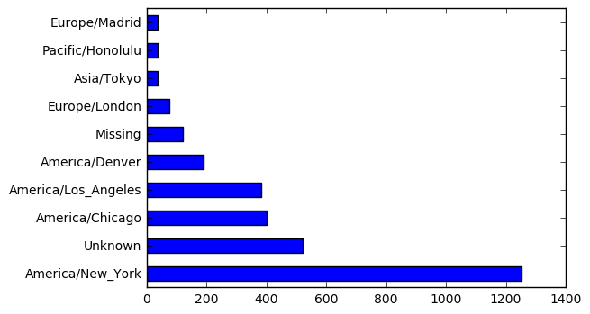
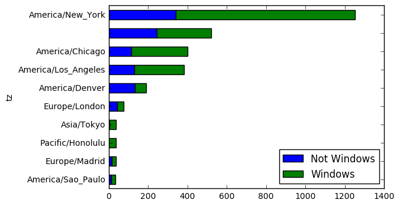
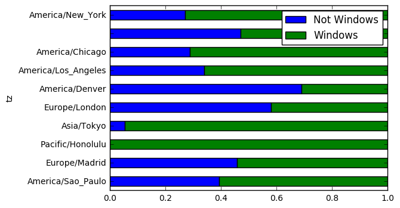

#### 미 정부 사이트에 접속자의 timezone별 OS 집계

----------------------------------

### 1. usagov_bitly_data
* 출처 : "파이썬 라이브러리를 활용한 데이터분석 (웨스 맥키니)"

```python
# 단축 url로 미국 정부 사이트에 접속한 사용자 정보.
```


```python
path = 'data/usagov_bitly_data2012-03-16.txt'
open(path).readline()   # 1 line
```


    '{ "a": "Mozilla\\/5.0 (Windows NT 6.1; WOW64) AppleWebKit\\/535.11 (KHTML, like Gecko) Chrome\\/17.0.963.78 Safari\\/535.11", "c": "US", "nk": 1, "tz": "America\\/New_York", "gr": "MA", "g": "A6qOVH", "h": "wfLQtf", "l": "orofrog", "al": "en-US,en;q=0.8", "hh": "1.usa.gov", "r": "http:\\/\\/www.facebook.com\\/l\\/7AQEFzjSi\\/1.usa.gov\\/wfLQtf", "u": "http:\\/\\/www.ncbi.nlm.nih.gov\\/pubmed\\/22415991", "t": 1331923247, "hc": 1331822918, "cy": "Danvers", "ll": [ 42.576698, -70.954903 ] }\n'


```python
import json
records = [json.loads(line) for line in open(path)]   # 각 라인별로 json.loads 함수 적용.
records[0]
```


    {'a': 'Mozilla/5.0 (Windows NT 6.1; WOW64) AppleWebKit/535.11 (KHTML, like Gecko) Chrome/17.0.963.78 Safari/535.11',
     'al': 'en-US,en;q=0.8',
     'c': 'US',
     'cy': 'Danvers',
     'g': 'A6qOVH',
     'gr': 'MA',
     'h': 'wfLQtf',
     'hc': 1331822918,
     'hh': '1.usa.gov',
     'l': 'orofrog',
     'll': [42.576698, -70.954903],
     'nk': 1,
     'r': 'http://www.facebook.com/l/7AQEFzjSi/1.usa.gov/wfLQtf',
     't': 1331923247,
     'tz': 'America/New_York',
     'u': 'http://www.ncbi.nlm.nih.gov/pubmed/22415991'}


### Time Zone 집계


```python
# 'tz' 없는 항목 체크하여 제외.
tz = [rec['tz'] for rec in records if 'tz' in rec and len(rec['tz'])>0]   # --> list
tz[:10]
```


    ['America/New_York',
     'America/Denver',
     'America/New_York',
     'America/Sao_Paulo',
     'America/New_York',
     'America/New_York',
     'Europe/Warsaw',
     'America/Los_Angeles',
     'America/New_York',
     'America/New_York']


```python
len(tz)
```


    2919


```python
# timezone 빈도수 집계
```


```python
def get_counts(sequence):
    tzDic = {}
    for x in sequence:            
        if x in tzDic:
            tzDic[x] += 1
        else:
            tzDic[x] = 1
    return tzDic
```


```python
counts = get_counts(tz)
counts.keys()
```


    dict_keys(['Asia/Jakarta', 'Europe/Belgrade', 'Asia/Istanbul', 'America/New_York', 'Asia/Pontianak', 'Africa/Casablanca', 'America/Mexico_City', 'Asia/Seoul', 'Europe/Volgograd', 'America/Caracas', 'Europe/Warsaw', 'Asia/Karachi', 'Asia/Kuala_Lumpur', 'Asia/Harbin', 'America/Puerto_Rico', 'America/Managua', 'America/Montreal', 'America/Costa_Rica', 'Europe/Amsterdam', 'Europe/Sofia', 'Europe/London', 'Africa/Ceuta', 'America/Santo_Domingo', 'Asia/Kuching', 'America/Mazatlan', 'Europe/Stockholm', 'America/Denver', 'Europe/Lisbon', 'Europe/Vilnius', 'America/Argentina/Buenos_Aires', 'Europe/Budapest', 'America/Montevideo', 'America/Los_Angeles', 'America/Guayaquil', 'America/Bogota', 'Europe/Bucharest', 'Africa/Cairo', 'Europe/Paris', 'America/Rainy_River', 'Europe/Athens', 'America/Halifax', 'Africa/Johannesburg', 'Europe/Copenhagen', 'Asia/Novosibirsk', 'Europe/Prague', 'Asia/Jerusalem', 'Australia/NSW', 'America/Argentina/Cordoba', 'Europe/Ljubljana', 'Asia/Nicosia', 'Pacific/Auckland', 'Europe/Dublin', 'America/Anchorage', 'Asia/Beirut', 'Asia/Amman', 'Africa/Lusaka', 'Europe/Vienna', 'Europe/Madrid', 'America/Edmonton', 'Pacific/Honolulu', 'America/Sao_Paulo', 'Asia/Riyadh', 'Asia/Tokyo', 'America/Phoenix', 'Europe/Rome', 'Chile/Continental', 'Australia/Queensland', 'Asia/Manila', 'Europe/Brussels', 'Asia/Hong_Kong', 'America/Vancouver', 'Europe/Bratislava', 'America/Chihuahua', 'Asia/Bangkok', 'Europe/Skopje', 'America/St_Kitts', 'Europe/Riga', 'America/Lima', 'America/Argentina/Mendoza', 'Asia/Yekaterinburg', 'America/La_Paz', 'Europe/Malta', 'Asia/Calcutta', 'Europe/Zurich', 'America/Tegucigalpa', 'Europe/Moscow', 'Europe/Berlin', 'America/Recife', 'Europe/Uzhgorod', 'America/Monterrey', 'Europe/Oslo', 'Asia/Dubai', 'America/Chicago', 'Europe/Helsinki', 'America/Winnipeg', 'America/Indianapolis'])


```python
counts['Asia/Seoul']
```


    5


```python
# 상위 10개 timezone
```


```python
def top_counts(count_dict, n=10):
    value_key_pairs = [(count, tz) for tz, count in count_dict.items()]   # sorting을 위해 value를 앞에 위치.
    value_key_pairs.sort()
    return value_key_pairs[-n:]
```


```python
top_counts(counts)
```


    [(28, 'Europe/Berlin'),
     (33, 'America/Sao_Paulo'),
     (35, 'Europe/Madrid'),
     (36, 'Pacific/Honolulu'),
     (37, 'Asia/Tokyo'),
     (74, 'Europe/London'),
     (191, 'America/Denver'),
     (382, 'America/Los_Angeles'),
     (400, 'America/Chicago'),
     (1251, 'America/New_York')]


```python
# 상위 10개 - Counter 함수 사용
```


```python
from collections import Counter
```


```python
counts = Counter(tz)
counts.most_common(10)
```


    [('America/New_York', 1251),
     ('America/Chicago', 400),
     ('America/Los_Angeles', 382),
     ('America/Denver', 191),
     ('Europe/London', 74),
     ('Asia/Tokyo', 37),
     ('Pacific/Honolulu', 36),
     ('Europe/Madrid', 35),
     ('America/Sao_Paulo', 33),
     ('Europe/Berlin', 28)]


### pandas로 Time Zone 집계


```python
from pandas import DataFrame, Series
import pandas as pd
import numpy as np
```


```python
df = DataFrame(records)   # json으로 읽은 내용을 dataframe으로 변환.
df.head()
```


<div>
<table border="1" class="dataframe">
  <thead>
    <tr style="text-align: right;">
      <th></th>
      <th>_heartbeat_</th>
      <th>a</th>
      <th>al</th>
      <th>c</th>
      <th>cy</th>
      <th>g</th>
      <th>gr</th>
      <th>h</th>
      <th>hc</th>
      <th>hh</th>
      <th>kw</th>
      <th>l</th>
      <th>ll</th>
      <th>nk</th>
      <th>r</th>
      <th>t</th>
      <th>tz</th>
      <th>u</th>
    </tr>
  </thead>
  <tbody>
    <tr>
      <th>0</th>
      <td>NaN</td>
      <td>Mozilla/5.0 (Windows NT 6.1; WOW64) AppleWebKi...</td>
      <td>en-US,en;q=0.8</td>
      <td>US</td>
      <td>Danvers</td>
      <td>A6qOVH</td>
      <td>MA</td>
      <td>wfLQtf</td>
      <td>1.331823e+09</td>
      <td>1.usa.gov</td>
      <td>NaN</td>
      <td>orofrog</td>
      <td>[42.576698, -70.954903]</td>
      <td>1.0</td>
      <td>http://www.facebook.com/l/7AQEFzjSi/1.usa.gov/...</td>
      <td>1.331923e+09</td>
      <td>America/New_York</td>
      <td>http://www.ncbi.nlm.nih.gov/pubmed/22415991</td>
    </tr>
    <tr>
      <th>1</th>
      <td>NaN</td>
      <td>GoogleMaps/RochesterNY</td>
      <td>NaN</td>
      <td>US</td>
      <td>Provo</td>
      <td>mwszkS</td>
      <td>UT</td>
      <td>mwszkS</td>
      <td>1.308262e+09</td>
      <td>j.mp</td>
      <td>NaN</td>
      <td>bitly</td>
      <td>[40.218102, -111.613297]</td>
      <td>0.0</td>
      <td>http://www.AwareMap.com/</td>
      <td>1.331923e+09</td>
      <td>America/Denver</td>
      <td>http://www.monroecounty.gov/etc/911/rss.php</td>
    </tr>
    <tr>
      <th>2</th>
      <td>NaN</td>
      <td>Mozilla/4.0 (compatible; MSIE 8.0; Windows NT ...</td>
      <td>en-US</td>
      <td>US</td>
      <td>Washington</td>
      <td>xxr3Qb</td>
      <td>DC</td>
      <td>xxr3Qb</td>
      <td>1.331920e+09</td>
      <td>1.usa.gov</td>
      <td>NaN</td>
      <td>bitly</td>
      <td>[38.9007, -77.043098]</td>
      <td>1.0</td>
      <td>http://t.co/03elZC4Q</td>
      <td>1.331923e+09</td>
      <td>America/New_York</td>
      <td>http://boxer.senate.gov/en/press/releases/0316...</td>
    </tr>
    <tr>
      <th>3</th>
      <td>NaN</td>
      <td>Mozilla/5.0 (Macintosh; Intel Mac OS X 10_6_8)...</td>
      <td>pt-br</td>
      <td>BR</td>
      <td>Braz</td>
      <td>zCaLwp</td>
      <td>27</td>
      <td>zUtuOu</td>
      <td>1.331923e+09</td>
      <td>1.usa.gov</td>
      <td>NaN</td>
      <td>alelex88</td>
      <td>[-23.549999, -46.616699]</td>
      <td>0.0</td>
      <td>direct</td>
      <td>1.331923e+09</td>
      <td>America/Sao_Paulo</td>
      <td>http://apod.nasa.gov/apod/ap120312.html</td>
    </tr>
    <tr>
      <th>4</th>
      <td>NaN</td>
      <td>Mozilla/5.0 (Windows NT 6.1; WOW64) AppleWebKi...</td>
      <td>en-US,en;q=0.8</td>
      <td>US</td>
      <td>Shrewsbury</td>
      <td>9b6kNl</td>
      <td>MA</td>
      <td>9b6kNl</td>
      <td>1.273672e+09</td>
      <td>bit.ly</td>
      <td>NaN</td>
      <td>bitly</td>
      <td>[42.286499, -71.714699]</td>
      <td>0.0</td>
      <td>http://www.shrewsbury-ma.gov/selco/</td>
      <td>1.331923e+09</td>
      <td>America/New_York</td>
      <td>http://www.shrewsbury-ma.gov/egov/gallery/1341...</td>
    </tr>
  </tbody>
</table>
</div>


```python
tz_counts = df['tz'].value_counts()   # = dataframe row count
tz_counts[:10]
```


    America/New_York       1251
                            521
    America/Chicago         400
    America/Los_Angeles     382
    America/Denver          191
    Europe/London            74
    Asia/Tokyo               37
    Pacific/Honolulu         36
    Europe/Madrid            35
    America/Sao_Paulo        33
    Name: tz, dtype: int64


```python
clean_tz = df['tz'].fillna('Missing')   # NA 처리
clean_tz[clean_tz == ''] = 'Unknown'    # 값 없는 것 처리
tz_counts = clean_tz.value_counts()
tz_counts[:10]
```


    America/New_York       1251
    Unknown                 521
    America/Chicago         400
    America/Los_Angeles     382
    America/Denver          191
    Missing                 120
    Europe/London            74
    Asia/Tokyo               37
    Pacific/Honolulu         36
    Europe/Madrid            35
    Name: tz, dtype: int64


```python
%matplotlib inline
import matplotlib.pyplot as plt
```


```python
plt.figure()
tz_counts[:10].plot(kind='barh')   # plt 레이어 위에 dataframe.plot
```


    <matplotlib.axes._subplots.AxesSubplot at 0x1137cb6d8>





#### OS 집계


```python
df.a[0].split()   # split string
```


    ['Mozilla/5.0',
     '(Windows',
     'NT',
     '6.1;',
     'WOW64)',
     'AppleWebKit/535.11',
     '(KHTML,',
     'like',
     'Gecko)',
     'Chrome/17.0.963.78',
     'Safari/535.11']


```python
results = Series([x.split()[0] for x in df.a.dropna()])  # a:useragent. NA 항목 제외. --> Series로 리턴
results.value_counts()[:10]
```


    Mozilla/5.0                 2594
    Mozilla/4.0                  601
    GoogleMaps/RochesterNY       121
    Opera/9.80                    34
    TEST_INTERNET_AGENT           24
    GoogleProducer                21
    Mozilla/6.0                    5
    BlackBerry8520/5.0.0.681       4
    Dalvik/1.4.0                   3
    BlackBerry8520/5.0.0.592       3
    dtype: int64


```python
# null 항목 제외하고 Win / Not Win 구분
```


```python
odf = df[df.a.notnull()]
odf.a.head()
```


    0    Mozilla/5.0 (Windows NT 6.1; WOW64) AppleWebKi...
    1                               GoogleMaps/RochesterNY
    2    Mozilla/4.0 (compatible; MSIE 8.0; Windows NT ...
    3    Mozilla/5.0 (Macintosh; Intel Mac OS X 10_6_8)...
    4    Mozilla/5.0 (Windows NT 6.1; WOW64) AppleWebKi...
    Name: a, dtype: object


```python
browserOS = np.where(odf['a'].str.contains('Windows'), 'Windows', 'Not Windows')
browserOS
```


    array(['Windows', 'Not Windows', 'Windows', ..., 'Not Windows',
           'Not Windows', 'Windows'], 
          dtype='<U11')


```python
# Grouping by timezone & os
```


```python
by_tz_os = odf.groupby(['tz', browserOS])
print(by_tz_os)
```

    <pandas.core.groupby.DataFrameGroupBy object at 0x115c29dd8>
    


```python
agg_counts = by_tz_os.size().unstack().fillna(0)   # size : 그룹별 갯수 집계 / unstack : 결과를 표로 재배치.
agg_counts[:10]
```


<div>
<table border="1" class="dataframe">
  <thead>
    <tr style="text-align: right;">
      <th></th>
      <th>Not Windows</th>
      <th>Windows</th>
    </tr>
    <tr>
      <th>tz</th>
      <th></th>
      <th></th>
    </tr>
  </thead>
  <tbody>
    <tr>
      <th></th>
      <td>245.0</td>
      <td>276.0</td>
    </tr>
    <tr>
      <th>Africa/Cairo</th>
      <td>0.0</td>
      <td>3.0</td>
    </tr>
    <tr>
      <th>Africa/Casablanca</th>
      <td>0.0</td>
      <td>1.0</td>
    </tr>
    <tr>
      <th>Africa/Ceuta</th>
      <td>0.0</td>
      <td>2.0</td>
    </tr>
    <tr>
      <th>Africa/Johannesburg</th>
      <td>0.0</td>
      <td>1.0</td>
    </tr>
    <tr>
      <th>Africa/Lusaka</th>
      <td>0.0</td>
      <td>1.0</td>
    </tr>
    <tr>
      <th>America/Anchorage</th>
      <td>4.0</td>
      <td>1.0</td>
    </tr>
    <tr>
      <th>America/Argentina/Buenos_Aires</th>
      <td>1.0</td>
      <td>0.0</td>
    </tr>
    <tr>
      <th>America/Argentina/Cordoba</th>
      <td>0.0</td>
      <td>1.0</td>
    </tr>
    <tr>
      <th>America/Argentina/Mendoza</th>
      <td>0.0</td>
      <td>1.0</td>
    </tr>
  </tbody>
</table>
</div>


```python
indexer = agg_counts.sum(1).argsort()  # Asc. 표시된 값은 각 항목의 sorting된 인덱스 값.
indexer[:10]
```


    tz
                                      24
    Africa/Cairo                      20
    Africa/Casablanca                 21
    Africa/Ceuta                      92
    Africa/Johannesburg               87
    Africa/Lusaka                     53
    America/Anchorage                 54
    America/Argentina/Buenos_Aires    57
    America/Argentina/Cordoba         26
    America/Argentina/Mendoza         55
    dtype: int64


```python
count_subset = agg_counts.take(indexer)[-10:]  # 상위 10개
count_subset
```


<div>
<table border="1" class="dataframe">
  <thead>
    <tr style="text-align: right;">
      <th></th>
      <th>Not Windows</th>
      <th>Windows</th>
    </tr>
    <tr>
      <th>tz</th>
      <th></th>
      <th></th>
    </tr>
  </thead>
  <tbody>
    <tr>
      <th>America/Sao_Paulo</th>
      <td>13.0</td>
      <td>20.0</td>
    </tr>
    <tr>
      <th>Europe/Madrid</th>
      <td>16.0</td>
      <td>19.0</td>
    </tr>
    <tr>
      <th>Pacific/Honolulu</th>
      <td>0.0</td>
      <td>36.0</td>
    </tr>
    <tr>
      <th>Asia/Tokyo</th>
      <td>2.0</td>
      <td>35.0</td>
    </tr>
    <tr>
      <th>Europe/London</th>
      <td>43.0</td>
      <td>31.0</td>
    </tr>
    <tr>
      <th>America/Denver</th>
      <td>132.0</td>
      <td>59.0</td>
    </tr>
    <tr>
      <th>America/Los_Angeles</th>
      <td>130.0</td>
      <td>252.0</td>
    </tr>
    <tr>
      <th>America/Chicago</th>
      <td>115.0</td>
      <td>285.0</td>
    </tr>
    <tr>
      <th></th>
      <td>245.0</td>
      <td>276.0</td>
    </tr>
    <tr>
      <th>America/New_York</th>
      <td>339.0</td>
      <td>912.0</td>
    </tr>
  </tbody>
</table>
</div>


```python
plt.figure()
count_subset.plot(kind='barh', stacked=True)  # stacked : 중첩 그래프
```


    <matplotlib.axes._subplots.AxesSubplot at 0x1162566d8>


    <matplotlib.figure.Figure at 0x115c572b0>





```python
# win / not win 상대적인 비율 보기위해 정규화. sum(1) : 총합이 1이 되도록.
plt.figure()
normed_subset = count_subset.div(count_subset.sum(1), axis=0)
normed_subset.plot(kind='barh', stacked=True)
```


    <matplotlib.axes._subplots.AxesSubplot at 0x115bd1550>


    <matplotlib.figure.Figure at 0x116440860>




