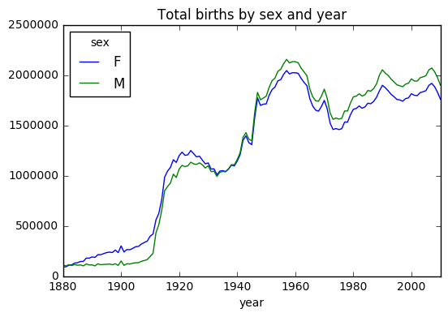
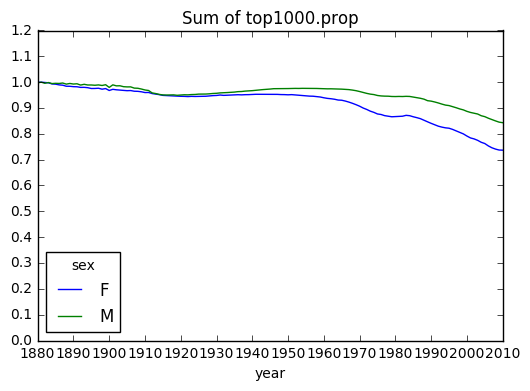
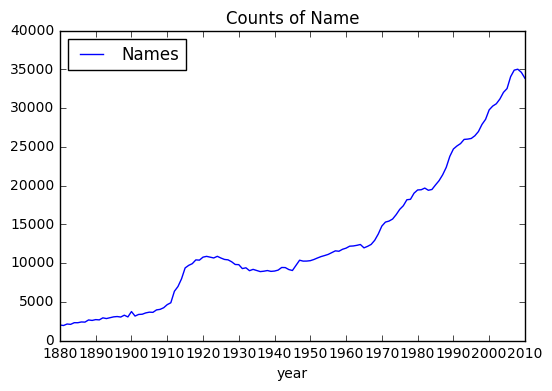
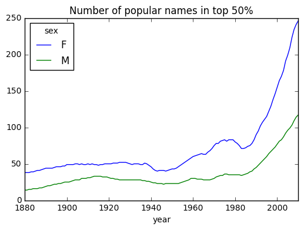
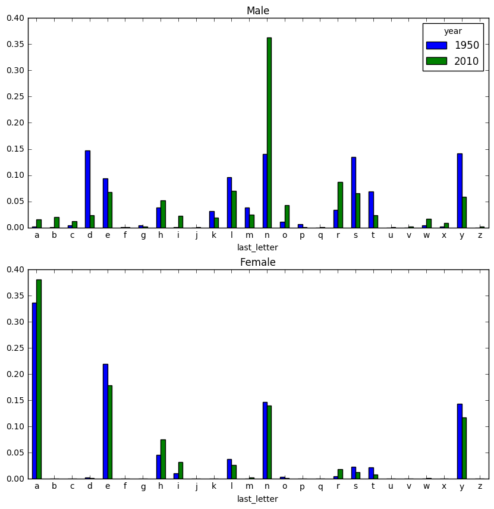
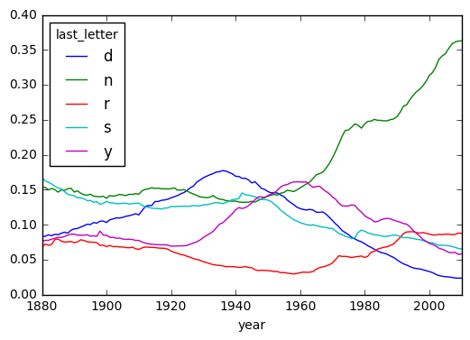
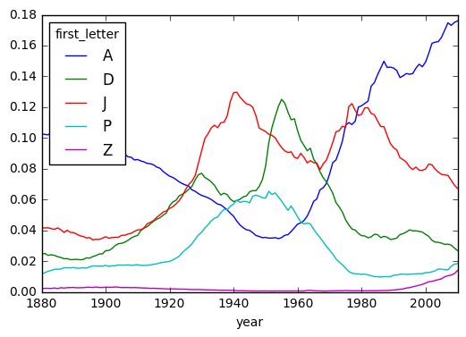

#### 신생아 출생 트렌드, 이름 유행 분석, 첫글자 및 마지막 글자의 변화 추세

----------------------------------

### 3. Baby Names (2000 - 2010)
* 출처 : "파이썬 라이브러리를 활용한 데이터분석 (웨스 맥키니)"

```python
import numpy as np
import pandas as pd
import matplotlib.pyplot as plt
%matplotlib inline
```


```python
names2010 = pd.read_csv('data/names/yob2010.txt', names=['name', 'sex', 'births'])
names2010.head()
```


<div>
<table border="1" class="dataframe">
  <thead>
    <tr style="text-align: right;">
      <th></th>
      <th>name</th>
      <th>sex</th>
      <th>births</th>
    </tr>
  </thead>
  <tbody>
    <tr>
      <th>0</th>
      <td>Isabella</td>
      <td>F</td>
      <td>22731</td>
    </tr>
    <tr>
      <th>1</th>
      <td>Sophia</td>
      <td>F</td>
      <td>20477</td>
    </tr>
    <tr>
      <th>2</th>
      <td>Emma</td>
      <td>F</td>
      <td>17179</td>
    </tr>
    <tr>
      <th>3</th>
      <td>Olivia</td>
      <td>F</td>
      <td>16860</td>
    </tr>
    <tr>
      <th>4</th>
      <td>Ava</td>
      <td>F</td>
      <td>15300</td>
    </tr>
  </tbody>
</table>
</div>


```python
names2010.shape
```


    (33838, 3)


```python
names2010.groupby('sex').births.sum()
```


    sex
    F    1759010
    M    1898382
    Name: births, dtype: int64


### 년도별 데이터 합치기


```python
years = range(1880, 2011)
pieces = []
columns = ['name', 'sex', 'births']
```


```python
for year in years:
    path = 'data/names/yob%d.txt' % year
    df = pd.read_csv(path, names=columns)

    df['year'] = year
    pieces.append(df)
```


```python
# 하나의 dataframe으로 취합. 
names = pd.concat(pieces, ignore_index=True)  # ignore_index : 원래의 행순서 상관없음.
names.head()
```


<div>
<table border="1" class="dataframe">
  <thead>
    <tr style="text-align: right;">
      <th></th>
      <th>name</th>
      <th>sex</th>
      <th>births</th>
      <th>year</th>
    </tr>
  </thead>
  <tbody>
    <tr>
      <th>0</th>
      <td>Mary</td>
      <td>F</td>
      <td>7065</td>
      <td>1880</td>
    </tr>
    <tr>
      <th>1</th>
      <td>Anna</td>
      <td>F</td>
      <td>2604</td>
      <td>1880</td>
    </tr>
    <tr>
      <th>2</th>
      <td>Emma</td>
      <td>F</td>
      <td>2003</td>
      <td>1880</td>
    </tr>
    <tr>
      <th>3</th>
      <td>Elizabeth</td>
      <td>F</td>
      <td>1939</td>
      <td>1880</td>
    </tr>
    <tr>
      <th>4</th>
      <td>Minnie</td>
      <td>F</td>
      <td>1746</td>
      <td>1880</td>
    </tr>
  </tbody>
</table>
</div>


```python
names.tail()
```


<div>
<table border="1" class="dataframe">
  <thead>
    <tr style="text-align: right;">
      <th></th>
      <th>name</th>
      <th>sex</th>
      <th>births</th>
      <th>year</th>
    </tr>
  </thead>
  <tbody>
    <tr>
      <th>1690779</th>
      <td>Zymaire</td>
      <td>M</td>
      <td>5</td>
      <td>2010</td>
    </tr>
    <tr>
      <th>1690780</th>
      <td>Zyonne</td>
      <td>M</td>
      <td>5</td>
      <td>2010</td>
    </tr>
    <tr>
      <th>1690781</th>
      <td>Zyquarius</td>
      <td>M</td>
      <td>5</td>
      <td>2010</td>
    </tr>
    <tr>
      <th>1690782</th>
      <td>Zyran</td>
      <td>M</td>
      <td>5</td>
      <td>2010</td>
    </tr>
    <tr>
      <th>1690783</th>
      <td>Zzyzx</td>
      <td>M</td>
      <td>5</td>
      <td>2010</td>
    </tr>
  </tbody>
</table>
</div>


```python
total = names.groupby(['year', 'sex']).births.sum()
total.head(10)
```


    year  sex
    1880  F       90993
          M      110493
    1881  F       91955
          M      100748
    1882  F      107851
          M      113687
    1883  F      112322
          M      104632
    1884  F      129021
          M      114445
    Name: births, dtype: int64


```python
total_births = names.pivot_table('births', index='year', columns='sex', aggfunc=sum)
total_births.head()
```


<div>
<table border="1" class="dataframe">
  <thead>
    <tr style="text-align: right;">
      <th>sex</th>
      <th>F</th>
      <th>M</th>
    </tr>
    <tr>
      <th>year</th>
      <th></th>
      <th></th>
    </tr>
  </thead>
  <tbody>
    <tr>
      <th>1880</th>
      <td>90993</td>
      <td>110493</td>
    </tr>
    <tr>
      <th>1881</th>
      <td>91955</td>
      <td>100748</td>
    </tr>
    <tr>
      <th>1882</th>
      <td>107851</td>
      <td>113687</td>
    </tr>
    <tr>
      <th>1883</th>
      <td>112322</td>
      <td>104632</td>
    </tr>
    <tr>
      <th>1884</th>
      <td>129021</td>
      <td>114445</td>
    </tr>
  </tbody>
</table>
</div>


### 성별, 연도별 출생 트렌드


```python
plt.figure()
total_births.plot(title='Total births by sex and year')
```


    <matplotlib.axes._subplots.AxesSubplot at 0x11dc4df28>


    <matplotlib.figure.Figure at 0x104b48cf8>





```python
# 년도별 성별 그룹핑
```


```python
ysGrouped = names.groupby(['year', 'sex'])

g = []
for name, group in ysGrouped:
    g.append(name)
    
print(g[:10])
```

    [(1880, 'F'), (1880, 'M'), (1881, 'F'), (1881, 'M'), (1882, 'F'), (1882, 'M'), (1883, 'F'), (1883, 'M'), (1884, 'F'), (1884, 'M')]
    


```python
ysGrouped.get_group((2000,'F')).head()   # 특정 그룹에 속한 데이터
```


<div>
<table border="1" class="dataframe">
  <thead>
    <tr style="text-align: right;">
      <th></th>
      <th>name</th>
      <th>sex</th>
      <th>births</th>
      <th>year</th>
    </tr>
  </thead>
  <tbody>
    <tr>
      <th>1332172</th>
      <td>Emily</td>
      <td>F</td>
      <td>25949</td>
      <td>2000</td>
    </tr>
    <tr>
      <th>1332173</th>
      <td>Hannah</td>
      <td>F</td>
      <td>23066</td>
      <td>2000</td>
    </tr>
    <tr>
      <th>1332174</th>
      <td>Madison</td>
      <td>F</td>
      <td>19965</td>
      <td>2000</td>
    </tr>
    <tr>
      <th>1332175</th>
      <td>Ashley</td>
      <td>F</td>
      <td>17991</td>
      <td>2000</td>
    </tr>
    <tr>
      <th>1332176</th>
      <td>Sarah</td>
      <td>F</td>
      <td>17677</td>
      <td>2000</td>
    </tr>
  </tbody>
</table>
</div>


```python
# 각 이름이 각 그룹에서 차지하는 비율
```


```python
def add_prop(group):
    births = group.births.astype(float)
    group['prop'] = births / births.sum()
    return group
```


```python
names = ysGrouped.apply(add_prop)
names.head()
```


<div>
<table border="1" class="dataframe">
  <thead>
    <tr style="text-align: right;">
      <th></th>
      <th>name</th>
      <th>sex</th>
      <th>births</th>
      <th>year</th>
      <th>prop</th>
    </tr>
  </thead>
  <tbody>
    <tr>
      <th>0</th>
      <td>Mary</td>
      <td>F</td>
      <td>7065</td>
      <td>1880</td>
      <td>0.077643</td>
    </tr>
    <tr>
      <th>1</th>
      <td>Anna</td>
      <td>F</td>
      <td>2604</td>
      <td>1880</td>
      <td>0.028618</td>
    </tr>
    <tr>
      <th>2</th>
      <td>Emma</td>
      <td>F</td>
      <td>2003</td>
      <td>1880</td>
      <td>0.022013</td>
    </tr>
    <tr>
      <th>3</th>
      <td>Elizabeth</td>
      <td>F</td>
      <td>1939</td>
      <td>1880</td>
      <td>0.021309</td>
    </tr>
    <tr>
      <th>4</th>
      <td>Minnie</td>
      <td>F</td>
      <td>1746</td>
      <td>1880</td>
      <td>0.019188</td>
    </tr>
  </tbody>
</table>
</div>


```python
# 그룹별로 비율의 합이 1이 맞는지 확인
```


```python
np.allclose(names.groupby(['year', 'sex']).prop.sum(), 1)
```


    True


```python
# 그룹별로 사용 빈도수가 높은 이름 1000 개 추출
```


```python
def get_top1000(group):
    #group = group[group['prop'] > 0.01]  # 사용 비율로 필터링.
    return group.sort_values(by='births', ascending=False)[:1000]
```


```python
top1000 = names.groupby(['year', 'sex']).apply(get_top1000)
top1000.index = np.arange(len(top1000))
top1000.head()
```


<div>
<table border="1" class="dataframe">
  <thead>
    <tr style="text-align: right;">
      <th></th>
      <th>name</th>
      <th>sex</th>
      <th>births</th>
      <th>year</th>
      <th>prop</th>
    </tr>
  </thead>
  <tbody>
    <tr>
      <th>0</th>
      <td>Mary</td>
      <td>F</td>
      <td>7065</td>
      <td>1880</td>
      <td>0.077643</td>
    </tr>
    <tr>
      <th>1</th>
      <td>Anna</td>
      <td>F</td>
      <td>2604</td>
      <td>1880</td>
      <td>0.028618</td>
    </tr>
    <tr>
      <th>2</th>
      <td>Emma</td>
      <td>F</td>
      <td>2003</td>
      <td>1880</td>
      <td>0.022013</td>
    </tr>
    <tr>
      <th>3</th>
      <td>Elizabeth</td>
      <td>F</td>
      <td>1939</td>
      <td>1880</td>
      <td>0.021309</td>
    </tr>
    <tr>
      <th>4</th>
      <td>Minnie</td>
      <td>F</td>
      <td>1746</td>
      <td>1880</td>
      <td>0.019188</td>
    </tr>
  </tbody>
</table>
</div>


```python
top1000.tail()
```


<div>
<table border="1" class="dataframe">
  <thead>
    <tr style="text-align: right;">
      <th></th>
      <th>name</th>
      <th>sex</th>
      <th>births</th>
      <th>year</th>
      <th>prop</th>
    </tr>
  </thead>
  <tbody>
    <tr>
      <th>261872</th>
      <td>Camilo</td>
      <td>M</td>
      <td>194</td>
      <td>2010</td>
      <td>0.000102</td>
    </tr>
    <tr>
      <th>261873</th>
      <td>Destin</td>
      <td>M</td>
      <td>194</td>
      <td>2010</td>
      <td>0.000102</td>
    </tr>
    <tr>
      <th>261874</th>
      <td>Jaquan</td>
      <td>M</td>
      <td>194</td>
      <td>2010</td>
      <td>0.000102</td>
    </tr>
    <tr>
      <th>261875</th>
      <td>Jaydan</td>
      <td>M</td>
      <td>194</td>
      <td>2010</td>
      <td>0.000102</td>
    </tr>
    <tr>
      <th>261876</th>
      <td>Maxton</td>
      <td>M</td>
      <td>193</td>
      <td>2010</td>
      <td>0.000102</td>
    </tr>
  </tbody>
</table>
</div>


### 이름 유행 분석


```python
boys = top1000[top1000.sex == 'M']
girls = top1000[top1000.sex == 'F']
```


```python
girls.shape
```


    (130880, 5)


```python
girls.head()
```


<div>
<table border="1" class="dataframe">
  <thead>
    <tr style="text-align: right;">
      <th></th>
      <th>name</th>
      <th>sex</th>
      <th>births</th>
      <th>year</th>
      <th>prop</th>
    </tr>
  </thead>
  <tbody>
    <tr>
      <th>0</th>
      <td>Mary</td>
      <td>F</td>
      <td>7065</td>
      <td>1880</td>
      <td>0.077643</td>
    </tr>
    <tr>
      <th>1</th>
      <td>Anna</td>
      <td>F</td>
      <td>2604</td>
      <td>1880</td>
      <td>0.028618</td>
    </tr>
    <tr>
      <th>2</th>
      <td>Emma</td>
      <td>F</td>
      <td>2003</td>
      <td>1880</td>
      <td>0.022013</td>
    </tr>
    <tr>
      <th>3</th>
      <td>Elizabeth</td>
      <td>F</td>
      <td>1939</td>
      <td>1880</td>
      <td>0.021309</td>
    </tr>
    <tr>
      <th>4</th>
      <td>Minnie</td>
      <td>F</td>
      <td>1746</td>
      <td>1880</td>
      <td>0.019188</td>
    </tr>
  </tbody>
</table>
</div>


```python
# pandas groupby --> dataframe --> sort
```


```python
girlsRating = pd.DataFrame(girls.groupby('name').births.sum())
girlsRating.sort_values(by='births', ascending=False).head()
```


<div>
<table border="1" class="dataframe">
  <thead>
    <tr style="text-align: right;">
      <th></th>
      <th>births</th>
    </tr>
    <tr>
      <th>name</th>
      <th></th>
    </tr>
  </thead>
  <tbody>
    <tr>
      <th>Mary</th>
      <td>4103935</td>
    </tr>
    <tr>
      <th>Patricia</th>
      <td>1568737</td>
    </tr>
    <tr>
      <th>Elizabeth</th>
      <td>1561874</td>
    </tr>
    <tr>
      <th>Jennifer</th>
      <td>1454725</td>
    </tr>
    <tr>
      <th>Linda</th>
      <td>1448771</td>
    </tr>
  </tbody>
</table>
</div>


```python
# 각 이름의 년도별 사용 트렌드
```


```python
total_births = top1000.pivot_table('births', index='year', columns='name', aggfunc=sum)
total_births.tail()
```


<div>
<table border="1" class="dataframe">
  <thead>
    <tr style="text-align: right;">
      <th>name</th>
      <th>Aaden</th>
      <th>Aaliyah</th>
      <th>Aarav</th>
      <th>Aaron</th>
      <th>Aarush</th>
      <th>Ab</th>
      <th>Abagail</th>
      <th>Abb</th>
      <th>Abbey</th>
      <th>Abbie</th>
      <th>...</th>
      <th>Zoa</th>
      <th>Zoe</th>
      <th>Zoey</th>
      <th>Zoie</th>
      <th>Zola</th>
      <th>Zollie</th>
      <th>Zona</th>
      <th>Zora</th>
      <th>Zula</th>
      <th>Zuri</th>
    </tr>
    <tr>
      <th>year</th>
      <th></th>
      <th></th>
      <th></th>
      <th></th>
      <th></th>
      <th></th>
      <th></th>
      <th></th>
      <th></th>
      <th></th>
      <th></th>
      <th></th>
      <th></th>
      <th></th>
      <th></th>
      <th></th>
      <th></th>
      <th></th>
      <th></th>
      <th></th>
      <th></th>
    </tr>
  </thead>
  <tbody>
    <tr>
      <th>2006</th>
      <td>NaN</td>
      <td>3737.0</td>
      <td>NaN</td>
      <td>8279.0</td>
      <td>NaN</td>
      <td>NaN</td>
      <td>297.0</td>
      <td>NaN</td>
      <td>404.0</td>
      <td>440.0</td>
      <td>...</td>
      <td>NaN</td>
      <td>5145.0</td>
      <td>2839.0</td>
      <td>530.0</td>
      <td>NaN</td>
      <td>NaN</td>
      <td>NaN</td>
      <td>NaN</td>
      <td>NaN</td>
      <td>NaN</td>
    </tr>
    <tr>
      <th>2007</th>
      <td>NaN</td>
      <td>3941.0</td>
      <td>NaN</td>
      <td>8914.0</td>
      <td>NaN</td>
      <td>NaN</td>
      <td>313.0</td>
      <td>NaN</td>
      <td>349.0</td>
      <td>468.0</td>
      <td>...</td>
      <td>NaN</td>
      <td>4925.0</td>
      <td>3028.0</td>
      <td>526.0</td>
      <td>NaN</td>
      <td>NaN</td>
      <td>NaN</td>
      <td>NaN</td>
      <td>NaN</td>
      <td>NaN</td>
    </tr>
    <tr>
      <th>2008</th>
      <td>955.0</td>
      <td>4028.0</td>
      <td>219.0</td>
      <td>8511.0</td>
      <td>NaN</td>
      <td>NaN</td>
      <td>317.0</td>
      <td>NaN</td>
      <td>344.0</td>
      <td>400.0</td>
      <td>...</td>
      <td>NaN</td>
      <td>4764.0</td>
      <td>3438.0</td>
      <td>492.0</td>
      <td>NaN</td>
      <td>NaN</td>
      <td>NaN</td>
      <td>NaN</td>
      <td>NaN</td>
      <td>NaN</td>
    </tr>
    <tr>
      <th>2009</th>
      <td>1265.0</td>
      <td>4352.0</td>
      <td>270.0</td>
      <td>7936.0</td>
      <td>NaN</td>
      <td>NaN</td>
      <td>296.0</td>
      <td>NaN</td>
      <td>307.0</td>
      <td>369.0</td>
      <td>...</td>
      <td>NaN</td>
      <td>5120.0</td>
      <td>3981.0</td>
      <td>496.0</td>
      <td>NaN</td>
      <td>NaN</td>
      <td>NaN</td>
      <td>NaN</td>
      <td>NaN</td>
      <td>NaN</td>
    </tr>
    <tr>
      <th>2010</th>
      <td>448.0</td>
      <td>4628.0</td>
      <td>438.0</td>
      <td>7374.0</td>
      <td>226.0</td>
      <td>NaN</td>
      <td>277.0</td>
      <td>NaN</td>
      <td>295.0</td>
      <td>324.0</td>
      <td>...</td>
      <td>NaN</td>
      <td>6200.0</td>
      <td>5164.0</td>
      <td>504.0</td>
      <td>NaN</td>
      <td>NaN</td>
      <td>NaN</td>
      <td>NaN</td>
      <td>NaN</td>
      <td>258.0</td>
    </tr>
  </tbody>
</table>
<p>5 rows × 6868 columns</p>
</div>


```python
# 여자 이름 상위 5개
```


```python
subset = total_births[['Mary', 'Patricia', 'Elizabeth', 'Jennifer', 'Linda']]
```


```python
subset.plot(subplots=True, figsize=(10,10), grid=False, title='Girls name trend')
```


    array([<matplotlib.axes._subplots.AxesSubplot object at 0x11cb0bb00>,
           <matplotlib.axes._subplots.AxesSubplot object at 0x11a118fd0>,
           <matplotlib.axes._subplots.AxesSubplot object at 0x11bc15940>,
           <matplotlib.axes._subplots.AxesSubplot object at 0x11bc02748>,
           <matplotlib.axes._subplots.AxesSubplot object at 0x11768b588>], dtype=object)


```python
# 상위 이름 1000개가 전체에서 차지하는 비율
```


```python
table = top1000.pivot_table('prop', index='year', columns='sex', aggfunc=sum)
table.plot(title='Sum of top1000.prop',
           yticks=np.linspace(0, 1.2, 13), xticks=range(1880, 2020, 10))
```


    <matplotlib.axes._subplots.AxesSubplot at 0x11d0e6748>





```python
# 년도별 사용하는 이름 갯수 - 점점 더 다양한 이름을 사용하는 경향
```


```python
nameCounts = pd.DataFrame(names.groupby('year').size())
nameCounts.columns = ['Names']
nameCounts.plot(title='Counts of Name', yticks=np.linspace(0, 40000, 9), xticks=range(1880, 2020, 10))
```


    <matplotlib.axes._subplots.AxesSubplot at 0x1192b4978>





```python
# 남녀별 사용하는 이름의 다양성 비교 (전체의 50% 차지하는 이름의 갯수)
```


```python
def get_quantile_count(group, q=0.5):
    group = group.sort_values(by='prop', ascending=False)    # 그룹별 prop 기준 정렬
    return group.prop.cumsum().values.searchsorted(q) + 1   # prop 누계가 0.5인 index 찾기
```


```python
diversity = top1000.groupby(['year', 'sex']).apply(get_quantile_count)
diversity = diversity.unstack('sex')   # 결과를 표로 재배치
diversity.tail()
```


<div>
<table border="1" class="dataframe">
  <thead>
    <tr style="text-align: right;">
      <th>sex</th>
      <th>F</th>
      <th>M</th>
    </tr>
    <tr>
      <th>year</th>
      <th></th>
      <th></th>
    </tr>
  </thead>
  <tbody>
    <tr>
      <th>2006</th>
      <td>209</td>
      <td>99</td>
    </tr>
    <tr>
      <th>2007</th>
      <td>223</td>
      <td>103</td>
    </tr>
    <tr>
      <th>2008</th>
      <td>234</td>
      <td>109</td>
    </tr>
    <tr>
      <th>2009</th>
      <td>241</td>
      <td>114</td>
    </tr>
    <tr>
      <th>2010</th>
      <td>246</td>
      <td>117</td>
    </tr>
  </tbody>
</table>
</div>


```python
diversity.plot(title="Number of popular names in top 50%")
# 여자 이름이 남자 이름보다 더 다양. 시간이 흐를수록 다양성 높아짐.
```


    <matplotlib.axes._subplots.AxesSubplot at 0x11d0f54a8>





### 마지막 글자의 변화


```python
get_last_letter = lambda x: x[-1]
last_letters = names.name.map(get_last_letter)
last_letters.name = 'last_letter'
```


```python
# 년도별, 성별 마지막 글자
```


```python
table = names.pivot_table('births', index=last_letters, columns=['sex', 'year'], aggfunc=sum)
table.head()
```


<div>
<table border="1" class="dataframe">
  <thead>
    <tr>
      <th>sex</th>
      <th colspan="10" halign="left">F</th>
      <th>...</th>
      <th colspan="10" halign="left">M</th>
    </tr>
    <tr>
      <th>year</th>
      <th>1880</th>
      <th>1881</th>
      <th>1882</th>
      <th>1883</th>
      <th>1884</th>
      <th>1885</th>
      <th>1886</th>
      <th>1887</th>
      <th>1888</th>
      <th>1889</th>
      <th>...</th>
      <th>2001</th>
      <th>2002</th>
      <th>2003</th>
      <th>2004</th>
      <th>2005</th>
      <th>2006</th>
      <th>2007</th>
      <th>2008</th>
      <th>2009</th>
      <th>2010</th>
    </tr>
    <tr>
      <th>last_letter</th>
      <th></th>
      <th></th>
      <th></th>
      <th></th>
      <th></th>
      <th></th>
      <th></th>
      <th></th>
      <th></th>
      <th></th>
      <th></th>
      <th></th>
      <th></th>
      <th></th>
      <th></th>
      <th></th>
      <th></th>
      <th></th>
      <th></th>
      <th></th>
      <th></th>
    </tr>
  </thead>
  <tbody>
    <tr>
      <th>a</th>
      <td>31446.0</td>
      <td>31581.0</td>
      <td>36536.0</td>
      <td>38330.0</td>
      <td>43680.0</td>
      <td>45408.0</td>
      <td>49100.0</td>
      <td>48942.0</td>
      <td>59442.0</td>
      <td>58631.0</td>
      <td>...</td>
      <td>39124.0</td>
      <td>38815.0</td>
      <td>37825.0</td>
      <td>38650.0</td>
      <td>36838.0</td>
      <td>36156.0</td>
      <td>34654.0</td>
      <td>32901.0</td>
      <td>31430.0</td>
      <td>28438.0</td>
    </tr>
    <tr>
      <th>b</th>
      <td>NaN</td>
      <td>NaN</td>
      <td>NaN</td>
      <td>NaN</td>
      <td>NaN</td>
      <td>NaN</td>
      <td>NaN</td>
      <td>NaN</td>
      <td>NaN</td>
      <td>NaN</td>
      <td>...</td>
      <td>50950.0</td>
      <td>49284.0</td>
      <td>48065.0</td>
      <td>45914.0</td>
      <td>43144.0</td>
      <td>42600.0</td>
      <td>42123.0</td>
      <td>39945.0</td>
      <td>38862.0</td>
      <td>38859.0</td>
    </tr>
    <tr>
      <th>c</th>
      <td>NaN</td>
      <td>NaN</td>
      <td>5.0</td>
      <td>5.0</td>
      <td>NaN</td>
      <td>NaN</td>
      <td>NaN</td>
      <td>NaN</td>
      <td>NaN</td>
      <td>NaN</td>
      <td>...</td>
      <td>27113.0</td>
      <td>27238.0</td>
      <td>27697.0</td>
      <td>26778.0</td>
      <td>26078.0</td>
      <td>26635.0</td>
      <td>26864.0</td>
      <td>25318.0</td>
      <td>24048.0</td>
      <td>23125.0</td>
    </tr>
    <tr>
      <th>d</th>
      <td>609.0</td>
      <td>607.0</td>
      <td>734.0</td>
      <td>810.0</td>
      <td>916.0</td>
      <td>862.0</td>
      <td>1007.0</td>
      <td>1027.0</td>
      <td>1298.0</td>
      <td>1374.0</td>
      <td>...</td>
      <td>60838.0</td>
      <td>55829.0</td>
      <td>53391.0</td>
      <td>51754.0</td>
      <td>50670.0</td>
      <td>51410.0</td>
      <td>50595.0</td>
      <td>47910.0</td>
      <td>46172.0</td>
      <td>44398.0</td>
    </tr>
    <tr>
      <th>e</th>
      <td>33378.0</td>
      <td>34080.0</td>
      <td>40399.0</td>
      <td>41914.0</td>
      <td>48089.0</td>
      <td>49616.0</td>
      <td>53884.0</td>
      <td>54353.0</td>
      <td>66750.0</td>
      <td>66663.0</td>
      <td>...</td>
      <td>145395.0</td>
      <td>144651.0</td>
      <td>144769.0</td>
      <td>142098.0</td>
      <td>141123.0</td>
      <td>142999.0</td>
      <td>143698.0</td>
      <td>140966.0</td>
      <td>135496.0</td>
      <td>129012.0</td>
    </tr>
  </tbody>
</table>
<p>5 rows × 262 columns</p>
</div>


```python
subtable = table.reindex(columns=[1950, 2010], level='year') # year 컬럼 기준으로 binning
subtable.head()
```


<div>
<table border="1" class="dataframe">
  <thead>
    <tr>
      <th>sex</th>
      <th colspan="2" halign="left">F</th>
      <th colspan="2" halign="left">M</th>
    </tr>
    <tr>
      <th>year</th>
      <th>1950</th>
      <th>2010</th>
      <th>1950</th>
      <th>2010</th>
    </tr>
    <tr>
      <th>last_letter</th>
      <th></th>
      <th></th>
      <th></th>
      <th></th>
    </tr>
  </thead>
  <tbody>
    <tr>
      <th>a</th>
      <td>576481.0</td>
      <td>670605.0</td>
      <td>4037.0</td>
      <td>28438.0</td>
    </tr>
    <tr>
      <th>b</th>
      <td>17.0</td>
      <td>450.0</td>
      <td>1632.0</td>
      <td>38859.0</td>
    </tr>
    <tr>
      <th>c</th>
      <td>16.0</td>
      <td>946.0</td>
      <td>6500.0</td>
      <td>23125.0</td>
    </tr>
    <tr>
      <th>d</th>
      <td>4413.0</td>
      <td>2607.0</td>
      <td>263643.0</td>
      <td>44398.0</td>
    </tr>
    <tr>
      <th>e</th>
      <td>376863.0</td>
      <td>313833.0</td>
      <td>168659.0</td>
      <td>129012.0</td>
    </tr>
  </tbody>
</table>
</div>


```python
letter_prop = subtable / subtable.sum().astype(float)
```


```python
fig, axes = plt.subplots(2, 1, figsize=(10, 10))
letter_prop['M'].plot(kind='bar', rot=0, ax=axes[0], title='Male')
letter_prop['F'].plot(kind='bar', rot=0, ax=axes[1], title='Female', legend=False)
```


    <matplotlib.axes._subplots.AxesSubplot at 0x11a680748>





```python
# 남자이름 d,n,r,s,y - 급격한 변화. 년도별 추세 확인.
```


```python
letter_prop = table / table.sum().astype(float)
ts_5 = letter_prop.ix[['d', 'n', 'r', 's', 'y'], 'M'].T
ts_5.head()
```


<div>
<table border="1" class="dataframe">
  <thead>
    <tr style="text-align: right;">
      <th>last_letter</th>
      <th>d</th>
      <th>n</th>
      <th>r</th>
      <th>s</th>
      <th>y</th>
    </tr>
    <tr>
      <th>year</th>
      <th></th>
      <th></th>
      <th></th>
      <th></th>
      <th></th>
    </tr>
  </thead>
  <tbody>
    <tr>
      <th>1880</th>
      <td>0.083055</td>
      <td>0.153213</td>
      <td>0.067461</td>
      <td>0.167006</td>
      <td>0.075760</td>
    </tr>
    <tr>
      <th>1881</th>
      <td>0.083247</td>
      <td>0.153214</td>
      <td>0.072190</td>
      <td>0.162495</td>
      <td>0.077451</td>
    </tr>
    <tr>
      <th>1882</th>
      <td>0.085340</td>
      <td>0.149560</td>
      <td>0.070263</td>
      <td>0.160441</td>
      <td>0.077537</td>
    </tr>
    <tr>
      <th>1883</th>
      <td>0.084066</td>
      <td>0.151646</td>
      <td>0.071775</td>
      <td>0.158116</td>
      <td>0.079144</td>
    </tr>
    <tr>
      <th>1884</th>
      <td>0.086120</td>
      <td>0.149915</td>
      <td>0.078492</td>
      <td>0.154764</td>
      <td>0.080405</td>
    </tr>
  </tbody>
</table>
</div>


```python
plt.close('all')
ts_5.plot()   # 1960년대 이후로 n으로 끝나는 남자이름 급격한 증가.
```


    <matplotlib.axes._subplots.AxesSubplot at 0x11d14f390>





### 첫글자의 변화 추세


```python
get_first_letter = lambda x: x[0]
first_letters = names.name.map(get_first_letter)
first_letters.name = 'first_letter'
```


```python
table = names.pivot_table('births', index=first_letters, columns=['sex', 'year'], aggfunc=sum)
table.head()
```


<div>
<table border="1" class="dataframe">
  <thead>
    <tr>
      <th>sex</th>
      <th colspan="10" halign="left">F</th>
      <th>...</th>
      <th colspan="10" halign="left">M</th>
    </tr>
    <tr>
      <th>year</th>
      <th>1880</th>
      <th>1881</th>
      <th>1882</th>
      <th>1883</th>
      <th>1884</th>
      <th>1885</th>
      <th>1886</th>
      <th>1887</th>
      <th>1888</th>
      <th>1889</th>
      <th>...</th>
      <th>2001</th>
      <th>2002</th>
      <th>2003</th>
      <th>2004</th>
      <th>2005</th>
      <th>2006</th>
      <th>2007</th>
      <th>2008</th>
      <th>2009</th>
      <th>2010</th>
    </tr>
    <tr>
      <th>first_letter</th>
      <th></th>
      <th></th>
      <th></th>
      <th></th>
      <th></th>
      <th></th>
      <th></th>
      <th></th>
      <th></th>
      <th></th>
      <th></th>
      <th></th>
      <th></th>
      <th></th>
      <th></th>
      <th></th>
      <th></th>
      <th></th>
      <th></th>
      <th></th>
      <th></th>
    </tr>
  </thead>
  <tbody>
    <tr>
      <th>A</th>
      <td>9334.0</td>
      <td>9405.0</td>
      <td>11001.0</td>
      <td>11632.0</td>
      <td>13324.0</td>
      <td>13437.0</td>
      <td>14416.0</td>
      <td>14836.0</td>
      <td>17729.0</td>
      <td>17689.0</td>
      <td>...</td>
      <td>189874.0</td>
      <td>195896.0</td>
      <td>208421.0</td>
      <td>214679.0</td>
      <td>216042.0</td>
      <td>224793.0</td>
      <td>225091.0</td>
      <td>220998.0</td>
      <td>211190.0</td>
      <td>198870.0</td>
    </tr>
    <tr>
      <th>B</th>
      <td>3874.0</td>
      <td>4013.0</td>
      <td>4824.0</td>
      <td>5194.0</td>
      <td>6005.0</td>
      <td>6340.0</td>
      <td>6990.0</td>
      <td>7110.0</td>
      <td>8775.0</td>
      <td>8744.0</td>
      <td>...</td>
      <td>102260.0</td>
      <td>102009.0</td>
      <td>103251.0</td>
      <td>104295.0</td>
      <td>105325.0</td>
      <td>108233.0</td>
      <td>111282.0</td>
      <td>112743.0</td>
      <td>109937.0</td>
      <td>108460.0</td>
    </tr>
    <tr>
      <th>C</th>
      <td>5868.0</td>
      <td>5661.0</td>
      <td>6454.0</td>
      <td>6857.0</td>
      <td>7919.0</td>
      <td>8164.0</td>
      <td>8412.0</td>
      <td>8605.0</td>
      <td>10412.0</td>
      <td>10257.0</td>
      <td>...</td>
      <td>176796.0</td>
      <td>171727.0</td>
      <td>176042.0</td>
      <td>176323.0</td>
      <td>175163.0</td>
      <td>179372.0</td>
      <td>182358.0</td>
      <td>181352.0</td>
      <td>178370.0</td>
      <td>168356.0</td>
    </tr>
    <tr>
      <th>D</th>
      <td>2218.0</td>
      <td>2299.0</td>
      <td>2557.0</td>
      <td>2709.0</td>
      <td>3060.0</td>
      <td>3031.0</td>
      <td>3231.0</td>
      <td>3144.0</td>
      <td>3852.0</td>
      <td>3732.0</td>
      <td>...</td>
      <td>154619.0</td>
      <td>151285.0</td>
      <td>153742.0</td>
      <td>149913.0</td>
      <td>148518.0</td>
      <td>149656.0</td>
      <td>149211.0</td>
      <td>139763.0</td>
      <td>131635.0</td>
      <td>123298.0</td>
    </tr>
    <tr>
      <th>E</th>
      <td>11444.0</td>
      <td>11742.0</td>
      <td>13771.0</td>
      <td>14449.0</td>
      <td>16465.0</td>
      <td>17379.0</td>
      <td>18825.0</td>
      <td>19140.0</td>
      <td>23258.0</td>
      <td>23244.0</td>
      <td>...</td>
      <td>84224.0</td>
      <td>90358.0</td>
      <td>94306.0</td>
      <td>99243.0</td>
      <td>99529.0</td>
      <td>100967.0</td>
      <td>103119.0</td>
      <td>103479.0</td>
      <td>103128.0</td>
      <td>102513.0</td>
    </tr>
  </tbody>
</table>
<p>5 rows × 262 columns</p>
</div>


```python
subtable = table.reindex(columns=[1950, 2010], level='year') # year 컬럼 기준으로 binning
subtable.head()
```


<div>
<table border="1" class="dataframe">
  <thead>
    <tr>
      <th>sex</th>
      <th colspan="2" halign="left">F</th>
      <th colspan="2" halign="left">M</th>
    </tr>
    <tr>
      <th>year</th>
      <th>1950</th>
      <th>2010</th>
      <th>1950</th>
      <th>2010</th>
    </tr>
    <tr>
      <th>first_letter</th>
      <th></th>
      <th></th>
      <th></th>
      <th></th>
    </tr>
  </thead>
  <tbody>
    <tr>
      <th>A</th>
      <td>60581.0</td>
      <td>309608.0</td>
      <td>64834.0</td>
      <td>198870.0</td>
    </tr>
    <tr>
      <th>B</th>
      <td>118942.0</td>
      <td>64191.0</td>
      <td>55989.0</td>
      <td>108460.0</td>
    </tr>
    <tr>
      <th>C</th>
      <td>160638.0</td>
      <td>96780.0</td>
      <td>92828.0</td>
      <td>168356.0</td>
    </tr>
    <tr>
      <th>D</th>
      <td>139818.0</td>
      <td>47211.0</td>
      <td>189534.0</td>
      <td>123298.0</td>
    </tr>
    <tr>
      <th>E</th>
      <td>62897.0</td>
      <td>118824.0</td>
      <td>56076.0</td>
      <td>102513.0</td>
    </tr>
  </tbody>
</table>
</div>


```python
letter_prop = subtable / subtable.sum().astype(float)
fig, axes = plt.subplots(2, 1, figsize=(10, 10))
letter_prop['M'].plot(kind='bar', rot=0, ax=axes[0], title='Male')
letter_prop['F'].plot(kind='bar', rot=0, ax=axes[1], title='Female', legend=False)
```


    <matplotlib.axes._subplots.AxesSubplot at 0x11d4e5ba8>


```python
letter_prop = table / table.sum().astype(float)
ts_5 = letter_prop.ix[['A', 'D', 'J', 'P', 'Z'], 'F'].T
ts_5.head()
```


<div>
<table border="1" class="dataframe">
  <thead>
    <tr style="text-align: right;">
      <th>first_letter</th>
      <th>A</th>
      <th>D</th>
      <th>J</th>
      <th>P</th>
      <th>Z</th>
    </tr>
    <tr>
      <th>year</th>
      <th></th>
      <th></th>
      <th></th>
      <th></th>
      <th></th>
    </tr>
  </thead>
  <tbody>
    <tr>
      <th>1880</th>
      <td>0.102579</td>
      <td>0.024376</td>
      <td>0.041772</td>
      <td>0.011693</td>
      <td>0.002099</td>
    </tr>
    <tr>
      <th>1881</th>
      <td>0.102278</td>
      <td>0.025001</td>
      <td>0.041466</td>
      <td>0.012441</td>
      <td>0.002284</td>
    </tr>
    <tr>
      <th>1882</th>
      <td>0.102002</td>
      <td>0.023709</td>
      <td>0.041641</td>
      <td>0.013370</td>
      <td>0.002281</td>
    </tr>
    <tr>
      <th>1883</th>
      <td>0.103559</td>
      <td>0.024118</td>
      <td>0.041061</td>
      <td>0.013924</td>
      <td>0.002146</td>
    </tr>
    <tr>
      <th>1884</th>
      <td>0.103270</td>
      <td>0.023717</td>
      <td>0.040606</td>
      <td>0.014641</td>
      <td>0.002558</td>
    </tr>
  </tbody>
</table>
</div>


```python
plt.close('all')
ts_5.plot()   
# 1920 ~ 60년대에는 A 대신 D 또는 J 로 시작하는 이름이 유행. 
# 1990년대에 Z로 시작하는 이름을 많이 사용하기 시작.
```


    <matplotlib.axes._subplots.AxesSubplot at 0x11df86240>




