#### 모수 추정, 선형 회귀, Bootstrap CI, 가설 검정, 순열 샘플링

----------------------------------


```python
import numpy as np
import pandas as pd
import seaborn as sb
sb.set()
```


```python
import matplotlib.pyplot as plt
%matplotlib inline
```


```python
# setting plot defatult size
%pylab inline
pylab.rcParams['figure.figsize'] = (12, 6)
```

    Populating the interactive namespace from numpy and matplotlib


```python
# Empirical cumulative distribution function
def ecdf(data):
    """Compute ECDF for a one-dimensional array of measurements."""
    n = len(data)      # Number of data points
    x = np.sort(data)
    y = np.arange(1, n+1) / n

    return x, y
```

## 1. Parameter estimation (모수 추정)

### Exponential distribution (지수 분포)

* 일정 구간에서 일어날 확률이 균등할 경우 - 균등 분포
* 평균에 가까울수록 일어날 확률이 커질 경우 - 정규 분포
* 시간이 지날수록 확률이 점점 작아지는 경우 - [지수 분포](http://math7.tistory.com/51)


```python
# 미 메이저리그에서 no-hitter 나타나는 주기 (단위:game) - 지수 분포
# tau : mean interval time
```


```python
nohitter_times = np.array([843, 1613, 1101, 215, 684, 814, 278, 324, 161, 219, 545, 715, 966, 624, 29, 450, 107, 20, 91, 1325, 124, 1468, 104, 1309, 429, 62, 1878, 1104, 123, 251, 93, 188, 983, 166, 96, 702, 23, 524, 26, 299, 59, 39, 12, 2, 308, 1114, 813, 887, 645, 2088, 42, 2090, 11, 886, 1665, 1084, 2900, 2432, 750, 4021, 1070, 1765, 1322, 26, 548, 1525, 77, 2181, 2752, 127, 2147, 211, 41, 1575, 151, 479, 697, 557, 2267, 542, 392, 73, 603, 233, 255, 528, 397, 1529, 1023, 1194, 462, 583, 37, 943, 996, 480, 1497, 717, 224, 219, 1531, 498, 44, 288, 267, 600, 52, 269, 1086, 386, 176, 2199, 216, 54, 675, 1243, 463, 650, 171, 327, 110, 774, 509, 8, 197, 136, 12, 1124, 64, 380, 811, 232, 192, 731, 715, 226, 605, 539, 1491, 323, 240, 179, 702, 156, 82, 1397, 354, 778, 603, 1001, 385, 986, 203, 149, 576, 445, 180, 1403, 252, 675, 1351, 2983, 1568, 45, 899, 3260, 1025, 31, 100, 2055, 4043, 79, 238, 3931, 2351, 595, 110, 215, 0, 563, 206, 660, 242, 577, 179, 157, 192, 192, 1848, 792, 1693, 55, 388, 225, 1134, 1172, 1555, 31, 1582, 1044, 378, 1687, 2915, 280, 765, 2819, 511, 1521, 745, 2491, 580, 2072, 6450, 578, 745, 1075, 1103, 1549, 1520, 138, 1202, 296, 277, 351, 391, 950, 459, 62, 1056, 1128, 139, 420, 87, 71, 814, 603, 1349, 162, 1027, 783, 326, 101, 876, 381, 905, 156, 419, 239, 119, 129, 467])
```


```python
tau = np.mean(nohitter_times)  # parameter
```


```python
# tau를 통해 지수 분포 생성
inter_nohitter_time = np.random.exponential(tau, 100000)
# plot
_ = plt.hist(inter_nohitter_time, bins=50, normed=True, histtype='step', edgecolor='red')
_ = plt.xlabel('Games between no-hitters')
_ = plt.ylabel('PDF')
```


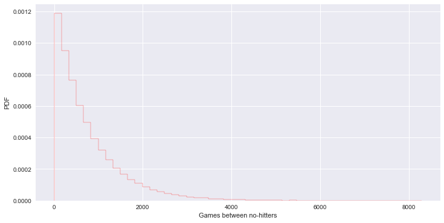


```python
# ECDF from real data
x, y = ecdf(nohitter_times)

# CDF from theoretical samples
x_theor, y_theor = ecdf(inter_nohitter_time)

# plot - 실제 데이터와 이론상 데이터가 유사한 패턴을 보인다.
plt.plot(x_theor, y_theor)
plt.plot(x, y, marker='.', linestyle='none', color='orange')
plt.margins(0.02)
plt.xlabel('Games between no-hitters')
plt.ylabel('CDF')
```


    <matplotlib.text.Text at 0x11335be10>


```python
# tau 값이 1/2 또는 2배인 지수 분포와 함께 보면 tau 값이 optimal parameter 임을 알 수 있다.
```


```python
plt.plot(x_theor, y_theor)
plt.plot(x, y, marker='.', linestyle='none')
plt.margins(0.02)
plt.xlabel('Games between no-hitters')
plt.ylabel('CDF')

samples_half = np.random.exponential(tau/2, 10000)
samples_double = np.random.exponential(tau*2, 10000)

x_half, y_half = ecdf(samples_half)
x_double, y_double = ecdf(samples_double)

_ = plt.plot(x_half, y_half)
_ = plt.plot(x_double, y_double)
_ = plt.legend(('theoretical', 'real', 'half', 'double'), loc='lower right')
plt.show()
```


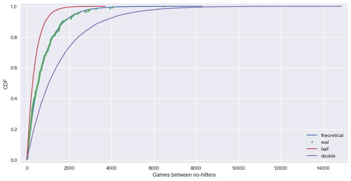


### Linear Regression

* correlation between female iliteracy and fertility (defined as the average number of children born per woman)
* 자녀 수가 많을 수록 문맹률이 높은가?


```python
fertility = np.array([ 1.769,  2.682,  2.077,  2.132,  1.827,  3.872,  2.288,  5.173, 1.393,  1.262,  2.156,  3.026,  2.033,  1.324,  2.816,  5.211, 2.1  ,  1.781,  1.822,  5.908,  1.881,  1.852,  1.39 ,  2.281, 2.505,  1.224,  1.361,  1.468,  2.404,  5.52 ,  4.058,  2.223, 4.859,  1.267,  2.342,  1.579,  6.254,  2.334,  3.961,  6.505, 2.53 ,  2.823,  2.498,  2.248,  2.508,  3.04 ,  1.854,  4.22 , 5.1  ,  4.967,  1.325,  4.514,  3.173,  2.308,  4.62 ,  4.541, 5.637,  1.926,  1.747,  2.294,  5.841,  5.455,  7.069,  2.859, 4.018,  2.513,  5.405,  5.737,  3.363,  4.89 ,  1.385,  1.505, 6.081,  1.784,  1.378,  1.45 ,  1.841,  1.37 ,  2.612,  5.329, 5.33 ,  3.371,  1.281,  1.871,  2.153,  5.378,  4.45 ,  1.46 , 1.436,  1.612,  3.19 ,  2.752,  3.35 ,  4.01 ,  4.166,  2.642, 2.977,  3.415,  2.295,  3.019,  2.683,  5.165,  1.849,  1.836, 2.518,  2.43 ,  4.528,  1.263,  1.885,  1.943,  1.899,  1.442, 1.953,  4.697,  1.582,  2.025,  1.841,  5.011,  1.212,  1.502, 2.516,  1.367,  2.089,  4.388,  1.854,  1.748,  2.978,  2.152, 2.362,  1.988,  1.426,  3.29 ,  3.264,  1.436,  1.393,  2.822, 4.969,  5.659,  3.24 ,  1.693,  1.647,  2.36 ,  1.792,  3.45 , 1.516,  2.233,  2.563,  5.283,  3.885,  0.966,  2.373,  2.663, 1.251,  2.052,  3.371,  2.093,  2.   ,  3.883,  3.852,  3.718, 1.732,  3.928])
```


```python
illiteracy = np.array([  9.5,  49.2,   1. ,  11.2,   9.8,  60. ,  50.2,  51.2,   0.6, 1. ,   8.5,   6.1,   9.8,   1. ,  42.2,  77.2,  18.7,  22.8, 8.5,  43.9,   1. ,   1. ,   1.5,  10.8,  11.9,   3.4,   0.4, 3.1,   6.6,  33.7,  40.4,   2.3,  17.2,   0.7,  36.1,   1. , 33.2,  55.9,  30.8,  87.4,  15.4,  54.6,   5.1,   1.1,  10.2, 19.8,   0. ,  40.7,  57.2,  59.9,   3.1,  55.7,  22.8,  10.9, 34.7,  32.2,  43. ,   1.3,   1. ,   0.5,  78.4,  34.2,  84.9, 29.1,  31.3,  18.3,  81.8,  39. ,  11.2,  67. ,   4.1,   0.2, 78.1,   1. ,   7.1,   1. ,  29. ,   1.1,  11.7,  73.6,  33.9, 14. ,   0.3,   1. ,   0.8,  71.9,  40.1,   1. ,   2.1,   3.8, 16.5,   4.1,   0.5,  44.4,  46.3,  18.7,   6.5,  36.8,  18.6, 11.1,  22.1,  71.1,   1. ,   0. ,   0.9,   0.7,  45.5,   8.4, 0. ,   3.8,   8.5,   2. ,   1. ,  58.9,   0.3,   1. ,  14. , 47. ,   4.1,   2.2,   7.2,   0.3,   1.5,  50.5,   1.3,   0.6, 19.1,   6.9,   9.2,   2.2,   0.2,  12.3,   4.9,   4.6,   0.3, 16.5,  65.7,  63.5,  16.8,   0.2,   1.8,   9.6,  15.2,  14.4, 3.3,  10.6,  61.3,  10.9,  32.2,   9.3,  11.6,  20.7,   6.5, 6.7,   3.5,   1. ,   1.6,  20.5,   1.5,  16.7,   2. , 0.9])
```


```python
_ = plt.plot(illiteracy, fertility, marker='.', linestyle='none')
_ = plt.xlabel('illiterate (%)')
_ = plt.ylabel('fertility')
plt.margins(0.02)
plt.show()
```


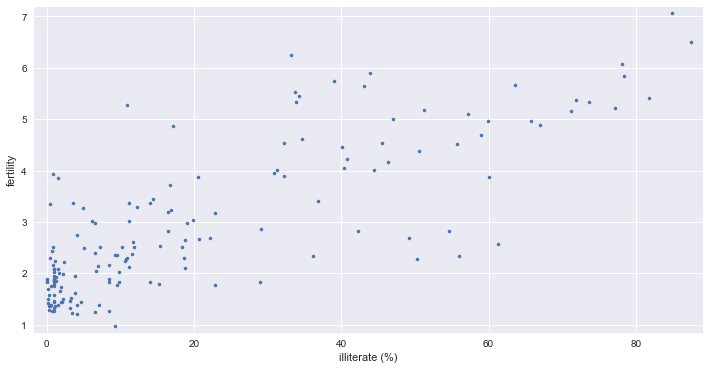


```python
np.corrcoef(illiteracy, fertility)
```


    array([[ 1.       ,  0.8041324],
           [ 0.8041324,  1.       ]])


```python
# np.polyfit - 최소자승법을 이용한 선형회귀
```


```python
_ = plt.plot(illiteracy, fertility, marker='.', linestyle='none')
_ = plt.xlabel('percent illiterate')
_ = plt.ylabel('fertility')
plt.margins(0.02)

# Perform a linear regression using np.polyfit()
a, b = np.polyfit(illiteracy, fertility, 1)

# Print the results to the screen
print('slope =', a, 'children per woman / percent illiterate')
print('intercept =', b, 'children per woman')

# Make theoretical line to plot - regression line
x = np.array([0, 100])
y = a * x + b

_ = plt.plot(x, y)
```

    slope = 0.0497985480906 children per woman / percent illiterate
    intercept = 1.88805061064 children per woman


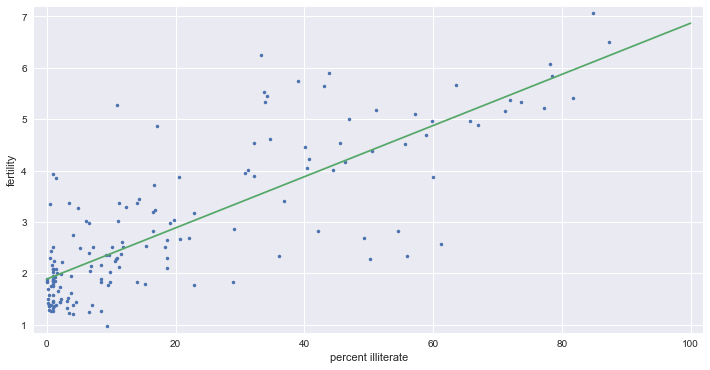


## 2. Bootstrap confidence intervals

* Bootstrap : resampled data to perform statistical inference


```python
df = pd.read_csv('data/election2012.csv')
df_ny = df.loc[df['state'] == 'NY']
vote_ny = df_ny['Obama']
```


```python
# NY 주에서 오바마에 대한 지지율로 50개의 bootstrap 생성하여 ECDF 비교
```


```python
for _ in range(50):
    # Generate bootstrap sample
    bs_sample = np.random.choice(vote_ny, size=len(vote_ny))

    # Compute and plot ECDF from bootstrap sample
    x, y = ecdf(bs_sample)
    _ = plt.plot(x, y, marker='.', linestyle='none', color='gray', alpha=0.1)
    
# real data
x, y = ecdf(vote_ny)
_ = plt.plot(x, y, marker='.')

plt.margins(0.02)
_ = plt.xlabel('vote Obama (NY)')
_ = plt.ylabel('ECDF')
plt.show()
```


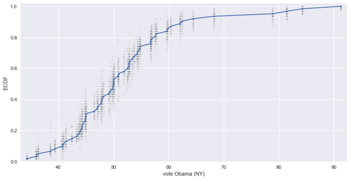


### Bootstrap confidence intervals


```python
def bootstrap_replicate_1d(data, func):
    return func(np.random.choice(data, size=len(data)))
```


```python
def draw_bootstrap_reps(data, func, size=1):
    """Draw bootstrap replicates."""
    
    bs_replicates = np.empty(size)

    # Generate replicates
    for i in range(size):
        bs_replicates[i] = bootstrap_replicate_1d(data, func)

    return bs_replicates
```

* 오바마에 대한 NY주의 지지율 평균을 10,000개의 bootstrap replicates로 추정


```python
bs_replicates = draw_bootstrap_reps(vote_ny, np.mean, size=10000)

print('standard error of mean :', np.std(vote_ny) / np.sqrt(len(vote_ny)))
print('standard deviation of bootstraps :', np.std(bs_replicates))

# Make a histogram of the results
_ = plt.hist(bs_replicates, bins=50, normed=True, edgecolor='white')
_ = plt.xlabel('mean annual rainfall (mm)')
_ = plt.ylabel('PDF')
plt.show()
```

    standard error of mean : 1.39909435215
    standard deviation of bootstraps : 1.38923447343


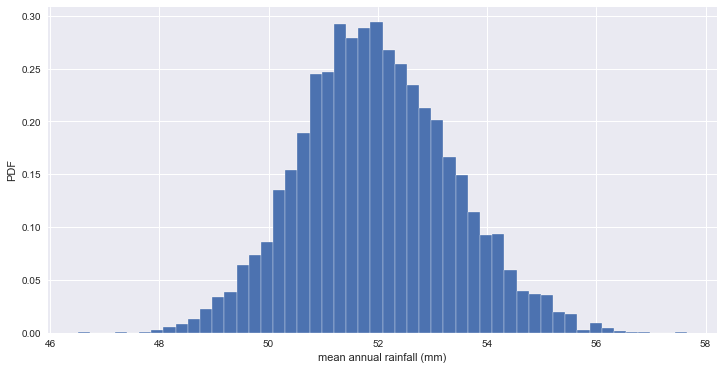


```python
# 95% 신뢰구간
np.percentile(bs_replicates, [2.5, 97.5])
```


    array([ 49.33548387,  54.85483871])


* no-hitter 에 대한 신뢰구간 추정


```python
bs_replicates = draw_bootstrap_reps(nohitter_times, np.mean, size=10000)

conf_int = np.percentile(bs_replicates, [2.5, 97.5])
print('95% confidence interval =', conf_int, 'games')

_ = plt.hist(bs_replicates, bins=50, normed=True, edgecolor='white')
_ = plt.xlabel(r'$\tau$ (games)')
_ = plt.ylabel('PDF')
```

    95% confidence interval = [ 660.99960159  869.30717131] games


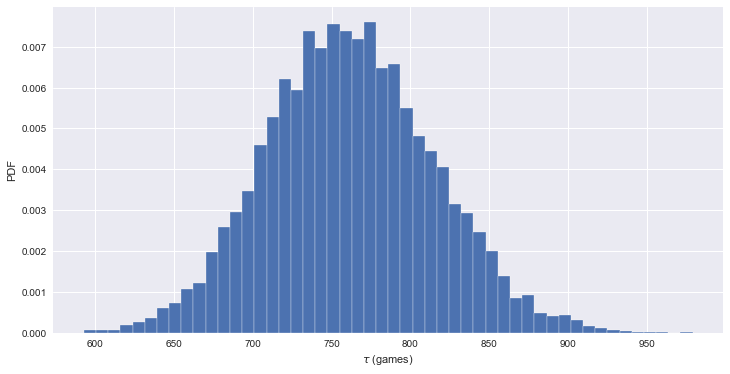


### Nonparametric inference (비모수 추정)

* 분포에 대해 알려지지 않아 데이터에 대한 추정
* [비모수 추정과 bootstrap](http://blog.naver.com/leerider/100189402336)

### Pairs bootstrap for linear regression
* Resample data in pairs
* Compute slope and intercept from resampled data
* Each slope and intercept is a bootstrap replicate
* Compute confidence intervals from percentiles of bootstrap replicates


```python
def draw_bs_pairs_linreg(x, y, size=1):
    """Perform pairs bootstrap for linear regression."""

    # Set up array of indices to sample
    inds = np.arange(len(x))

    # Initialize replicates
    bs_slope_reps = np.empty(size)
    bs_intercept_reps = np.empty(size)

    # Generate replicates
    for i in range(size):
        bs_inds = np.random.choice(inds, size=len(inds))
        bs_x, bs_y = x[bs_inds], y[bs_inds]
        bs_slope_reps[i], bs_intercept_reps[i] = np.polyfit(bs_x, bs_y, 1)

    return bs_slope_reps, bs_intercept_reps
```


```python
# 출산율 대비 문맹률 데이터에 대한 추정
```


```python
# estimate of the slope
bs_slope_reps, bs_intercept_reps = draw_bs_pairs_linreg(illiteracy, fertility, size=1000)

# 95% CI for slope
print('95% confidence interval =', np.percentile(bs_slope_reps, [2.5, 97.5]))

_ = plt.hist(bs_slope_reps, bins=50, normed=True, edgecolor='white')
_ = plt.xlabel('slope')
_ = plt.ylabel('PDF')
plt.show()
```

    95% confidence interval = [ 0.04394249  0.05530549]


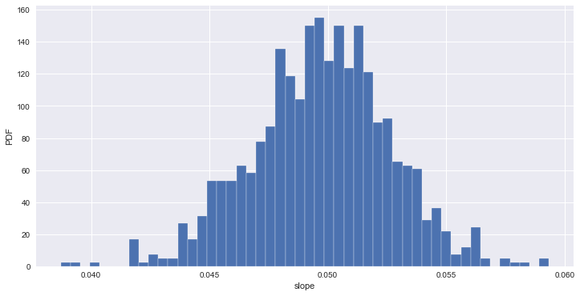


```python
x = np.array([0, 100])

# Plot the bootstrap lines
for i in range(100):
    _ = plt.plot(x, bs_slope_reps[i] * x + bs_intercept_reps[i], linewidth=0.5, alpha=0.2, color='red')

# Plot the data
_ = plt.plot(illiteracy, fertility, marker='.', linestyle='none')

# Label axes, set the margins, and show the plot
_ = plt.xlabel('illiteracy')
_ = plt.ylabel('fertility')
plt.margins(0.02)
plt.show()
```


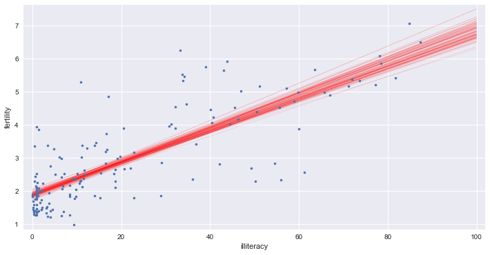


## 3. Hypothesis testing

### permutation sampling (순열 샘플링)
* 두 변수가 동일한 확률을 갖는다는 가설을 증명
* 두 배열을 합쳐서 섞은 다음 각각 원래의 그 수만큼 분할


```python
def permutation_sample(data1, data2):
    """Generate a permutation sample from two data sets."""
    
    data = np.concatenate((data1, data2))
    permuted_data = np.random.permutation(data)

    # Split the permuted array into two
    perm_sample_1 = permuted_data[:len(data1)]
    perm_sample_2 = permuted_data[len(data1):]

    return perm_sample_1, perm_sample_2
```


```python
# 제품 A와 B의 1월 강수량 비교
```


```python
rain_a = np.array([66.2,39.7,76.4,26.5,11.2,61.8,6.1,48.4,89.2,104.,34.,60.6,57.1,79.1,90.9,32.3,63.8,78.2,27.5,43.4,30.1,17.3,77.5,44.9,92.2,39.6,79.4,66.1,53.5,98.5,20.8,55.5,39.6,56.,65.1,14.8,13.2,88.1,8.4,32.1,19.6,40.4,2.2,77.5,105.4,77.2,38.,27.1,111.8,17.2,26.7,23.3,77.2,87.2,27.7,50.6,60.3,15.1,6.,29.4,39.3,56.3,80.4,85.3,68.4,72.5,13.3,28.4,14.7,37.4,49.5,57.2,85.9,82.1,31.8,126.6,30.7,41.4,33.9,13.5,99.1,70.2,91.8,61.3,13.7,54.9,62.5,24.2,69.4,83.1,44.,48.5,11.9,16.6,66.4,90.,43.2])
rain_b = np.array([83.6,30.9,62.2,37.,41.,160.2,18.2,122.4,71.3,44.2,49.1,37.6,114.5,28.8,82.5,71.9,50.7,67.7,112.,63.6,42.8,57.2,99.1,86.4,84.4,38.1,17.7,102.2,101.3,58.,82.,101.4,81.4,100.1,54.6,39.6,57.5,29.2,48.8,37.3,115.4,55.6,62.,95.,84.2,118.1,153.2,83.4,104.7,59.,46.4,50.,147.6,76.8,59.9,101.8,136.6,173.,92.5,37.,59.8,142.1,9.9,158.2,72.6,28.,112.9,119.3,199.2,50.7,44.,170.7,67.2,21.4,61.3,15.6,106.,116.2,42.3,38.5,132.5,40.8,147.5,93.9,71.4,87.3,163.7,141.4,62.6,84.9,28.8,121.1,28.6,32.4,112.,50.,126.8])
```


```python
for _ in range(50):
    # Generate permutation samples
    perm_sample_1, perm_sample_2 = permutation_sample(rain_a, rain_b)

    # ECDFs of permutation sample
    x_1, y_1 = ecdf(perm_sample_1)
    x_2, y_2 = ecdf(perm_sample_2)
    _ = plt.plot(x_1, y_1, marker='.', linestyle='none', color='red', alpha=0.02)
    _ = plt.plot(x_2, y_2, marker='.', linestyle='none', color='blue', alpha=0.02)

# ECDFs from original data
x_1, y_1 = ecdf(rain_a)
x_2, y_2 = ecdf(rain_b)
_ = plt.plot(x_1, y_1, marker='.', linestyle='none', color='red')
_ = plt.plot(x_2, y_2, marker='.', linestyle='none', color='blue')

# Label axes, set margin, and show plot
plt.margins(0.02)
_ = plt.xlabel('rain fall (mm)')
_ = plt.ylabel('ECDF')
plt.show()

# 두 지역의 강수량은 동일한 분포를 갖지 않음을 알 수 있다.
```


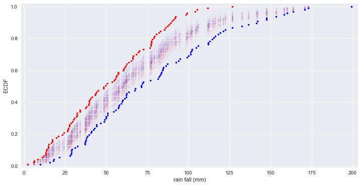


### A/B Test

* A그룹은 프로모션 상품을 153명이 구매, 91명은 비구매. B그룹은 136명 구매, 35명 비구매.
* A와 B 그룹의 특성이 상품 구매에 영향을 미쳤는가?


```python
def draw_perm_reps(data_1, data_2, func, size=1):
    """Generate multiple permutation replicates."""

    perm_replicates = np.empty(size)

    for i in range(size):
        # Generate permutation sample
        perm_sample_1, perm_sample_2 = permutation_sample(data_1, data_2)

        # Compute the test statistic
        perm_replicates[i] = func(perm_sample_1, perm_sample_2)

    return perm_replicates
```


```python
groupA = np.array([True] * 153 + [False] * 91)
groupB = np.array([True] * 136 + [False] * 35)

# A 그룹에서 상품을 구매한 비율
def frac_yes(groupA, groupB):
    frac = np.sum(groupA) / len(groupA)
    return frac

# permutation samples
perm_replicates = draw_perm_reps(groupA, groupB, frac_yes, 10000)

frac = np.sum(groupA) / len(groupA)
p = np.sum(perm_replicates <= frac) / len(perm_replicates)
print('p-value =', p)

# p-value가 0.05보다 작기 때문에 그룹이 영향을 미치지 않는다는 가설은 기각된다.
```

    p-value = 0.0002


## 5. Case study 

* 1975년과 2012년에 측정한 finch 새의 부리 깊이와 길이(mm)


```python
bd_1975 = np.array([8.4, 8.8, 8.4, 8., 7.9, 8.9, 8.6, 8.5, 8.9, 9.1, 8.6, 9.8, 8.2, 9., 9.7, 8.6, 8.2, 9., 8.4, 8.6, 8.9, 9.1, 8.3, 8.7, 9.6, 8.5, 9.1, 9., 9.2, 9.9, 8.6, 9.2, 8.4, 8.9, 8.5, 10.4, 9.6, 9.1, 9.3, 9.3, 8.8, 8.3, 8.8, 9.1, 10.1, 8.9, 9.2, 8.5, 10.2, 10.1, 9.2, 9.7, 9.1, 8.5, 8.2, 9., 9.3, 8., 9.1, 8.1, 8.3, 8.7, 8.8, 8.6, 8.7, 8., 8.8, 9., 9.1, 9.74, 9.1, 9.8, 10.4, 8.3, 9.44, 9.04, 9., 9.05, 9.65, 9.45, 8.65, 9.45, 9.45, 9.05, 8.75, 9.45, 8.35])
len(bd_1975)
```


    87


```python
bl_1975 = np.array([13.9, 14., 12.9, 13.5, 12.9, 14.6, 13., 14.2, 14., 14.2, 13.1, 15.1, 13.5, 14.4, 14.9, 12.9, 13., 14.9, 14., 13.8, 13., 14.75, 13.7, 13.8, 14., 14.6, 15.2, 13.5, 15.1, 15., 12.8, 14.9, 15.3, 13.4, 14.2, 15.1, 15.1, 14., 13.6, 14., 14., 13.9, 14., 14.9, 15.6, 13.8, 14.4, 12.8, 14.2, 13.4, 14., 14.8, 14.2, 13.5, 13.4, 14.6, 13.5, 13.7, 13.9, 13.1, 13.4, 13.8, 13.6, 14., 13.5, 12.8, 14., 13.4, 14.9, 15.54, 14.63, 14.73, 15.73, 14.83, 15.94, 15.14, 14.23, 14.15, 14.35, 14.95, 13.95, 14.05, 14.55, 14.05, 14.45, 15.05, 13.25])
len(bl_1975)
```


    87


```python
bd_2012 = np.array([9.4, 8.9, 9.5, 11., 8.7, 8.4, 9.1, 8.7, 10.2, 9.6, 8.85, 8.8, 9.5, 9.2, 9., 9.8, 9.3, 9., 10.2, 7.7, 9., 9.5, 9.4, 8., 8.9, 9.4, 9.5, 8., 10., 8.95, 8.2, 8.8, 9.2, 9.4, 9.5, 8.1, 9.5, 8.4, 9.3, 9.3, 9.6, 9.2, 10., 8.9, 10.5, 8.9, 8.6, 8.8, 9.15, 9.5, 9.1, 10.2, 8.4, 10., 10.2, 9.3, 10.8, 8.3, 7.8, 9.8, 7.9, 8.9, 7.7, 8.9, 9.4, 9.4, 8.5, 8.5, 9.6, 10.2, 8.8, 9.5, 9.3, 9., 9.2, 8.7, 9., 9.1, 8.7, 9.4, 9.8, 8.6, 10.6, 9., 9.5, 8.1, 9.3, 9.6, 8.5, 8.2, 8., 9.5, 9.7, 9.9, 9.1, 9.5, 9.8, 8.4, 8.3, 9.6, 9.4, 10., 8.9, 9.1, 9.8, 9.3, 9.9, 8.9, 8.5, 10.6, 9.3, 8.9, 8.9, 9.7, 9.8, 10.5, 8.4, 10., 9., 8.7, 8.8, 8.4, 9.3, 9.8, 8.9, 9.8, 9.1])
len(bd_2012)
```


    127


```python
bl_2012 = np.array([14.3, 12.5, 13.7, 13.8, 12., 13., 13., 13.6, 12.8, 13.6, 12.95, 13.1, 13.4, 13.9, 12.3, 14., 12.5, 12.3, 13.9, 13.1, 12.5, 13.9, 13.7, 12., 14.4, 13.5, 13.8, 13., 14.9, 12.5, 12.3, 12.8, 13.4, 13.8, 13.5, 13.5, 13.4, 12.3, 14.35, 13.2, 13.8, 14.6, 14.3, 13.8, 13.6, 12.9, 13., 13.5, 13.2, 13.7, 13.1, 13.2, 12.6, 13., 13.9, 13.2, 15., 13.37, 11.4, 13.8, 13., 13., 13.1, 12.8, 13.3, 13.5, 12.4, 13.1, 14., 13.5, 11.8, 13.7, 13.2, 12.2, 13., 13.1, 14.7, 13.7, 13.5, 13.3, 14.1, 12.5, 13.7, 14.6, 14.1, 12.9, 13.9, 13.4, 13., 12.7, 12.1, 14., 14.9, 13.9, 12.9, 14.6, 14., 13., 12.7, 14., 14.1, 14.1, 13., 13.5, 13.4, 13.9, 13.1, 12.9, 14., 14., 14.1, 14.7, 13.4, 13.8, 13.4, 13.8, 12.4, 14.1, 12.9, 13.9, 14.3, 13.2, 14.2, 13., 14.6, 13.1, 15.2])
len(bl_2012)
```


    127


```python
df1 = pd.DataFrame({'beak_depth':bd_1975, 'beak_length':bl_1975,
                    'year':list(map(lambda item: '1975', range(len(bd_1975))))})
df2 = pd.DataFrame({'beak_depth':bd_2012, 'beak_length':bl_2012,
                    'year':list(map(lambda item: '2012', range(len(bd_2012))))})
```


```python
df_finch = df1.append(df2)
df_finch.shape
```


    (214, 3)


```python
df_finch.head()
```


<div>
<table border="1" class="dataframe">
  <thead>
    <tr style="text-align: right;">
      <th></th>
      <th>beak_depth</th>
      <th>beak_length</th>
      <th>year</th>
    </tr>
  </thead>
  <tbody>
    <tr>
      <th>0</th>
      <td>8.4</td>
      <td>13.9</td>
      <td>1975</td>
    </tr>
    <tr>
      <th>1</th>
      <td>8.8</td>
      <td>14.0</td>
      <td>1975</td>
    </tr>
    <tr>
      <th>2</th>
      <td>8.4</td>
      <td>12.9</td>
      <td>1975</td>
    </tr>
    <tr>
      <th>3</th>
      <td>8.0</td>
      <td>13.5</td>
      <td>1975</td>
    </tr>
    <tr>
      <th>4</th>
      <td>7.9</td>
      <td>12.9</td>
      <td>1975</td>
    </tr>
  </tbody>
</table>
</div>


### bee swarm plot


```python
_ = sb.swarmplot(data=df_finch, x='year', y='beak_depth')
_ = plt.xlabel('year')
_ = plt.ylabel('beak depth (mm)')
plt.show()
```


```python
# 두 데이터가 분명하게 구분된다고 보기는 어렵다.
# 2012년 데이터의 평균이 약간 높고, 분산이 더 커 보인다.
```

### ECDFs of beak depths


```python
# ECDFs
x_1975, y_1975 = ecdf(bd_1975)
x_2012, y_2012 = ecdf(bd_2012)

_ = plt.plot(x_1975, y_1975, marker='.', linestyle='none')
_ = plt.plot(x_2012, y_2012, marker='.', linestyle='none')
plt.margins(0.02)
_ = plt.xlabel('beak depth (mm)')
_ = plt.ylabel('ECDF')
_ = plt.legend(('1975', '2012'), loc='lower right')
plt.show()
```


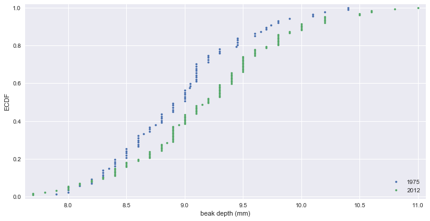


```python
# ECDF 에서 차이가 좀 더 분명하게 드러난다.
```

### Parameter estimate


```python
# difference of the sample means
mean_diff = np.mean(bd_2012) - np.mean(bd_1975)

# bootstrap replicates of means
bs_replicates_1975 = draw_bootstrap_reps(bd_1975, np.mean, 10000)
bs_replicates_2012 = draw_bootstrap_reps(bd_2012, np.mean, 10000)

# difference of means
bs_diff_replicates = bs_replicates_2012 - bs_replicates_1975

# 95% confidence interval
conf_int = np.percentile(bs_diff_replicates, [2.5, 97.5])

print('difference of means =', mean_diff, 'mm')
print('95% confidence interval =', conf_int, 'mm')
```

    difference of means = 0.226220472441 mm
    95% confidence interval = [ 0.05981571  0.3871821 ] mm


### Hypothesis test : 2012년에 부리가 더 깊어졌는가?

* finch 새의 부리가 더 깊어진 것이 단지 우연의 결과가 아님을 보기 위해 permutation test 수행.


```python
# Shift the samples
combined_mean = np.mean(np.concatenate((bd_1975, bd_2012)))
bd_1975_shifted = bd_1975 - np.mean(bd_1975) + combined_mean
bd_2012_shifted = bd_2012 - np.mean(bd_2012) + combined_mean

# bootstrap replicates of shifted data sets
bs_replicates_1975 = draw_bootstrap_reps(bd_1975_shifted, np.mean, 10000)
bs_replicates_2012 = draw_bootstrap_reps(bd_2012_shifted, np.mean, 10000)
bs_diff_replicates = bs_replicates_2012 - bs_replicates_1975

# p-value
p = np.sum(bs_diff_replicates >= mean_diff) / len(bs_diff_replicates)
print('p =', p)
```

    p = 0.0036


```python
# 통계적으로 유의미한 차이가 있음을 알 수 있다.
# 그러나 평균의 차이가 겨우 0.2 mm 이므로 큰 차이가 있다고 하기는 어렵다. 
```

### relation of length & depth


```python
_ = plt.plot(bl_1975, bd_1975, marker='.', linestyle='none', color='blue', alpha=0.5)
_ = plt.plot(bl_2012, bd_2012, marker='.', linestyle='none', color='red', alpha=0.5)
_ = plt.xlabel('beak length (mm)')
_ = plt.ylabel('beak depth (mm)')
_ = plt.legend(('1975', '2012'), loc='upper left')
plt.show()
```


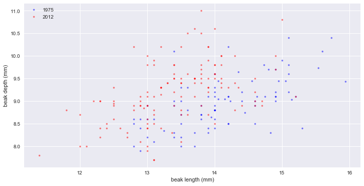


```python
# 빨간점(2012)을 보면 부리는 더 깊어지기는 했지만 길이가 늘어나지는 않았다. 오히려 조금 짧아진 것으로 보인다.
```

### Linear regressions


```python
# linear regressions
slope_1975, intercept_1975 = np.polyfit(bl_1975, bd_1975, 1)
slope_2012, intercept_2012 = np.polyfit(bl_2012, bd_2012, 1)

# pairs bootstrap for the linear regressions
bs_slope_reps_1975, bs_intercept_reps_1975 = draw_bs_pairs_linreg(bl_1975, bd_1975, 1000)
bs_slope_reps_2012, bs_intercept_reps_2012 = draw_bs_pairs_linreg(bl_2012, bd_2012, 1000)

# confidence intervals of slopes
slope_conf_int_1975 = np.percentile(bs_slope_reps_1975, [2.5, 97.5])
slope_conf_int_2012 = np.percentile(bs_slope_reps_2012, [2.5, 97.5])
intercept_conf_int_1975 = np.percentile(bs_intercept_reps_1975, [2.5, 97.5])
intercept_conf_int_2012 = np.percentile(bs_intercept_reps_2012, [2.5, 97.5])

# Print the results
print('1975: slope =', slope_1975, 'conf int =', slope_conf_int_1975)
print('1975: intercept =', intercept_1975, 'conf int =', intercept_conf_int_1975)
print('2012: slope =', slope_2012, 'conf int =', slope_conf_int_2012)
print('2012: intercept =', intercept_2012, 'conf int =', intercept_conf_int_2012)
```

    1975: slope = 0.465205169161 conf int = [ 0.33720846  0.58679333]
    1975: intercept = 2.39087523658 conf int = [ 0.683399    4.23168645]
    2012: slope = 0.462630358835 conf int = [ 0.33744671  0.6003248 ]
    2012: intercept = 2.97724749824 conf int = [ 1.09982491  4.66346537]


```python
_ = plt.plot(bl_1975, bd_1975, marker='.', linestyle='none', color='blue', alpha=0.5)
_ = plt.plot(bl_2012, bd_2012, marker='.', linestyle='none', color='red', alpha=0.5)
_ = plt.xlabel('beak length (mm)')
_ = plt.ylabel('beak depth (mm)')
_ = plt.legend(('1975', '2012'), loc='upper left')

# Generate x-values for bootstrap lines
x = np.array([10, 17])

# Plot the bootstrap lines
for i in range(100):
    plt.plot(x, bs_slope_reps_1975[i] * x + bs_intercept_reps_1975[i], linewidth=0.5, alpha=0.2, color='blue')
    plt.plot(x, bs_slope_reps_2012[i] * x + bs_intercept_reps_2012[i], linewidth=0.5, alpha=0.2, color='red')

plt.show()
```


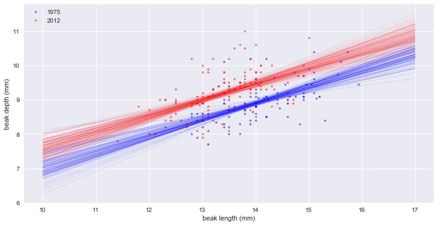


```python
# slope는 같은데, 깊이(intercept)가 약 0.5 mm 증가했다.
```


```python
# 부리의 길이/깊이 비율
ratio_1975 = bl_1975 / bd_1975
ratio_2012 = bl_2012 / bd_2012

mean_ratio_1975 = np.mean(ratio_1975)
mean_ratio_2012 = np.mean(ratio_2012)

bs_replicates_1975 = draw_bootstrap_reps(ratio_1975, np.mean, size=10000)
bs_replicates_2012 = draw_bootstrap_reps(ratio_2012, np.mean, size=10000)

# 99% confidence intervals
conf_int_1975 = np.percentile(bs_replicates_1975, [0.5, 99.5])
conf_int_2012 = np.percentile(bs_replicates_2012, [0.5, 99.5])

print('1975: mean ratio =', mean_ratio_1975, 'conf int =', conf_int_1975)
print('2012: mean ratio =', mean_ratio_2012, 'conf int =', conf_int_2012)
```

    1975: mean ratio = 1.57888237719 conf int = [ 1.55625152  1.60200243]
    2012: mean ratio = 1.46583422768 conf int = [ 1.44420506  1.48776669]


```python
# 평균 부리의 길이/깊이 비율은 약 0.1mm 또는 7 % 감소했다. 99% 신뢰구간이 겹치지 않기 때문에 실제 변화이다.
```
