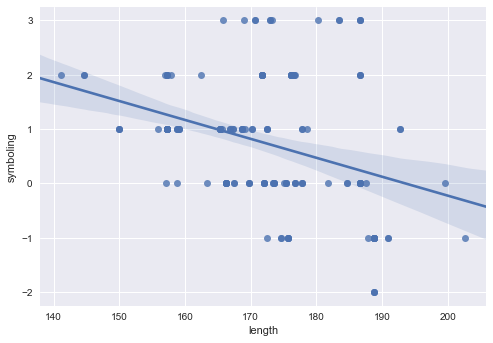
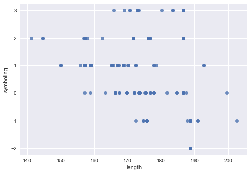
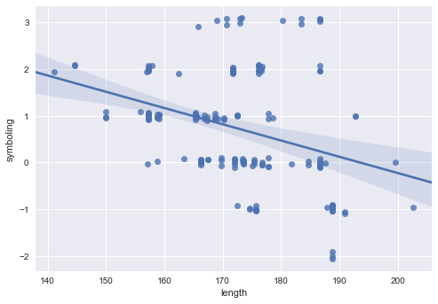
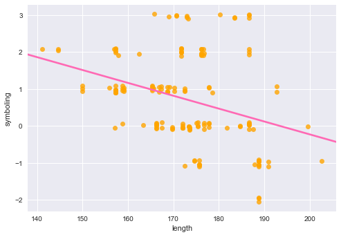
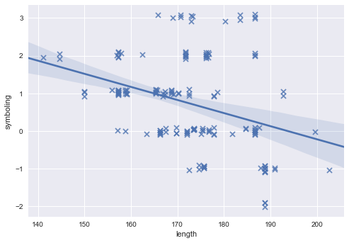

#### Linear Regression Plot with Seaborn, 통계를 위한 statsmodels 라이브러리

----------------------------------

## Seaborn

Python에서 많이 쓰이는 시각화 라이브러리. [http://seaborn.pydata.org](http://seaborn.pydata.org/)


```python
%matplotlib inline
import pandas as pd
import seaborn as sb
import matplotlib as plt
```


```python
cars = pd.read_csv('automobile.csv')
cars.head()
```


<div>
<table border="1" class="dataframe">
  <thead>
    <tr style="text-align: right;">
      <th></th>
      <th>symboling</th>
      <th>maker</th>
      <th>fuel</th>
      <th>aspiration</th>
      <th>doors</th>
      <th>body</th>
      <th>wheels</th>
      <th>engine_location</th>
      <th>wheel_base</th>
      <th>...</th>
    </tr>
  </thead>
  <tbody>
    <tr>
      <th>0</th>
      <td>2</td>
      <td>audi</td>
      <td>gas</td>
      <td>std</td>
      <td>four</td>
      <td>sedan</td>
      <td>fwd</td>
      <td>front</td>
      <td>99.8</td>
      <td>...</td>
    </tr>
    <tr>
      <th>1</th>
      <td>2</td>
      <td>audi</td>
      <td>gas</td>
      <td>std</td>
      <td>four</td>
      <td>sedan</td>
      <td>4wd</td>
      <td>front</td>
      <td>99.4</td>
      <td>...</td>
    </tr>
    <tr>
      <th>2</th>
      <td>1</td>
      <td>audi</td>
      <td>gas</td>
      <td>std</td>
      <td>four</td>
      <td>sedan</td>
      <td>fwd</td>
      <td>front</td>
      <td>105.8</td>
      <td>...</td>
    </tr>
    <tr>
      <th>3</th>
      <td>1</td>
      <td>audi</td>
      <td>gas</td>
      <td>turbo</td>
      <td>four</td>
      <td>sedan</td>
      <td>fwd</td>
      <td>front</td>
      <td>105.8</td>
      <td>...</td>
    </tr>
    <tr>
      <th>4</th>
      <td>2</td>
      <td>bmw</td>
      <td>gas</td>
      <td>std</td>
      <td>two</td>
      <td>sedan</td>
      <td>rwd</td>
      <td>front</td>
      <td>101.2</td>
      <td>...</td>
    </tr>
  </tbody>
</table>
<p>5 rows × 26 columns</p>
</div>


```python
cars.columns
```


    Index(['symboling', 'normalized_losses', 'maker', 'fuel', 'aspiration',
           'doors', 'body', 'wheels', 'engine_location', 'wheel_base', 'length',
           'width', 'height', 'curb_weight', 'engine_type', 'cylinders',
           'engine_size', 'fuel_system', 'bore', 'stroke', 'compression_ratio',
           'horsepower', 'peak_rpm', 'city_mpg', 'highway_mpg', 'price'],
          dtype='object')


### Regression Plot


```python
# 노트북에 표시되는 plot 크기 조절
```


```python
fig = plt.pyplot.gcf()
fig.set_size_inches(16, 10)
```


    <matplotlib.figure.Figure at 0x28d98908898>


```python
sb.regplot(cars.length, cars.symboling)
```


    <matplotlib.axes._subplots.AxesSubplot at 0x28d989199b0>


```python
sb.regplot('length', 'symboling', data=cars)
```


    <matplotlib.axes._subplots.AxesSubplot at 0x28d989d5630>





```python
# 회귀선 지우기
```


```python
sb.regplot('length', 'symboling', data=cars, fit_reg=False)
```


    <matplotlib.axes._subplots.AxesSubplot at 0x28d98a33b38>





```python
# jitter
```


```python
sb.regplot('length', 'symboling', data=cars, y_jitter=0.1)
```


    <matplotlib.axes._subplots.AxesSubplot at 0x28d98be3be0>





```python
# 신뢰구간(ci) 지우기. 회귀선 색상. 점 색상.
```


```python
sb.regplot('length', 'symboling', data=cars, y_jitter=0.1, ci=None, 
           line_kws={'color': 'hotpink'}, 
           scatter_kws={'color': 'orange'})   # 16진수('FF9900')로 색상 지정 가능.
```


    <matplotlib.axes._subplots.AxesSubplot at 0x28d98c24320>





```python
# 점 모양과 크기
```

http://matplotlib.org/api/markers_api.html#module-matplotlib.markers


```python
sb.regplot('length', 'symboling', data=cars, y_jitter=0.1, marker='x', scatter_kws={'s': 50})
```


    <matplotlib.axes._subplots.AxesSubplot at 0x28d98c8ce48>





```python
# save plot
```


```python
plot = sb.regplot('length', 'symboling', data=cars)
plot.get_figure().savefig('plot.png')
```


# statsmodels

Python에서 통계 분석을 위한 라이브러리. http://statsmodels.sourceforge.net/


```python
import statsmodels.formula.api as smf
```


```python
model = smf.ols('symboling ~ length', data=cars)
result = model.fit()
result.summary()
```


<table class="simpletable">
<caption>OLS Regression Results</caption>
<tr>
  <th>Dep. Variable:</th>        <td>symboling</td>    <th>  R-squared:         </th> <td>   0.113</td>
</tr>
<tr>
  <th>Model:</th>                   <td>OLS</td>       <th>  Adj. R-squared:    </th> <td>   0.107</td>
</tr>
<tr>
  <th>Method:</th>             <td>Least Squares</td>  <th>  F-statistic:       </th> <td>   20.01</td>
</tr>
<tr>
  <th>Date:</th>             <td>Sat, 25 Mar 2017</td> <th>  Prob (F-statistic):</th> <td>1.47e-05</td>
</tr>
<tr>
  <th>Time:</th>                 <td>10:47:16</td>     <th>  Log-Likelihood:    </th> <td> -243.64</td>
</tr>
<tr>
  <th>No. Observations:</th>      <td>   159</td>      <th>  AIC:               </th> <td>   491.3</td>
</tr>
<tr>
  <th>Df Residuals:</th>          <td>   157</td>      <th>  BIC:               </th> <td>   497.4</td>
</tr>
<tr>
  <th>Df Model:</th>              <td>     1</td>      <th>                     </th>     <td> </td>   
</tr>
<tr>
  <th>Covariance Type:</th>      <td>nonrobust</td>    <th>                     </th>     <td> </td>   
</tr>
</table>
<table class="simpletable">
<tr>
      <td></td>         <th>coef</th>     <th>std err</th>      <th>t</th>      <th>P>|t|</th> <th>[95.0% Conf. Int.]</th> 
</tr>
<tr>
  <th>Intercept</th> <td>    6.7385</td> <td>    1.345</td> <td>    5.011</td> <td> 0.000</td> <td>    4.082     9.395</td>
</tr>
<tr>
  <th>length</th>    <td>   -0.0348</td> <td>    0.008</td> <td>   -4.474</td> <td> 0.000</td> <td>   -0.050    -0.019</td>
</tr>
</table>
<table class="simpletable">
<tr>
  <th>Omnibus:</th>       <td>10.632</td> <th>  Durbin-Watson:     </th> <td>   0.909</td>
</tr>
<tr>
  <th>Prob(Omnibus):</th> <td> 0.005</td> <th>  Jarque-Bera (JB):  </th> <td>  11.510</td>
</tr>
<tr>
  <th>Skew:</th>          <td> 0.658</td> <th>  Prob(JB):          </th> <td> 0.00317</td>
</tr>
<tr>
  <th>Kurtosis:</th>      <td> 2.915</td> <th>  Cond. No.          </th> <td>2.60e+03</td>
</tr>
</table>


```python
model = smf.ols('symboling ~ length + price', data=cars).fit().summary()
```


```python
# smf.ols('symboling ~ .', data=cont_data).fit().summary()   # ~ 다음에 '.' 인식 안됨
```

#### 연속형 / 범주형 변수 구분


```python
cars.columns
```


    Index(['symboling', 'normalized_losses', 'maker', 'fuel', 'aspiration',
           'doors', 'body', 'wheels', 'engine_location', 'wheel_base', 'length',
           'width', 'height', 'curb_weight', 'engine_type', 'cylinders',
           'engine_size', 'fuel_system', 'bore', 'stroke', 'compression_ratio',
           'horsepower', 'peak_rpm', 'city_mpg', 'highway_mpg', 'price'],
          dtype='object')


```python
cont_var = cars.columns[cars.dtypes != 'object']
cont_var
```


    Index(['symboling', 'normalized_losses', 'wheel_base', 'length', 'width',
           'height', 'curb_weight', 'engine_size', 'bore', 'stroke',
           'compression_ratio', 'horsepower', 'peak_rpm', 'city_mpg',
           'highway_mpg', 'price'],
          dtype='object')


```python
cate_var = cars.columns[cars.dtypes == 'object']
cate_var
```


    Index(['maker', 'fuel', 'aspiration', 'doors', 'body', 'wheels',
           'engine_location', 'engine_type', 'cylinders', 'fuel_system'],
          dtype='object')


```python
cars[cate_var].head()
```


<div>
<table border="1" class="dataframe">
  <thead>
    <tr style="text-align: right;">
      <th></th>
      <th>maker</th>
      <th>fuel</th>
      <th>aspiration</th>
      <th>doors</th>
      <th>body</th>
      <th>wheels</th>
      <th>engine_location</th>
      <th>engine_type</th>
      <th>cylinders</th>
      <th>fuel_system</th>
    </tr>
  </thead>
  <tbody>
    <tr>
      <th>0</th>
      <td>audi</td>
      <td>gas</td>
      <td>std</td>
      <td>four</td>
      <td>sedan</td>
      <td>fwd</td>
      <td>front</td>
      <td>ohc</td>
      <td>four</td>
      <td>mpfi</td>
    </tr>
    <tr>
      <th>1</th>
      <td>audi</td>
      <td>gas</td>
      <td>std</td>
      <td>four</td>
      <td>sedan</td>
      <td>4wd</td>
      <td>front</td>
      <td>ohc</td>
      <td>five</td>
      <td>mpfi</td>
    </tr>
    <tr>
      <th>2</th>
      <td>audi</td>
      <td>gas</td>
      <td>std</td>
      <td>four</td>
      <td>sedan</td>
      <td>fwd</td>
      <td>front</td>
      <td>ohc</td>
      <td>five</td>
      <td>mpfi</td>
    </tr>
    <tr>
      <th>3</th>
      <td>audi</td>
      <td>gas</td>
      <td>turbo</td>
      <td>four</td>
      <td>sedan</td>
      <td>fwd</td>
      <td>front</td>
      <td>ohc</td>
      <td>five</td>
      <td>mpfi</td>
    </tr>
    <tr>
      <th>4</th>
      <td>bmw</td>
      <td>gas</td>
      <td>std</td>
      <td>two</td>
      <td>sedan</td>
      <td>rwd</td>
      <td>front</td>
      <td>ohc</td>
      <td>four</td>
      <td>mpfi</td>
    </tr>
  </tbody>
</table>
</div>


#### 연속형 변수들만 사용 (범주형 변수 제외)


```python
indep = ' + '.join(cont_var.difference(['symboling']))   # symboling 제외
indep
```


    'bore + city_mpg + compression_ratio + curb_weight + engine_size + height + highway_mpg + horsepower + length + normalized_losses + peak_rpm + price + stroke + wheel_base + width'


```python
smf.ols('symboling ~ ' + indep, data=cars).fit().summary()
```


<table class="simpletable">
<caption>OLS Regression Results</caption>
<tr>
  <th>Dep. Variable:</th>        <td>symboling</td>    <th>  R-squared:         </th> <td>   0.593</td>
</tr>
<tr>
  <th>Model:</th>                   <td>OLS</td>       <th>  Adj. R-squared:    </th> <td>   0.550</td>
</tr>
<tr>
  <th>Method:</th>             <td>Least Squares</td>  <th>  F-statistic:       </th> <td>   13.89</td>
</tr>
<tr>
  <th>Date:</th>             <td>Sat, 25 Mar 2017</td> <th>  Prob (F-statistic):</th> <td>3.68e-21</td>
</tr>
<tr>
  <th>Time:</th>                 <td>10:47:16</td>     <th>  Log-Likelihood:    </th> <td> -181.72</td>
</tr>
<tr>
  <th>No. Observations:</th>      <td>   159</td>      <th>  AIC:               </th> <td>   395.4</td>
</tr>
<tr>
  <th>Df Residuals:</th>          <td>   143</td>      <th>  BIC:               </th> <td>   444.5</td>
</tr>
<tr>
  <th>Df Model:</th>              <td>    15</td>      <th>                     </th>     <td> </td>   
</tr>
<tr>
  <th>Covariance Type:</th>      <td>nonrobust</td>    <th>                     </th>     <td> </td>   
</tr>
</table>
<table class="simpletable">
<tr>
          <td></td>             <th>coef</th>     <th>std err</th>      <th>t</th>      <th>P>|t|</th> <th>[95.0% Conf. Int.]</th> 
</tr>
<tr>
  <th>Intercept</th>         <td>    3.3079</td> <td>    5.583</td> <td>    0.592</td> <td> 0.554</td> <td>   -7.728    14.344</td>
</tr>
<tr>
  <th>bore</th>              <td>   -0.1778</td> <td>    0.368</td> <td>   -0.484</td> <td> 0.629</td> <td>   -0.905     0.549</td>
</tr>
<tr>
  <th>city_mpg</th>          <td>   -0.1086</td> <td>    0.052</td> <td>   -2.072</td> <td> 0.040</td> <td>   -0.212    -0.005</td>
</tr>
<tr>
  <th>compression_ratio</th> <td>    0.0456</td> <td>    0.026</td> <td>    1.741</td> <td> 0.084</td> <td>   -0.006     0.097</td>
</tr>
<tr>
  <th>curb_weight</th>       <td>   -0.0007</td> <td>    0.001</td> <td>   -1.179</td> <td> 0.241</td> <td>   -0.002     0.000</td>
</tr>
<tr>
  <th>engine_size</th>       <td>    0.0030</td> <td>    0.006</td> <td>    0.471</td> <td> 0.638</td> <td>   -0.010     0.016</td>
</tr>
<tr>
  <th>height</th>            <td>    0.0492</td> <td>    0.046</td> <td>    1.068</td> <td> 0.287</td> <td>   -0.042     0.140</td>
</tr>
<tr>
  <th>highway_mpg</th>       <td>    0.0847</td> <td>    0.047</td> <td>    1.800</td> <td> 0.074</td> <td>   -0.008     0.178</td>
</tr>
<tr>
  <th>horsepower</th>        <td>    0.0054</td> <td>    0.006</td> <td>    0.966</td> <td> 0.336</td> <td>   -0.006     0.017</td>
</tr>
<tr>
  <th>length</th>            <td>    0.0050</td> <td>    0.016</td> <td>    0.310</td> <td> 0.757</td> <td>   -0.027     0.037</td>
</tr>
<tr>
  <th>normalized_losses</th> <td>    0.0140</td> <td>    0.002</td> <td>    6.236</td> <td> 0.000</td> <td>    0.010     0.018</td>
</tr>
<tr>
  <th>peak_rpm</th>          <td>   -0.0001</td> <td>    0.000</td> <td>   -0.757</td> <td> 0.450</td> <td>   -0.001     0.000</td>
</tr>
<tr>
  <th>price</th>             <td> 8.963e-06</td> <td>  2.8e-05</td> <td>    0.320</td> <td> 0.750</td> <td>-4.64e-05  6.44e-05</td>
</tr>
<tr>
  <th>stroke</th>            <td>   -0.0668</td> <td>    0.268</td> <td>   -0.249</td> <td> 0.803</td> <td>   -0.597     0.463</td>
</tr>
<tr>
  <th>wheel_base</th>        <td>   -0.2074</td> <td>    0.031</td> <td>   -6.669</td> <td> 0.000</td> <td>   -0.269    -0.146</td>
</tr>
<tr>
  <th>width</th>             <td>    0.2207</td> <td>    0.081</td> <td>    2.716</td> <td> 0.007</td> <td>    0.060     0.381</td>
</tr>
</table>
<table class="simpletable">
<tr>
  <th>Omnibus:</th>       <td> 0.983</td> <th>  Durbin-Watson:     </th> <td>   1.035</td>
</tr>
<tr>
  <th>Prob(Omnibus):</th> <td> 0.612</td> <th>  Jarque-Bera (JB):  </th> <td>   0.833</td>
</tr>
<tr>
  <th>Skew:</th>          <td> 0.177</td> <th>  Prob(JB):          </th> <td>   0.659</td>
</tr>
<tr>
  <th>Kurtosis:</th>      <td> 3.013</td> <th>  Cond. No.          </th> <td>1.22e+06</td>
</tr>
</table>


