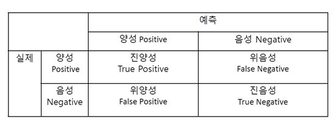
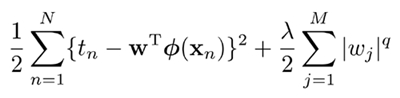

#### Scikit-Learn 라이브러리를 이용한 예측 모델, 모델의 성능 평가 (정확도, 정밀도, 재현율)

----------------------------------

# 모델 성능 평가



### 정확도 Accuracy = (TP + TF) / TOTAL

* 전체 사례 중 Positive와 Negative로 정확히 예측한 비율

### 정밀도 Precision = TP / (TP + FP)

* Positive로 예측한 사례 중 TruePostive 비율

### 재현율 Recall = TP / (TP + TN)

* True로 예측한 사례 중TruePositive 비율

### F1 Score = 2 x (Precision x Recall) / (Precision + Recall)

* 정밀도와 재현율의 조화 평균


```python

```

# Linear Model 에서의 정규화(Normalization)

RMSE (root mean squar error) 만 최소화하는 대신에 RMSE + (w의 크기)를 동시에 최적화



## Lasso

* w의 절대값의 합도 함께 최소화
* w를 0으로 만드는 경향이 있음
* 변수 선택의 기능

## Ridge

* w의 제곱의 합도 함께 최소화
* 대체로 Lasso 에 비해 예측력이 좋음
* 변수 선택 X

## Elastic Net

* RMSE + Lasso + Ridge
* Lambda: 정규화 항의 가중치
* Alpha: 정규화 항에서 Lasso 의 비중

# Scikit-Learn


```python
# 자동차의 여러 특성을 통해 4 door 차량인지 분류 예측
```


```python
import pandas
cars = pandas.read_csv('automobile.csv')
```


```python
# 데이터 준비
```


```python
variables = ['bore', 'city_mpg', 'compression_ratio', 'curb_weight', 'engine_size',
             'horsepower', 'peak_rpm', 'city_mpg', 'price']
X = cars[variables]
y = cars['doors']
```


```python
# 데이터 분할 (6 : 4)
```


```python
from sklearn.model_selection import train_test_split
X_train, X_test, y_train, y_test = train_test_split(X, y, test_size=0.4)
```


```python
X_train.shape
```


    (95, 9)


```python
X_test.shape
```


    (64, 9)


```python
from sklearn import metrics
```

## Classification

## 1. Logistic Regression (Lasso)


```python
from sklearn.linear_model import LogisticRegression
```


```python
# penalty : l1 = Lasso / l2 = Ridge
# C > 1 : 오차를 주로 줄임 / C < 1 : 파라미터를 주로 줄임
```


```python
lasso = LogisticRegression(penalty='l1', C=0.1)   
lasso.fit(X_train, y_train)
```


    LogisticRegression(C=0.1, class_weight=None, dual=False, fit_intercept=True,
              intercept_scaling=1, max_iter=100, multi_class='ovr', n_jobs=1,
              penalty='l1', random_state=None, solver='liblinear', tol=0.0001,
              verbose=0, warm_start=False)


```python
y_lasso = lasso.predict(X_test)
y_lasso
```


    array(['two', 'four', 'two', 'four', 'two', 'two', 'two', 'two', 'four',
           'two', 'four', 'four', 'four', 'four', 'four', 'four', 'two', 'two',
           'two', 'four', 'two', 'four', 'two', 'four', 'four', 'four', 'two',
           'two', 'two', 'four', 'two', 'two', 'two', 'two', 'four', 'two',
           'two', 'four', 'four', 'two', 'four', 'four', 'two', 'four', 'two',
           'four', 'two', 'four', 'two', 'two', 'two', 'two', 'two', 'four',
           'four', 'four', 'two', 'two', 'four', 'four', 'four', 'four',
           'four', 'two'], dtype=object)


```python
metrics.confusion_matrix(y_test, y_lasso)
```


    array([[26, 14],
           [ 5, 19]])


```python
metrics.accuracy_score(y_test, y_lasso)
```


    0.703125


```python
metrics.precision_score(y_test, y_lasso, pos_label='four')
```


    0.83870967741935487


```python
metrics.recall_score(y_test, y_lasso, pos_label='four')
```


    0.65000000000000002


```python
metrics.f1_score(y_test, y_lasso, pos_label='four')
```


    0.73239436619718312


## Logistic Regression (Ridge)


```python
ridge = LogisticRegression(penalty='l2', C=0.1)   # l1 = Lasso / l2 = Ridge. 
ridge.fit(X_train, y_train)
```


    LogisticRegression(C=0.1, class_weight=None, dual=False, fit_intercept=True,
              intercept_scaling=1, max_iter=100, multi_class='ovr', n_jobs=1,
              penalty='l2', random_state=None, solver='liblinear', tol=0.0001,
              verbose=0, warm_start=False)


```python
y_ridge = ridge.predict(X_test)
```


```python
metrics.confusion_matrix(y_test, y_ridge)
```


    array([[25, 15],
           [ 7, 17]])


```python
metrics.accuracy_score(y_test, y_ridge)
```


    0.65625


```python
metrics.precision_score(y_test, y_ridge, pos_label='four')
```


    0.78125


```python
metrics.recall_score(y_test, y_ridge, pos_label='four')
```


    0.625


```python
metrics.f1_score(y_test, y_ridge, pos_label='four')
```


    0.69444444444444442


