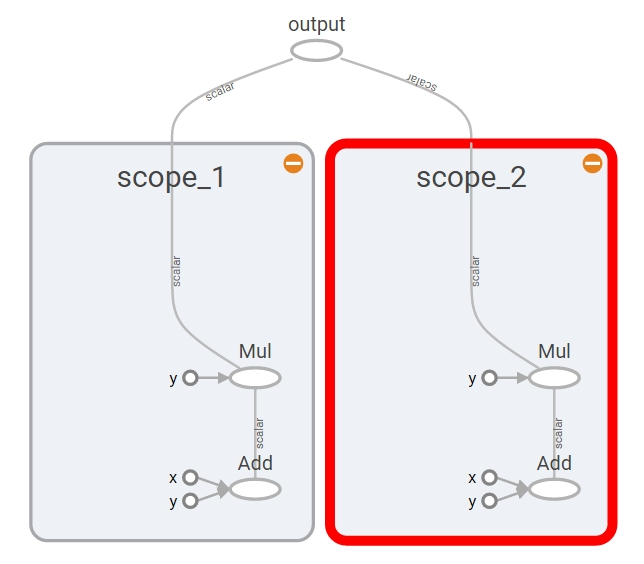
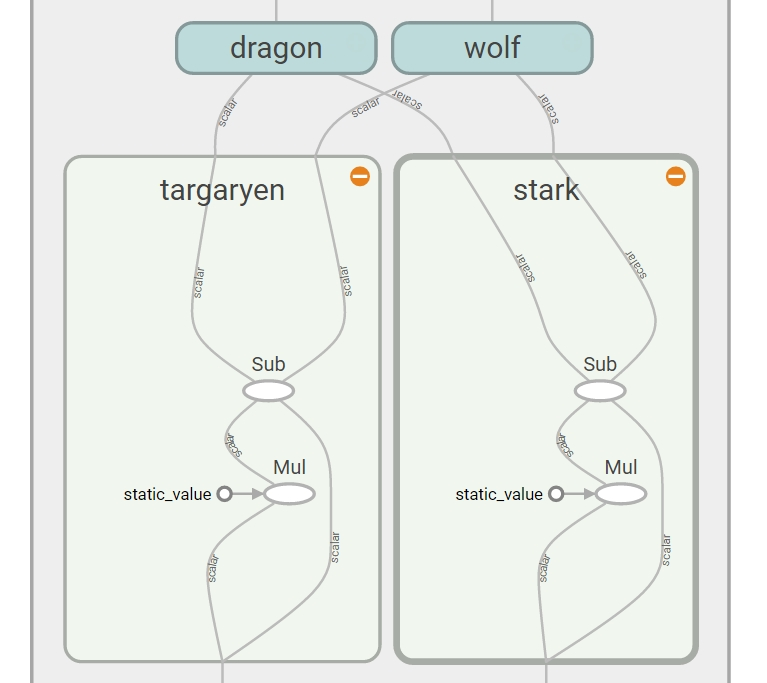
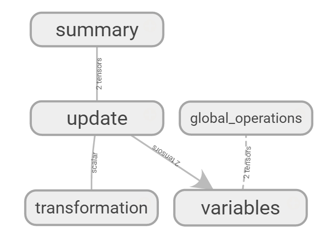
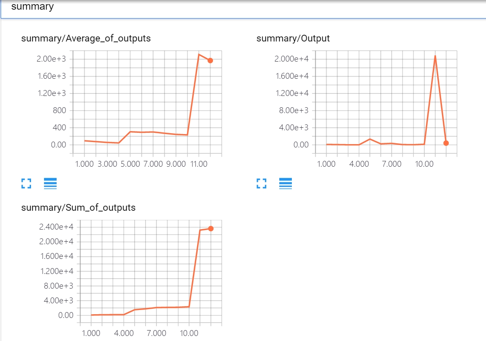

#### Name Scope의 개념 및 적용. tensorflow graph의 변수값 변화 추이를 tensorboard 플롯을 통해 확인하기.


----------------------------------


## Tensorflow - name scope

복잡한 그래프를 다루기 위해 텐서플로는 name scope를 통해 여러 오퍼레이션을 block 단위로 묶을 수 있다. 이를 통해 그래프 시각화를 단순화할 수 있다. 

### name scope 예제 1


```python
import tensorflow as tf
```


```python
with tf.name_scope("scope_1"):
    a = tf.add(1, 2)
    b = tf.multiply(a, 3)
```


```python
with tf.name_scope("scope_2"):
    x = tf.add(7, 8)
    y = tf.multiply(x, 9)
```


```python
o = tf.add(b, y, name="output")
```


```python
sess = tf.Session()
```


```python
# tensorboard 시각화
```


```python
writer = tf.summary.FileWriter('c:\Github\output01', graph=sess.graph)
writer.close()
```

(터미널) tensorboard --logdir=”c:\Github\output01”

(브라우저) http://localhost:6006




```python
sess.close()
```

### name scope 예제 2 - 중첩


```python
graph = tf.get_default_graph()   # 명시적으로 그래프 객체 생성
```


```python
with graph.as_default():
    input1 = tf.placeholder(tf.float32, shape=[], name="input_1")
    input2 = tf.placeholder(tf.float32, shape=[], name="input_2")
    const = tf.constant(9, dtype=tf.float32, name="static_value")
    
    with tf.name_scope("Kingdom"):
        
        with tf.name_scope("targaryen"):
            t_mul = tf.multiply(input1, const)
            t_out = tf.subtract(t_mul, input1)
            
        with tf.name_scope("stark"):
            s_mul = tf.multiply(input2, const)
            s_out = tf.subtract(s_mul, input2)
            
    
        with tf.name_scope("dragon"):
            d_div = tf.div(t_out, s_out)
            d_out = tf.add(d_div, const)
            
        with tf.name_scope("wolf"):
            w_div = tf.div(s_out, t_out)
            w_out = tf.add(w_div, const)
            
    out = tf.maximum(d_out, w_out)
```


```python
sess = tf.Session()
```


```python
writer = tf.summary.FileWriter('c:\Github\output02', graph)
writer.close()
```





```python
sess.close()
```

## name scope 예제 3


```python
import tensorflow as tf
```


```python
graph = tf.get_default_graph()
```


```python
with graph.as_default():
    
    with tf.name_scope("variables"):
        # 그래프가 실행되는 횟수 추적
        global_step = tf.Variable(0, dtype=tf.int32, trainable=False)
        # 출력값의 합계를 추적
        total_output = tf.Variable(0.0, dtype=tf.float32, trainable=False)
        
    # 입력, 연산, 출력
    with tf.name_scope("transformation"):
        
        with tf.name_scope("input"):
            a = tf.placeholder(tf.float32, shape=[None], name="input_placeholder")
            
        with tf.name_scope("middle_layer"):
            m_prod = tf.reduce_prod(a, name="product_m")
            m_sum = tf.reduce_sum(a, name="sum_m")
            
        with tf.name_scope("output"):
            output = tf.add(m_prod, m_sum, name="output")
            
    # 전역변수 업데이트
    with tf.name_scope("update"):
        update_total = total_output.assign_add(output)   # 최종 출력값을 누적
        increment_step = global_step.assign_add(1)       # 그래프 수행 횟수 증가
    
    # tensorboard에서 보여주기 위해 summary
    with tf.name_scope("summary"):
        avg = tf.div(update_total, tf.cast(increment_step, tf.float32), name="average")
        tf.summary.scalar('Output', output)
        tf.summary.scalar('Sum_of_outputs', update_total)
        tf.summary.scalar('Average_of_outputs', avg)
        
    with tf.name_scope("global_operations"):
        merged_summaries = tf.summary.merge_all()   # merge all summaries
        init = tf.global_variables_initializer()    # initialization
```


```python
sess = tf.Session()
sess.run(init)
```


```python
writer = tf.summary.FileWriter('c:\Github\output03', graph)
```


```python
# 그래프를 실행하기 위한 함수
```


```python
def run_graph(input_tensor):
    feed_dict = {a: input_tensor}   # 변수 재설정. np.array(input_tensor, dtype=np.float32)
    # 세션 실행 후 결과값 저장
    _, step, summary = sess.run([output, increment_step, merged_summaries], feed_dict=feed_dict)
    # 텐서보드가 그래프 그리도록 값을 추가
    writer.add_summary(summary, global_step=step)
```


```python
# 실제 값으로 그래프 실행
```


```python
run_graph([2,8,5])
run_graph([3,1,3,5])
run_graph([8])
run_graph([1,2,3])
run_graph([7,9,3,7])
run_graph([8,3,9])
run_graph([6,6,3,3])
run_graph([6,4,2,1])
run_graph([2,9])
run_graph([4,5,6])
run_graph([10,33,63])
run_graph([5,7,11])
```


```python
writer.flush()  # write the summaries to disk
```


```python
writer.close()
sess.close()
```

(터미널) tensorboard --logdir=”c:\Github\output03”




