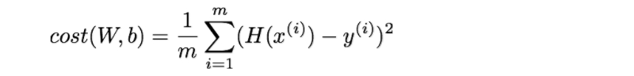

#### Tensorflow를 사용하여 간단하게 구현한 Linear Regression 예제


----------------------------------
### Computational Graph


```python
import tensorflow as tf
```


```python
a = tf.placeholder(tf.float32)
b = tf.placeholder(tf.float32)
c = a + b

sess = tf.Session()

print(sess.run(c, feed_dict={a: 3, b: 4.5}))
print(sess.run(c, feed_dict={a: [1, 3], b: [2, 4]}))
```

    7.5
    [ 3.  7.]
    


```python
d = c * 3.
print(sess.run(d, feed_dict={a: 3, b:4.5}))
```

    22.5
    

## Linear Regression


예측 Hypothesis (H) : 주어진 x 값에 대한 가중치(W)의 곱과 bias의 합



cost function : 예측값과 실제값 사이의 오차 함수. 학습을 통해 W와 b를 조정하여 cost function의 값이 최소가 되도록 한다.

#### Hypothesis


```python
# data
x_train = [1, 2, 3]
y_train = [1, 2, 3]

# 변수. 임의의 값 설정.
W = tf.Variable(tf.random_normal([1]), name='weight')
b = tf.Variable(tf.random_normal([1]), name='bias')

hypothesis = x_train * W + b             # 실제값 : W = 1, b = 0
```

#### cost function


```python
cost = tf.reduce_mean(tf.square(hypothesis - y_train))    # 평균
```

#### optimizer - minimize cost


```python
optimizer = tf.train.GradientDescentOptimizer(learning_rate=0.01)
train = optimizer.minimize(cost)
```

#### run graph


```python
sess = tf.Session()
sess.run(tf.global_variables_initializer())   # 변수 초기화 !!!
```


```python
# Fit
for step in range(2001):
    sess.run(train)
    if step % 200 == 0:
        print(step, sess.run(cost), sess.run(W), sess.run(b))
```

    0 6.28194 [ 1.63046098] [ 1.19202673]
    200 0.0321736 [ 0.79167271] [ 0.47357684]
    400 0.0122855 [ 0.87126642] [ 0.29264179]
    600 0.00469118 [ 0.92045051] [ 0.18083476]
    800 0.00179133 [ 0.95084321] [ 0.11174489]
    1000 0.000684017 [ 0.96962404] [ 0.06905165]
    1200 0.00026119 [ 0.9812296] [ 0.04266965]
    1400 9.97355e-05 [ 0.988401] [ 0.02636725]
    1600 3.80839e-05 [ 0.99283254] [ 0.01629329]
    1800 1.45421e-05 [ 0.99557096] [ 0.01006831]
    2000 5.55311e-06 [ 0.99726313] [ 0.00622157]
    


```python
# W = 1, b = 0 에 가까워졌다.
```

## Linear Regression - Placeholder & Feed


```python
X = tf.placeholder(tf.float32, shape=[None])
Y = tf.placeholder(tf.float32, shape=[None])
```


```python
W = tf.Variable(tf.random_normal([1]), name='weight')
b = tf.Variable(tf.random_normal([1]), name='bias')

hypothesis = X * W + b
```


```python
cost = tf.reduce_mean(tf.square(hypothesis - Y))
optimizer = tf.train.GradientDescentOptimizer(learning_rate=0.01)
train = optimizer.minimize(cost)
```


```python
sess = tf.Session()
sess.run(tf.global_variables_initializer())
```


```python
# Fit
for step in range(2001):
    cost_val, W_val, b_val, _ = sess.run([cost, W, b, train], feed_dict={X: [1, 2, 3], Y: [1, 2, 3]})
    if step % 200 == 0:
        print(step, cost_val, W_val, b_val)
```

    0 0.952772 [ 0.77082062] [-0.39007139]
    200 0.00323303 [ 1.0658803] [-0.14976136]
    400 0.00123454 [ 1.04071021] [-0.09254375]
    600 0.000471408 [ 1.0251565] [-0.05718652]
    800 0.000180003 [ 1.01554501] [-0.03533759]
    1000 6.87344e-05 [ 1.00960588] [-0.02183652]
    1200 2.62465e-05 [ 1.00593591] [-0.0134937]
    1400 1.00227e-05 [ 1.00366807] [-0.00833846]
    1600 3.82775e-06 [ 1.00226688] [-0.005153]
    1800 1.46214e-06 [ 1.00140107] [-0.00318478]
    2000 5.5866e-07 [ 1.00086606] [-0.00196877]
    


```python
# Test model
print(sess.run(hypothesis, feed_dict={X: [1.5, 3.5]}))
```

    [ 1.4993304   3.50106239]
    


```python
# 새로운 training data로 Fit
```


```python
for step in range(2001):
    cost_val, W_val, b_val, _ = sess.run([cost, W, b, train], 
                                         feed_dict={X: [1,   2,   3,   4,   5],
                                                    Y: [2.1, 3.1, 4.1, 5.1, 6.1]})   # y = 1 * x + 1.1
    if step % 200 == 0:
        print(step, cost_val, W_val, b_val)
```

    0 1.20862 [ 1.06679368] [ 0.02001864]
    200 0.049216 [ 1.14354241] [ 0.58176589]
    400 0.0126992 [ 1.07291496] [ 0.8367539]
    600 0.00327678 [ 1.03703833] [ 0.9662798]
    800 0.000845496 [ 1.01881397] [ 1.03207529]
    1000 0.000218165 [ 1.00955689] [ 1.06549597]
    1200 5.62957e-05 [ 1.00485468] [ 1.08247304]
    1400 1.45265e-05 [ 1.00246608] [ 1.09109652]
    1600 3.74845e-06 [ 1.00125265] [ 1.0954771]
    1800 9.678e-07 [ 1.0006367] [ 1.09770191]
    2000 2.50054e-07 [ 1.00032365] [ 1.09883177]
    


```python
# Test model
print(sess.run(hypothesis, feed_dict={X: [1.5, 3.5]}))
```

    [ 2.59931707  4.59996462]
    
