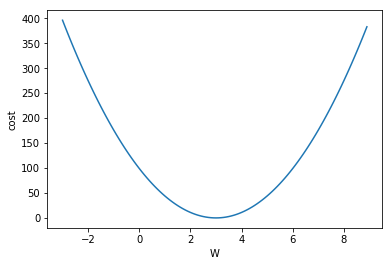
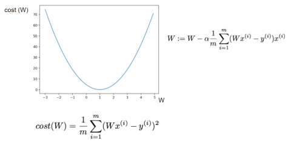

#### Minimizing Cost, Gradient Dscent의 개념과 동작 방법


----------------------------------
## Minimizing Cost

단순 그래프를 통해 W에 따라 cost가 변화되는 추세를 확인한다. 즉, cost 함수의 모양.


```python
import tensorflow as tf
```


```python
%matplotlib inline
import matplotlib.pyplot as plt
```


```python
X = [1, 2, 3, 4, 5]
Y = [3, 6, 9, 12, 15]

W = tf.placeholder(tf.float32)

hypothesis = X * W
```


```python
cost = tf.reduce_mean(tf.square(hypothesis - Y))
```


```python
sess = tf.Session()
sess.run(tf.global_variables_initializer())
```


```python
W_history = []
cost_history = []

# W를 -3 ~ 9 범위에서 0.1씩 증가
for i in range(-30, 90):
    curr_W = i * 0.1
    curr_cost = sess.run(cost, feed_dict={W: curr_W})
    W_history.append(curr_W)
    cost_history.append(curr_cost)
```


```python
plt.plot(W_history, cost_history)
plt.xlabel('W')
plt.ylabel('cost')
plt.show()

# W = 3에서 cost가 최소인 것을 알 수 있다.
```





## Minimizing Cost : Gradient Descent

현재의 W값에서 현재 점의 기울기(cost function의 미분값)를 빼줌으로써 cost가 작아지는 방향으로 움직인다.




```python
x_train = [1, 2, 3, 4, 5]
y_train = [3, 6, 9, 12, 15]

W = tf.Variable(tf.random_normal([1]), name='weight')   # 변수 선언
X = tf.placeholder(tf.float32)
Y = tf.placeholder(tf.float32)

hypothesis = X * W

cost = tf.reduce_mean(tf.square(hypothesis - Y))
```


```python
# W = W - learning_rate * gradient
learning_rate = 0.01
gradient = tf.reduce_mean((W * X - Y) * X)
descent = W - learning_rate * gradient

update = W.assign(descent)
```


```python
sess = tf.Session()
sess.run(tf.global_variables_initializer())
```


```python
for step in range(21):
    sess.run(update, feed_dict={X: x_train, Y: y_train})
    print(step, sess.run(cost, feed_dict={X: x_train, Y: y_train}), sess.run(W))
```

    0 143.285 [-0.60914719]
    1 113.496 [-0.21214104]
    2 89.9005 [ 0.14119446]
    3 71.2102 [ 0.45566308]
    4 56.4056 [ 0.73554015]
    5 44.6789 [ 0.9846307]
    6 35.3901 [ 1.20632136]
    7 28.0325 [ 1.40362597]
    8 22.2046 [ 1.57922709]
    9 17.5882 [ 1.73551214]
    10 13.9316 [ 1.87460577]
    11 11.0352 [ 1.99839914]
    12 8.74102 [ 2.10857534]
    13 6.92376 [ 2.20663214]
    14 5.48431 [ 2.29390264]
    15 4.34412 [ 2.37157345]
    16 3.44098 [ 2.44070029]
    17 2.7256 [ 2.50222325]
    18 2.15895 [ 2.5569787]
    19 1.7101 [ 2.60571098]
    20 1.35457 [ 2.64908266]
    


```python
# step - cost - W : cost 가 감소하면서 W가 목표값인 3으로 접근해가고 있다.
```

## Minimizing Cost : Use Optimizer


```python
X = [1, 2, 3, 4, 5]
Y = [3, 6, 9, 12, 15]

W = tf.Variable(5.0)   # 임의의 값 설정.

hypothesis = X * W
cost = tf.reduce_mean(tf.square(hypothesis - Y))
```


```python
# Optimizer
optimizer = tf.train.GradientDescentOptimizer(learning_rate=0.01)
train = optimizer.minimize(cost)
```


```python
sess = tf.Session()
sess.run(tf.global_variables_initializer())

for step in range(5000):
    if step % 200 == 0:
        sess.run(train)
        print(step, sess.run(W))
```

    0 4.56
    200 4.2168
    400 3.9491
    600 3.7403
    800 3.57743
    1000 3.4504
    1200 3.35131
    1400 3.27402
    1600 3.21374
    1800 3.16672
    2000 3.13004
    2200 3.10143
    2400 3.07912
    2600 3.06171
    2800 3.04813
    3000 3.03754
    3200 3.02928
    3400 3.02284
    3600 3.01782
    3800 3.0139
    4000 3.01084
    4200 3.00846
    4400 3.00659
    4600 3.00514
    4800 3.00401
    
