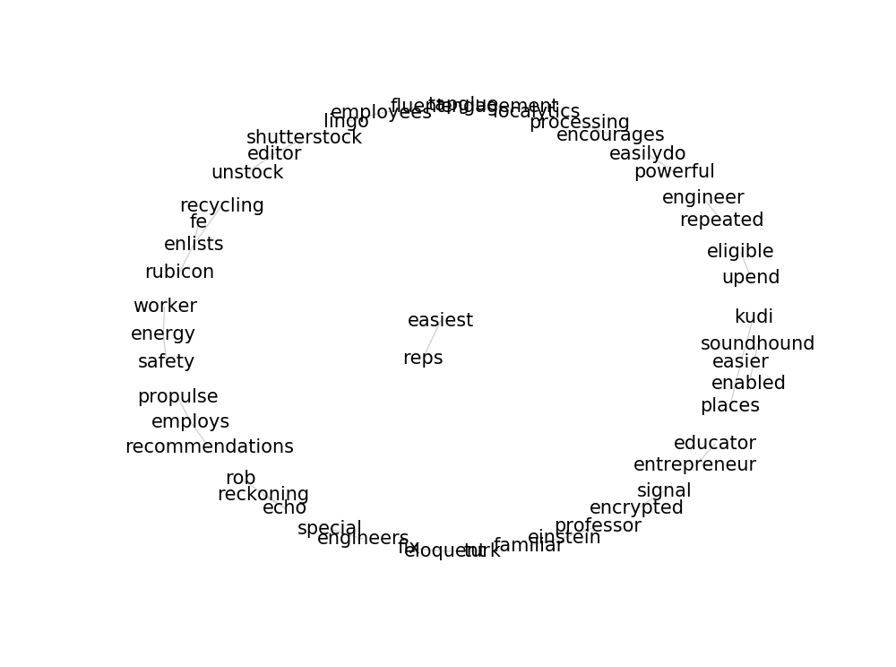

#### 뉴스 기사 목록 수집, Term Document Matrix, Word Cloud, Word network

----------------------------------


```python
import requests
import lxml.html
```

### 기사 목록 가져오기


```python
url = 'https://techcrunch.com/startups/page/2/'
```


```python
# 기사 제목에 해당하는 html 구조
# <div> <h2 class=""> <a href="">
```


```python
def get_tc_list(page):
    """각 page에 있는 기사 제목을 가져온다"""
    url = 'https://techcrunch.com/startups/page/{}/'.format(page)  # URL 만들기
    res = requests.get(url)                # 기사 목록
    root = lxml.html.fromstring(res.text)  # HTML 파싱
    titles = root.cssselect('h2 a')        # 제목 가져오기
    # Generator
    for title in titles:
        yield title.text
```


```python
# 1 page 기사 리스트
list(get_tc_list(1))
```


    ['83North closes $250M fourth fund focused on European, Israeli\xa0startups',
     'London-based Forward Partners closes new £60M fund to invest in startups at idea and Seed\xa0stage',
     'CheckRecipient, a London startup that uses machine learning to stop misaddressed emails, raises\xa0$2.7M',
     'Instacart VP of operations Mike Swartz has left the\xa0company',
     'High school junior launches TagDat, an emoji-based local reviews\xa0app',
     'How Winnipeg focused on local strengths to create a tech hub in central\xa0Canada',
     'LocusBots can now ‘talk’ to each other and collaborate in\xa0warehouses',
     'The TC Disrupt After Parties (and concert!) are going to be off the\xa0hook!',
     'TC is taking over Manhattan on\xa0Thursday!',
     'This new sentiment index aims to help founders time their\xa0fundraising',
     'Spotify trades free-tier album delays for smaller\xa0royalties',
     'Pluto AI raises $2.1 million to bring intelligence to water\xa0treatment',
     'Vimcar, a Berlin startup that offers hardware and an app to manage company fleets, raises\xa0$5.5M',
     'Infiniti launches a startup lab in Toronto to focus on IoT and smart\xa0cities',
     'Oscar Health’s Mario Schlosser is coming to Disrupt NY\xa02017',
     'Money transfer startup Azimo now lets you send money to a phone\xa0number',
     'Amino raises $25 million to match patients with doctors best qualified to help\xa0them',
     'Blackstorm Labs and Rakuten launch R Games to build high-fidelity HTML5\xa0games',
     'Apple Fellow Rich Page on ‘stealing jobs’ and Chowbotics’ salad-making\xa0robots',
     'Author Ryan Holiday talks about the value of stoicism in a high-tech\xa0world']


### TQDM
진행 막대(pregress bar)를 보여주는 라이브러리. conda install tqdm.


```python
import tqdm
```

### 기사 수집


```python
articles = []
# 30 page 까지
for page in tqdm.tqdm_notebook(range(1, 31)):  
    articles = articles + list(get_tc_list(page))
```

    
    


```python
len(articles)
```


    600


```python
articles[0]
```


    '83North closes $250M fourth fund focused on European, Israeli\xa0startups'


## TDM (Term Document Matrix)


```python
from sklearn.feature_extraction.text import CountVectorizer
```


```python
cv = CountVectorizer(max_features=2000, stop_words='english')  

# max_features : 최대 단어 갯수
# stop_words : 제외할 단어 목록 (english : a, the, of 등을 제외할 단어 내장)
```


```python
tdm = cv.fit_transform(articles)   # make TDM
tdm
```


    <600x2000 sparse matrix of type '<class 'numpy.int64'>'
    	with 4183 stored elements in Compressed Sparse Row format>


```python
words = cv.get_feature_names()  # word list. 한 단어가 컬럼 하나.
words[100:130]
```


    ['acquires',
     'acquisition',
     'acquisitions',
     'action',
     'ad',
     'adam',
     'add',
     'additional',
     'addresses',
     'adds',
     'adelphic',
     'ads',
     'adsemble',
     'advertising',
     'aerial',
     'aes',
     'affordable',
     'africa',
     'agent',
     'aggregates',
     'aging',
     'agreed',
     'ai',
     'aiden',
     'aimed',
     'aiming',
     'aims',
     'air',
     'airbnb',
     'airlines']


```python
count_mat = tdm.sum(axis=0)   # column별 합계. 즉, 단어별 사용 횟수
count_mat
```


    matrix([[4, 2, 2, ..., 1, 1, 1]], dtype=int64)


```python
import numpy
```


```python
count = numpy.squeeze(numpy.asarray(count_mat))   # matrix --> array
count
```


    array([4, 2, 2, ..., 1, 1, 1], dtype=int64)


```python
word_count = list(zip(words, count))
word_count[100:130]
```


    [('acquires', 22),
     ('acquisition', 3),
     ('acquisitions', 1),
     ('action', 1),
     ('ad', 7),
     ('adam', 1),
     ('add', 2),
     ('additional', 1),
     ('addresses', 1),
     ('adds', 7),
     ('adelphic', 1),
     ('ads', 4),
     ('adsemble', 1),
     ('advertising', 1),
     ('aerial', 1),
     ('aes', 1),
     ('affordable', 4),
     ('africa', 2),
     ('agent', 1),
     ('aggregates', 1),
     ('aging', 2),
     ('agreed', 1),
     ('ai', 24),
     ('aiden', 1),
     ('aimed', 2),
     ('aiming', 1),
     ('aims', 7),
     ('air', 1),
     ('airbnb', 6),
     ('airlines', 1)]


```python
import operator
```


```python
word_count = sorted(             # 정렬
    word_count,
    key=operator.itemgetter(1),  # 1번째(빈도)를 기준으로
    reverse=True)                # 내림차순으로
```


```python
word_count[:30]
```


    [('raises', 85),
     ('million', 70),
     ('startup', 67),
     ('new', 51),
     ('app', 47),
     ('startups', 37),
     ('tech', 29),
     ('launches', 28),
     ('platform', 25),
     ('ai', 24),
     ('acquires', 22),
     ('help', 21),
     ('series', 20),
     ('wants', 19),
     ('data', 17),
     ('mobile', 17),
     ('service', 17),
     ('company', 16),
     ('meetup', 15),
     ('london', 14),
     ('media', 14),
     ('5m', 13),
     ('founder', 13),
     ('lets', 13),
     ('make', 13),
     ('search', 13),
     ('online', 12),
     ('smart', 12),
     ('social', 12),
     ('uk', 12)]


## WordCloud

### Windows  (Mac osX 지원 안됨)

* [Unofficial Windows Binaries for Python Extension Packages](http://www.lfd.uci.edu/~gohlke/pythonlibs/#wordcloud)에서 
wordcloud-1.3.1-cpXX-cpXXm-win_amdXX.whl를 다운받은 다음, 명령창에서 아래 명령을 실행:
* 자신의 Python 버전과 운영체제 bit에맞게 다운로드
* cd c:\Downloads
* pip install wordcloud-1.3.1-cp35-cp35m-win_amd64.whl


```python
%matplotlib inline
from matplotlib import pyplot
```


```python
from wordcloud import WordCloud
```


```python
wc = WordCloud(background_color='white', width=400, height=300)
cloud = wc.generate_from_frequencies(dict(word_count))
```


```python
pyplot.figure(figsize=(12, 9))
pyplot.imshow(cloud)
pyplot.axis("off")
pyplot.show()
```


## 상관 행렬 (correlation matrix)


```python
word_corr = numpy.corrcoef(tdm.todense(), rowvar=0)
word_corr
```


    array([[ 1.        , -0.00386403, -0.00386403, ..., -0.00273   ,
            -0.00273   , -0.00273   ],
           [-0.00386403,  1.        , -0.00334448, ..., -0.00236293,
            -0.00236293, -0.00236293],
           [-0.00386403, -0.00334448,  1.        , ..., -0.00236293,
            -0.00236293, -0.00236293],
           ..., 
           [-0.00273   , -0.00236293, -0.00236293, ...,  1.        ,
            -0.00166945, -0.00166945],
           [-0.00273   , -0.00236293, -0.00236293, ..., -0.00166945,
             1.        , -0.00166945],
           [-0.00273   , -0.00236293, -0.00236293, ..., -0.00166945,
            -0.00166945,  1.        ]])


```python
edges = []
for i in range(len(words)):
    for j in range(i + 1, len(words)):
        if (words[i][0] == 'e'):       # e로 시작하는 단어들만...
            edges.append((words[i], words[j], word_corr[i, j]))
```


```python
edges = sorted(edges, key=operator.itemgetter(2), reverse=True)
```


```python
edges = edges[:30]
edges
```


    [('easier', 'kudi', 1.0),
     ('easier', 'places', 1.0),
     ('easiest', 'reps', 1.0),
     ('easilydo', 'powerful', 1.0),
     ('echo', 'reckoning', 1.0),
     ('echo', 'rob', 1.0),
     ('editor', 'shutterstock', 1.0),
     ('editor', 'unstock', 1.0),
     ('educator', 'entrepreneur', 1.0),
     ('einstein', 'familiar', 1.0),
     ('einstein', 'professor', 1.0),
     ('eligible', 'upend', 1.0),
     ('eloquent', 'fix', 1.0),
     ('eloquent', 'turk', 1.0),
     ('employees', 'fluent', 1.0),
     ('employees', 'lingo', 1.0),
     ('employs', 'propulse', 1.0),
     ('employs', 'recommendations', 1.0),
     ('enabled', 'soundhound', 1.0),
     ('encourages', 'processing', 1.0),
     ('encrypted', 'signal', 1.0),
     ('energy', 'safety', 1.0),
     ('energy', 'worker', 1.0),
     ('engagement', 'localytics', 1.0),
     ('engagement', 'tapglue', 1.0),
     ('engineer', 'repeated', 1.0),
     ('engineers', 'special', 1.0),
     ('enlists', 'fe', 1.0),
     ('enlists', 'recycling', 1.0),
     ('enlists', 'rubicon', 1.0)]


```python
edge_list = [(word1, word2) for word1, word2, weight in edges]
edge_list
```


    [('easier', 'kudi'),
     ('easier', 'places'),
     ('easiest', 'reps'),
     ('easilydo', 'powerful'),
     ('echo', 'reckoning'),
     ('echo', 'rob'),
     ('editor', 'shutterstock'),
     ('editor', 'unstock'),
     ('educator', 'entrepreneur'),
     ('einstein', 'familiar'),
     ('einstein', 'professor'),
     ('eligible', 'upend'),
     ('eloquent', 'fix'),
     ('eloquent', 'turk'),
     ('employees', 'fluent'),
     ('employees', 'lingo'),
     ('employs', 'propulse'),
     ('employs', 'recommendations'),
     ('enabled', 'soundhound'),
     ('encourages', 'processing'),
     ('encrypted', 'signal'),
     ('energy', 'safety'),
     ('energy', 'worker'),
     ('engagement', 'localytics'),
     ('engagement', 'tapglue'),
     ('engineer', 'repeated'),
     ('engineers', 'special'),
     ('enlists', 'fe'),
     ('enlists', 'recycling'),
     ('enlists', 'rubicon')]


```python
weight_list = [weight for word1, word2, weight in edges]
weight_list
```


    [1.0,
     1.0,
     1.0,
     1.0,
     1.0,
     1.0,
     1.0,
     1.0,
     1.0,
     1.0,
     1.0,
     1.0,
     1.0,
     1.0,
     1.0,
     1.0,
     1.0,
     1.0,
     1.0,
     1.0,
     1.0,
     1.0,
     1.0,
     1.0,
     1.0,
     1.0,
     1.0,
     1.0,
     1.0,
     1.0]


```python
import networkx
```


```python
G = networkx.Graph()

edge_set = set()
for word1, word2, weight in edges:
    G.add_edge(word1, word2, weight=weight)
    edge_set.add((word1, word2))
```


```python
position = networkx.spring_layout(G, k=0.09,  iterations=100)
pyplot.figure(figsize=(12, 9))
networkx.draw_networkx_nodes(G, position, node_size=0)
networkx.draw_networkx_edges(G, position, edgelist=edge_list, width=weight_list, edge_color='lightgray')
networkx.draw_networkx_labels(G, position, font_size=15)
pyplot.axis('off')
pyplot.show()
```




