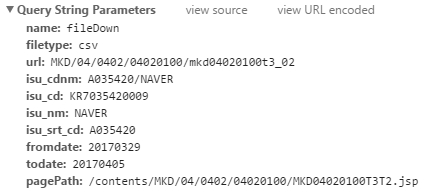
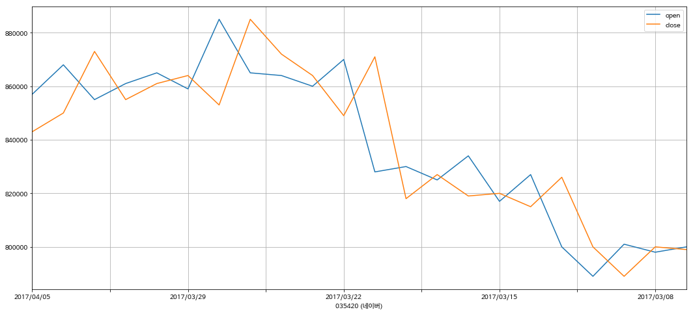

#### [FinDA] 거래소(KRX) 개별종목 일자별 시세 크롤링

----------------------------------

### 일자별 시세
[링크](http://marketdata.krx.co.kr/mdi#document=040204)

주식 - 종목정보 - 일자별 시세 - CSV 선택

### 종목 코드

* 거래소 단축코드 6 자리 : A035420 (네이버)
* ISIN 코드 12 자리 : KR7035420009

http://marketdata.krx.co.kr/contents/COM/GenerateOTP.jspx 에서 사용되는 항목



### 데이터 가져오기


```python
import pandas as pd
import numpy as np
import requests
from io import BytesIO
from datetime import datetime, timedelta
```


```python
def get_daily_price(code, fromdate=None, todate=None):
    if todate == None:
        todate = datetime.today().strftime('%Y%m%d')   # 오늘 날짜

    if fromdate == None:
        fromdate = (datetime.today() - timedelta(days=30)).strftime('%Y%m%d')   # 30일 이전 날짜

    # STEP 01: Generate OTP
    gen_otp_url = "http://marketdata.krx.co.kr/contents/COM/GenerateOTP.jspx"
    gen_otp_data = {
        'name':'fileDown',
        'filetype':'csv',
        'url':'MKD/04/0402/04020100/mkd04020100t3_02',
        'isu_cd':code,
        'fromdate':fromdate,
        'todate':todate,
    }
    
    r = requests.post(gen_otp_url, gen_otp_data)
    code = r.content  # 리턴받은 값을 아래 요청의 입력으로 사용.
    
    # STEP 02: download
    down_url = 'http://file.krx.co.kr/download.jspx'
    down_data = {
        'code': code,
    }
    
    r = requests.post(down_url, down_data)
    r.encoding = "utf-8-sig"
    df = pd.read_csv(BytesIO(r.content), header=0, thousands=',')
    return df
```


```python
df = get_daily_price('KR7035420009')
df.head()
```


<div>
<table border="1" class="dataframe">
  <thead>
    <tr style="text-align: right;">
      <th></th>
      <th>년/월/일</th>
      <th>종가</th>
      <th>대비</th>
      <th>거래량(주)</th>
      <th>거래대금(원)</th>
      <th>시가</th>
      <th>고가</th>
      <th>저가</th>
      <th>시가총액(백만)</th>
      <th>상장주식수(주)</th>
    </tr>
  </thead>
  <tbody>
    <tr>
      <th>0</th>
      <td>2017/04/05</td>
      <td>843000</td>
      <td>-7000</td>
      <td>99674</td>
      <td>84156754608</td>
      <td>857000</td>
      <td>859000</td>
      <td>835000</td>
      <td>27787538</td>
      <td>32962679</td>
    </tr>
    <tr>
      <th>1</th>
      <td>2017/04/04</td>
      <td>850000</td>
      <td>-23000</td>
      <td>59594</td>
      <td>51010262154</td>
      <td>868000</td>
      <td>869000</td>
      <td>846000</td>
      <td>28018277</td>
      <td>32962679</td>
    </tr>
    <tr>
      <th>2</th>
      <td>2017/04/03</td>
      <td>873000</td>
      <td>18000</td>
      <td>54884</td>
      <td>47808834000</td>
      <td>855000</td>
      <td>878000</td>
      <td>843000</td>
      <td>28776419</td>
      <td>32962679</td>
    </tr>
    <tr>
      <th>3</th>
      <td>2017/03/31</td>
      <td>855000</td>
      <td>-6000</td>
      <td>50026</td>
      <td>42957075000</td>
      <td>861000</td>
      <td>870000</td>
      <td>854000</td>
      <td>28183091</td>
      <td>32962679</td>
    </tr>
    <tr>
      <th>4</th>
      <td>2017/03/30</td>
      <td>861000</td>
      <td>-3000</td>
      <td>57075</td>
      <td>49337280851</td>
      <td>865000</td>
      <td>874000</td>
      <td>856000</td>
      <td>28380867</td>
      <td>32962679</td>
    </tr>
  </tbody>
</table>
</div>


```python
df = df.loc[:, ['년/월/일','시가','고가','저가','종가','거래량(주)']]
df.columns = ['date','open','hign','low','close','volume']
df.set_index('date', inplace=True)
df.head()
```


<div>
<table border="1" class="dataframe">
  <thead>
    <tr style="text-align: right;">
      <th></th>
      <th>open</th>
      <th>hign</th>
      <th>low</th>
      <th>close</th>
      <th>volume</th>
    </tr>
    <tr>
      <th>date</th>
      <th></th>
      <th></th>
      <th></th>
      <th></th>
      <th></th>
    </tr>
  </thead>
  <tbody>
    <tr>
      <th>2017/04/05</th>
      <td>857000</td>
      <td>859000</td>
      <td>835000</td>
      <td>843000</td>
      <td>99674</td>
    </tr>
    <tr>
      <th>2017/04/04</th>
      <td>868000</td>
      <td>869000</td>
      <td>846000</td>
      <td>850000</td>
      <td>59594</td>
    </tr>
    <tr>
      <th>2017/04/03</th>
      <td>855000</td>
      <td>878000</td>
      <td>843000</td>
      <td>873000</td>
      <td>54884</td>
    </tr>
    <tr>
      <th>2017/03/31</th>
      <td>861000</td>
      <td>870000</td>
      <td>854000</td>
      <td>855000</td>
      <td>50026</td>
    </tr>
    <tr>
      <th>2017/03/30</th>
      <td>865000</td>
      <td>874000</td>
      <td>856000</td>
      <td>861000</td>
      <td>57075</td>
    </tr>
  </tbody>
</table>
</div>


```python
%matplotlib inline
import matplotlib.pyplot as plt
```


```python
# plot의 한글 표시 설정
```


```python
plt.rcParams["font.family"]
```


    ['sans-serif']


```python
plt.rcParams["font.family"] = 'NanumBarunGothic'
plt.rcParams["font.size"] = 10
```


```python
df['open'].plot(figsize=(18,8))
df['close'].plot(grid=True)
plt.legend()
plt.xlabel('035420 (네이버)')
```


    <matplotlib.text.Text at 0x2afe384eb70>




