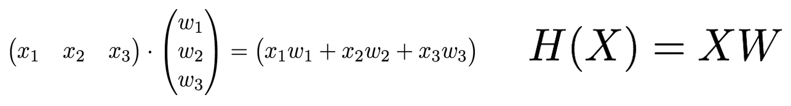

#### [딥러닝] 다변량 회귀분석을 이용한 호텔 신규지점 마진 예측, 성적 예측

----------------------------------

### Hypothesis with Matrix



### 3과목의 점수로 최종 점수 예측


```python
import tensorflow as tf
import numpy as np
```


```python
# import data from file
data = np.loadtxt('data/test-score.csv', delimiter=',', dtype=np.float32)
data.shape
```


    (25, 4)


```python
# 3 features
x_data = data[:, 0:-1]   # 1 ~ 3 번째 컬럼
y_data = data[:, [-1]]   # 마지막 컬럼
```


```python
# shape 설정
X = tf.placeholder(tf.float32, shape=[None, 3])   # input feature 수  :  [n, 3] * [3,1] = [n, 1]
Y = tf.placeholder(tf.float32, shape=[None, 1])   # output feature 수

# variable 의 수 = 3
W = tf.Variable(tf.random_normal([3, 1]), name='weight')
b = tf.Variable(tf.random_normal([1]), name='bias')

# 행렬 곱
hypothesis = tf.matmul(X, W) + b
```


```python
# modeling
cost = tf.reduce_mean(tf.square(hypothesis - Y))

optimizer = tf.train.GradientDescentOptimizer(learning_rate=1e-5)

train = optimizer.minimize(cost)
```


```python
# run graph
sess = tf.Session()
sess.run(tf.global_variables_initializer())
```


```python
# 학습
```


```python
for step in range(7001):
    cost_val, hy_val, _ = sess.run([cost, hypothesis, train], feed_dict={X: x_data, Y: y_data})
    if step % 1000 == 0:
        print(step, "Cost: ", cost_val)
    if step == 7000:
        print("Prediction:\n", hy_val)
```

    0 Cost:  166097.0
    1000 Cost:  15.8229
    2000 Cost:  11.9062
    3000 Cost:  9.59181
    4000 Cost:  8.21307
    5000 Cost:  7.38697
    6000 Cost:  6.88998
    7000 Cost:  6.59009
    Prediction:
     [[ 152.36933899]
     [ 185.24554443]
     [ 181.32817078]
     [ 198.60925293]
     [ 140.90942383]
     [ 105.94801331]
     [ 149.80859375]
     [ 112.57711029]
     [ 175.03233337]
     [ 164.85656738]
     [ 143.80343628]
     [ 143.18138123]
     [ 186.19641113]
     [ 153.31900024]
     [ 150.94363403]
     [ 188.87088013]
     [ 145.30027771]
     [ 179.97668457]
     [ 177.00708008]
     [ 158.37261963]
     [ 175.54580688]
     [ 174.77584839]
     [ 166.86877441]
     [ 150.97592163]
     [ 191.10281372]]
    


```python
# 나와 친구의 최종 점수 예측
sess.run(hypothesis, feed_dict={X: [[100, 70, 100], [90, 100, 80]]})
```


    array([[ 188.35801697],
           [ 175.17378235]], dtype=float32)


## 호텔체인 신규 지점의 마진 예측


```python
# import data
data = np.loadtxt('data/laquinta.csv', delimiter=',', dtype=np.float32)
data.shape
```


    (100, 7)


features
* Number : 3 마일 내에 있는 모텔 또는 호텔의 객실 수 (1000개)
* Nearest : 가장 가까운 모텔 또는 호텔과의 거리 (마일)
* OfficeSpace : 주변 지역에 있는 사무실의 규모 (1000 평방 피트)
* Enrollment : 근처 대학의 학생수 (1000 명)
* Income : 주변 지역의 중위 소득 ($1000)
* Distance : 시내 중심까지의 거리


```python
x_data = data[:, 0:-1]
y_data = data[:, [-1]]

x_data.shape
```


    (100, 6)


```python
x_data[:,0] = x_data[:,0] / 1000
x_data[:,2] = x_data[:,2] / 100
```


```python
x_data[0,:]
```


    array([  3.20300007,   4.19999981,   5.48999977,   8.        ,
            37.        ,   2.70000005], dtype=float32)


```python
X = tf.placeholder(tf.float32, shape=[None, 6])
Y = tf.placeholder(tf.float32, shape=[None, 1])

W = tf.Variable(tf.random_normal([6, 1]), name='weight')
b = tf.Variable(tf.random_normal([1]), name='bias')

hypothesis = tf.matmul(X, W) + b
```


```python
cost = tf.reduce_mean(tf.square(hypothesis - Y))
optimizer = tf.train.GradientDescentOptimizer(learning_rate=1e-5)
train = optimizer.minimize(cost)

sess = tf.Session()
sess.run(tf.global_variables_initializer())
```


```python
for step in range(30001):
    cost_val, hy_val, _ = sess.run([cost, hypothesis, train], feed_dict={X: x_data, Y: y_data})
    if step % 3000 == 0:
        print(step, "Cost: ", cost_val)
    if step == 30000:
        print("Prediction:\n", hy_val[:30])
```

    0 Cost:  353.289
    3000 Cost:  64.4129
    6000 Cost:  56.8195
    9000 Cost:  52.2762
    12000 Cost:  49.138
    15000 Cost:  46.8647
    18000 Cost:  45.1828
    21000 Cost:  43.9219
    24000 Cost:  42.9658
    27000 Cost:  42.2325
    30000 Cost:  41.663
    Prediction:
     [[ 44.76677704]
     [ 44.83603287]
     [ 42.98330688]
     [ 45.31852341]
     [ 52.92823029]
     [ 45.70767212]
     [ 44.85763168]
     [ 47.08715439]
     [ 48.97818756]
     [ 54.33695221]
     [ 46.06202698]
     [ 33.66534805]
     [ 40.40279388]
     [ 52.52919006]
     [ 36.8804512 ]
     [ 42.9991684 ]
     [ 48.62209702]
     [ 39.7893219 ]
     [ 46.79165649]
     [ 46.04627991]
     [ 40.36611557]
     [ 43.29184723]
     [ 48.91107178]
     [ 55.18282318]
     [ 50.87582397]
     [ 44.81761169]
     [ 47.78472519]
     [ 43.96390533]
     [ 34.89593124]
     [ 48.3162117 ]]
    


```python
# 신규 지점의 마진 예측
# 경쟁사 객실수 : 3815, 가까운 경쟁사 거리 : 0.9, 주변 사무실 : 4.76, 주변 대학생 수 : 24500, 중위 소득 : 35,000, 시내까지 거리 : 11.2
```


```python
sess.run(hypothesis, feed_dict={X: [[3.815, 0.9, 4.76, 24.5, 35.0, 11.2]]})
```


    array([[ 45.95544815]], dtype=float32)


## 데이터 파일 여러 개를 Queue로 불러오기


```python
# filename queue
```


```python
files = ['data/test-score.csv', 'data/test-score02.csv']
filename_queue = tf.train.string_input_producer(files, shuffle=False, name='filename_queue')
```


```python
# reader
```


```python
reader = tf.TextLineReader()
key, value = reader.read(filename_queue)
```


```python
# Default values
```


```python
record_defaults = [[0.], [0.], [0.], [0.]]                    # 3 개의 컬럼 + y
data = tf.decode_csv(value, record_defaults=record_defaults)
```


```python
# collect batches of csv
```


```python
train_x_batch, train_y_batch = tf.train.batch([data[0:-1], data[-1:]], batch_size=20)
```


```python
X = tf.placeholder(tf.float32, shape=[None, 3])
Y = tf.placeholder(tf.float32, shape=[None, 1])

W = tf.Variable(tf.random_normal([3, 1]), name='weight')
b = tf.Variable(tf.random_normal([1]), name='bias')

hypothesis = tf.matmul(X, W) + b
```


```python
cost = tf.reduce_mean(tf.square(hypothesis - Y))

optimizer = tf.train.GradientDescentOptimizer(learning_rate=1e-5)
train = optimizer.minimize(cost)

sess = tf.Session()
sess.run(tf.global_variables_initializer())
```


```python
# Start populating the filename queue.
```


```python
coord = tf.train.Coordinator()
threads = tf.train.start_queue_runners(sess=sess, coord=coord)
```


```python
# 학습
```


```python
for step in range(5001):
    x_batch, y_batch = sess.run([train_x_batch, train_y_batch])
    cost_val, hy_val, _ = sess.run([cost, hypothesis, train], feed_dict={X: x_batch, Y: y_batch})
    if step % 1000 == 0:
        print(step, "Cost: ", cost_val)
    if step == 5000:
        print("Prediction:\n", hy_val)
```

    0 Cost:  20920.5
    1000 Cost:  30.1588
    2000 Cost:  19.7607
    3000 Cost:  14.552
    4000 Cost:  11.8061
    5000 Cost:  10.2829
    Prediction:
     [[ 151.59170532]
     [ 186.13923645]
     [ 181.2706604 ]
     [ 197.42167664]
     [ 143.16911316]
     [ 106.47771454]
     [ 147.0309906 ]
     [ 107.73338318]
     [ 175.11833191]
     [ 162.87550354]
     [ 142.83317566]
     [ 142.72502136]
     [ 187.21566772]
     [ 155.9540863 ]
     [ 148.33409119]
     [ 188.58197021]
     [ 149.74754333]
     [ 175.33354187]
     [ 177.87763977]
     [ 158.83981323]]
    


```python
coord.request_stop()
coord.join(threads)
```


```python
# 나와 친구의 최종 점수 예측
sess.run(hypothesis, feed_dict={X: [[100, 70, 100], [90, 100, 80]]})
```


    array([[ 191.31782532],
           [ 178.37687683]], dtype=float32)


