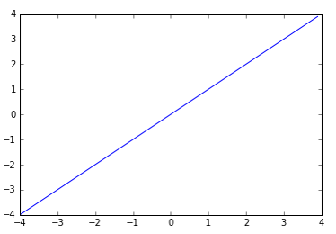
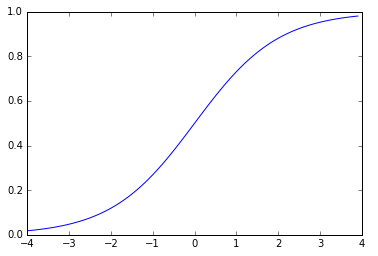
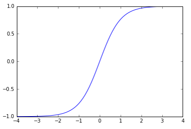
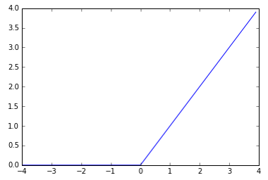
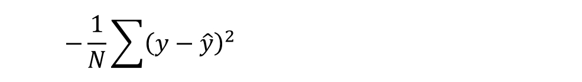
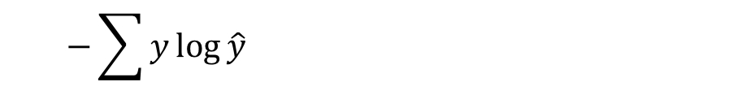

#### [딥러닝] Activation functions, Cost functions, Gradient Descent Optimizers 비교

----------------------------------

참고 사이트 : http://cs231n.github.io/neural-networks-3/

## 1. Activation Function

### Linear

* 입력이 그대로 출력으로 나간다.

### Sigmoid (= Logistic)

* 질문에 대한 답이 yes일 확률을 계산하는 확률분포함수. 0 ~ 1 사이의 값 출력.
* 2개의 카테고리를 예측할 때 output layer에서 사용

### Softmax

* Logistic function을 일반화한 것.
* n 개의 요소를 갖는 확률 벡터 - 각 요소의 값이 0 ~ 1 사이이고 전체이 합이 1이다.
* n 개의 카테고리를 예측할 때 output layter에서 사용.

### Hyper tangen (tanh)

* -1 ~ 1 사이의 값을 출력
* feature 값의 범위를 줄여주는 역할로 주로 hidden layer에서 사용.

### ReLU  (Rectified Linear Unit)

* 입력 < 0 이면 0, 입력 > 0 이면 Linear 처럼 동작.
* sigmoid 나 tanh 보다 학습속도가 빠르다는 장점이 있다.

# 2. Loss : Cost Function

### Mean Squared Error

* 오차 제곱의 평균
* 연속형 변수를 예측할 때 사용.

### Cross Entropy

* y : 실제값 (0 or 1) / y-hat : 예측값 (확률)
* 낮은 확률로 예측해서 맞추거나, 높은 확률로 예측해서 틀리는 경우 loss가 더 크다.

* 범주형 변수를 예측할 때 사용
* binary_crossentropy : 카테고리가 2개인 경우
* categorical_crossentropy : 3개 이상의 경우

# 3. Optimizer

참조 블로그
* http://blog.naver.com/tlarygns0211/220855892158
* http://newsight.tistory.com/224

## Gradient descent

* batch gradient descent      : 전체 데이터로 경사를 구함

* stochastic gradient descent (SGD) : 확률적으로 선택한 하나의 데이터로 경사를 구함. 일반적으로 사용.

* mini-batch gradient descent : 일부 데이터로 경사를 구함

## Momentum

SGD에서 계산된 gradient에 한 스텝 전의 gradient를 일정한 %만큼 반영하여 사용한다. 즉 원래의 gradient를 일정 부분 유지하면서 새로운 gradient를 적용하여 관성 모멘트와 같은 효과를 주는 방식이다. 이를 통해 local minima를 더 빨리 빠져나올 수 있다.

## Adagrad

learning rate를 normalization 하여 서서히 감소시킨다.

## RMSprop

모든 경사를 더하는 대신 지수이동평균을 사용한다. Non-stationary 한 데이터를 학습시킬 때 많이 사용한다.

## Adadelta

RMSprop + Adagrad를 보정한 것이지만 실제로는 Adagrad가 더 학습을 잘 하는 경우가 많다.

## Adam

* Adagrad와 비슷
* 경사에도 지수이동평균 적용
* 0으로 편향된 것을 보정
* 최근 딥러닝에서 많이 사용된다.

## -- Optimizer 비교 --

(이미지 출처 : http://cs231n.github.io/neural-networks-3/)
